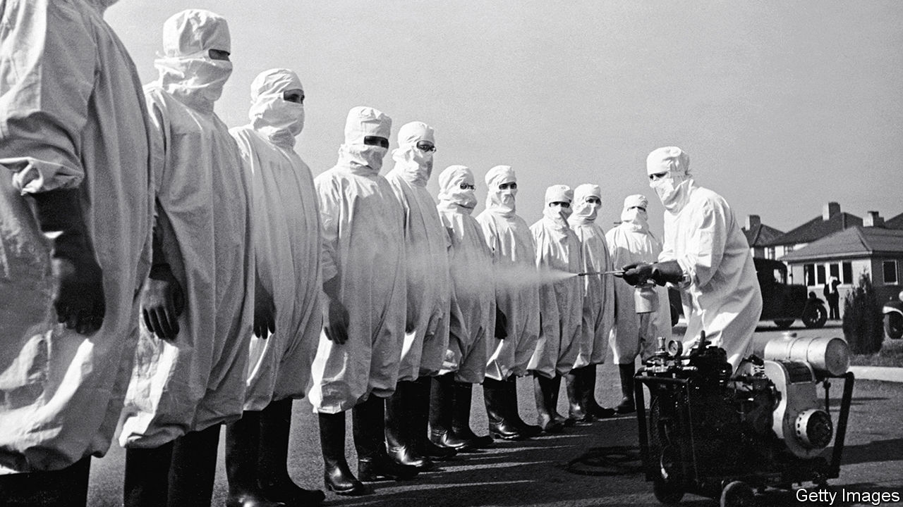

###### Pen v plague

# From Napoleon to Vladimir Putin, disease has shaped history 

##### A sacked New York Times reporter takes a global view of disease 

 

> Feb 15th 2024 

 By Donald McNeill. 

Early one morning a  reporter was shaken roughly awake. He was sleeping in a tiny hut, deep in the Cameroonian rainforest. Some local criminals were coming to kidnap him, his guide warned. Both men fled, just in time.

The reporter was Donald McNeill, who started at the as a copy boy in 1976 and later spent decades covering global health, especially the diseases that afflict the poor. He did so with courage, compassion and an eye for unexpectedly important details. The story he was pursuing in Cameroon was about hunting great apes and how their extinction might harm understanding of diseases that have crossed from other primates to humans. As a scientist told him, killing chimpanzees “is like burning a library full of books you haven’t read yet”. 

Mr McNeill’s reportorial adventures prepared him for the biggest story of his career: he and colleagues won a Pulitzer prize for their coverage of .  readers no longer have the benefit of his insights, however. He was pushed out in 2021 because of complaints that he had uttered a racial slur when referring to a conversation about someone else using it. On the plus side, Mr McNeill then had time to write a cracking book on pandemics. 

“The Wisdom of Plagues” puts the struggle against pestilence in , noting how the shift from hunter-gathering to farming made it easier for bugs to jump from livestock to people. Mr McNeill explains how plagues have shaped history, from the typhus that crippled Napoleon’s invasion of Russia to the covid-induced isolation that, he speculates, might have aggravated Vladimir Putin’s paranoia. 

Fear of disease has long led to scapegoating. Syphilis was “the French pox” to the English, “the Turkish disease” to Poles and “the Christian disease” to Turks. Mr McNeill recounts how a chest of gold and silver coins was recently found in the old Jewish quarter of Erfurt, Germany. The last king depicted on the coins had ruled in 1349, the year the  struck the city. Locals blamed the Jews, as they did all over western Europe. The owner of the chest never got to dig it up.

With fear comes falsehood. If it is not ethnic minorities supposedly spreading plagues, it is evil tycoons profiting from them in convoluted ways. A century before  was accused of using covid jabs to plant chips in people, John D. Rockefeller funded a campaign to urge Americans to wear shoes to stop hookworm burrowing into their bare feet. Rumours spread that “the oil magnate had secretly bought up shoe companies”. 

 is a huge obstacle to fighting disease. Mr McNeill saw close-up some of the estimated 300,000 extra deaths caused by a South African president, Thabo Mbeki, who concluded after surfing the internet that HIV did not cause AIDS. He watched the global campaign to eradicate polio stumble because so many Muslims believe the vaccine is a Western plot to sterilise them. Convincing them otherwise grew harder, Mr McNeill fumes, when the CIA used a fake vaccination campaign to try to trace Osama bin Laden in 2011. In one month the next year, Pakistani jihadists shot dead nine polio vaccinators. 

To fight pandemics, accurate information must be rapidly disseminated. That means bureaucracies need to move faster. “I can’t think of a single serious outbreak I learned of first” from the World Health Organisation (WHO), complains Mr McNeill.  It is part of the UN, and like “a London gentleman’s club”, defers to its members. ProMED, an unofficial disease-alert network, sounded the alarm about covid-19 four days before the much better-resourced WHO. 

Accurate information must also be believed. Too often, it is not, because of a breakdown of public trust in authorities. When experts make mistakes, which is inevitable when grappling with a new disease, many people conclude that the professionals are useless or self-serving. 

In this, they are encouraged by reckless and politicians. “The storm of rumours surrounding covid was by far the most intense I ever covered—for an obvious reason: many of them were spread by the president of the United States,” Mr McNeill writes. He deplores the way masks became political badges in America, with Republicans shunning them and Democrats sporting them even when cycling outdoors without helmets. Tribalism makes for poor risk assessment. 

Mr McNeill brims with ideas for curbing the next pandemic, including sampling sewage for viruses. He would, controversially, end religious exemptions to public-health rules. He omits some important things, such as the mystery of why Sweden coped reasonably well with covid despite very loose lockdown rules. But overall, this is a fascinating, ferocious fusillade against humanity’s two deadliest enemies: disease and itself. ■


