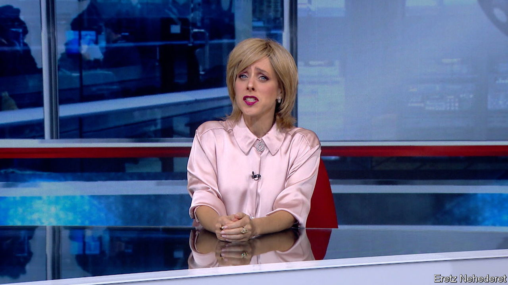

###### Laughing to tears

# On “A Wonderful Country”, Israelis joke their way through trauma 

##### Nothing appears off limits on the incisive comedy show, except for Gazans’ pain 

 

> Feb 15th 2024 

The comedy sketch opens at “Columbia Untisemity News, where everyone is welcome—LGBTQH,” says a university student with pink hair and face piercings. She explains that the “H” stands for “Hamas”. Another student, who wears a chequered  scarf and studies “queer post-colonial astrology”, chimes in enthusiastically. “Yeah, I totally simp Hamas, it’s so trending right now.” They decide to video chat with a Hamas militant, expressing concern for his well-being while he berates them: “We will throw you from the roof, you homosexual dirt.” The students are delighted. “Did you hear? They want to throw me a rooftop party!”

The satire recently aired on Israel’s irreverent television show, “Eretz Nehederet” (“A Wonderful Country”). Though sometimes compared to America’s “Saturday Night Live”, the humour in “A Wonderful Country” is more biting. “Life in Israel is much more extreme,” Muli Segev, the producer, says. “It’s actually life or death. The satire must be sharp, even brutal.”

Now in its 21st season—it had its premiere in 2003—“A Wonderful Country” is one of the most influential shows in Israel, watched by around 30% of Israelis who own television sets. The sketches often skewer Israeli politicians and public figures. But since the  the show has also looked outward, lampooning a supposed pro-Palestinian bias among liberals . 

One recent sketch lambasts the BBC’s coverage of the war. Announcing Israel’s bombing of a hospital in Gaza, a news anchor urges her producer to increase the number of casualties displayed on screen (“More, more!”). She turns to correspondent “Harry Whiteguilt”, who says he is reporting from the “illegal colony of Tel Aviv” and describes Hamas as “the most credible not-terrorist organisation in the world”, a swipe at the BBC’s reluctance to refer to Hamas as “terrorists”. It turns out Hamas is to blame for the hospital strike. “But it’s still Israel’s fault,” Mr Whiteguilt insists. 

The show posts sketches in both Hebrew and English on its social-media platforms, where they can reach viewers outside Israel. Lately, the English-language sketches have gone viral. The clips reflect “how a lot of Israelis feel” and are “a way for them to explain their side” to a global audience, says Shayna Weiss, senior associate director of the Schusterman Centre for Israel Studies at Brandeis University. 

The comedy show is especially popular among American Jews. A few Jewish-American celebrities, including Brett Gelman, an actor on the show “Stranger Things”, have made guest appearances. According to Ms Weiss, “This war is obviously not being fought just on the battlefield. It’s also being fought on social media.” But the show has a blind spot. Mocking college students is easy; acknowledging the suffering of Palestinians is proving rather harder. “A Wonderful Country” has not touched on the death and destruction Israel has caused in Gaza, which is no laughing matter.

After , the day 1,200 people in Israel were tortured and murdered by Hamas militants, the show temporarily changed its name to “Eretz Nilhemet” (“A Fighting Country”). But despite the nationalist bent, the Hebrew sketches often lampoon , the prime minister, and the Israeli government. (They are far more critical of Israeli leadership than those aired in English.) 

One sketch urged female soldiers in the Israel Defence Force to wear fake moustaches to be taken seriously—playing with the idea that a refusal to heed warnings from some of them contributed to Israel’s In another sketch Mr Netanyahu is visited by the ghost of Golda Meir, a former Israeli prime minister, who thanks him for making her look better. “Finally, after 50 years, my failures aren’t the biggest in history,” she says, puffing a cigarette. (Meir’s government was blamed for not being prepared for the Yom Kippur war in 1973.) “Most of us don’t like the government at all,” explains Mr Segev. But still, everyone on the show believes Hamas has to be defeated to keep Israelis safe: “We’re on Israel’s side.” ■


