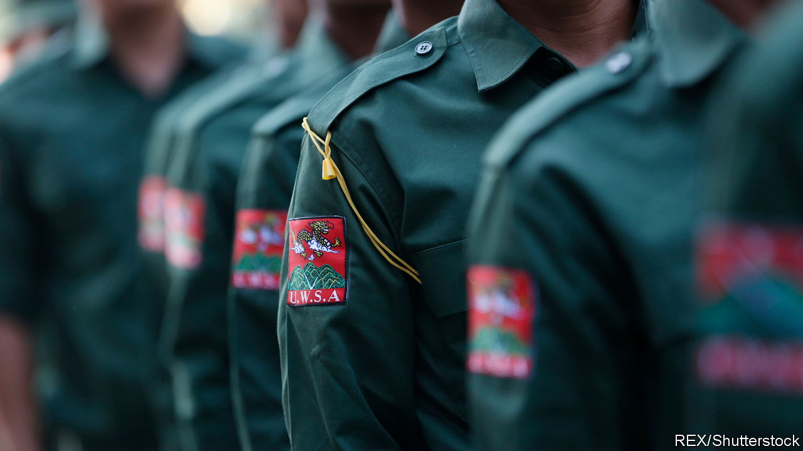

###### Drugs, terms and steel

# The Wa: the world’s biggest drug-dealers, with a tiny profile 

##### A new book looks at how the narco-state has flourished 

 

> Feb 9th 2024 

 By Patrick Winn. 

Many drug cartels share similar starts. Hard-up farmers in remote villages grow illicit cash crops ( plants and opium poppies can be cultivated even in poor soil). Local criminals muscle in. Trafficking syndicates spring up to ship the processed narcotics to the rich world. As profits rise, the cartel has to fight off competition. It bribes and threatens officials to ignore its activities. 

The pattern has been repeated from  to, but only one place has become a fully fledged narco-state. Wa State, a mountainous region within Myanmar, near China, is home to the Wa, an ethnic group comprising around 1m people. It spans roughly the same amount of land as the Netherlands. It declared de facto independence from Myanmar in 1989; today it is governed by the United Wa State Army (UWSA) under one-party socialist rule. (It is not recognised internationally.)

Since the late 1980s the UWSA has dominated the business of peddling methamphetamine in South-East Asia. (The UN estimates that trade of the drug in East and South-East Asia is worth $80bn a year.) It started out cultivating opium, graduated to making heroin and now cooks some of the world’s best meth. This pays for an army larger than Sweden’s, which is well stocked with high-tech weaponry.

“Just as Haiti was built on sugar and Saudi Arabia on oil, Wa State was built on heroin and methamphetamine,” Patrick Winn writes in “Narcotopia”. Yet the “UWSA isn’t some jungle-dwelling mafia. It’s running an honest-to-God nation.” The rogue ethnostate collects taxes. It has its own hospitals, schools and electricity grid, and its roads are better paved than many in Myanmar. Members of the Politburo are chummy with the Chinese government, and the Wa maintain an informal embassy in Myanmar. Wa citizens sing their own anthem and live under their own flag.

Mr Winn, a correspondent for “The World”, a show on America’s National Public Radio, has covered Asia’s fluid borders for years. His previous book, “Hello, Shadowlands” (2018), peeked at the UWSA as part of a broader look at rebel fiefs. “Narcotopia” is a more detailed examination. Though Mr Winn’s attempts to smuggle himself into Wa State were thwarted by the pandemic, he manages to interview leaders including Saw Lu, an anti-drug evangelical who became the UWSA’s first foreign minister. The elderly official recounts how he tried and failed to wean his government off narco-dollars.

America bears much of the blame, Mr Winn argues. Dredging up little-known research, he sets out how the CIA sponsored various opium-smugglers in Myanmar in the 1950s-70s. In exchange for guns and legal immunity, these warlords doubled as anti-communist militia bosses, gathering intelligence and launching raids into  China. The CIA thwarted attempts to arrest top capos and even lent them spy planes to move dope. The agency would repeat these deals with Nicaraguan rebels in the 1980s, igniting the Iran-Contra scandal.

In portraying Washington’s grimy role in the Wa saga, Mr Winn sometimes skims over the actions of others. China acts as the UWSA’s protector, giving it arms in exchange for not smuggling drugs into the country. Myanmar’s generals have granted Wa State carte blanche so long as it does not seek recognition from the UN. 

Even so, the book offers a rich analysis of narco-states. The UWSA produces bright pink, sweet-smelling meth pills that are triumphs of branding: the “WY” logo is “as recognisable…as Nike’s swoosh”, Mr Winn claims. Asia’s partying youngsters and exhausted workers consume billions every year. Wa State is not so much a den of vice, the author argues, as a nest of realpolitik and innovation. ■


