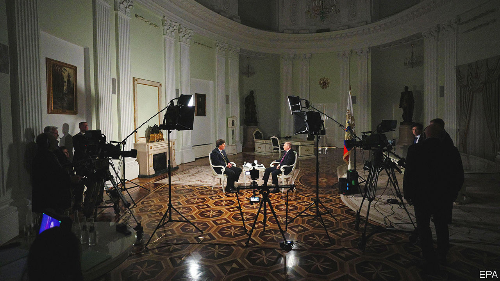

###### Back Story

# The real message of Vladimir Putin’s chat with Tucker Carlson 

##### Russia’s president is not a man to be trusted, still less to emulate or admire 

 

> Feb 9th 2024 

It cannot have taken long for Tucker Carlson to grasp that his interview with  might not go to plan. His first question was about the threat posed to Russia by NATO and America; President Putin’s response was a disquisition on Rurik, a Varangian chieftain of the ninth century, and the medieval reign of Yaroslav the Wise. To some on America’s right, he is an enviably ruthless pragmatist, a warrior-prince of white Christian nationalism. He came across as one of those cranks who fixate on an arcane bit of history, except that his obsession—Russia’s historical claim to Ukraine—is backed by a nuclear arsenal. 

The interview, taped in the Kremlin on February 6th and released online two days later, was the first Mr Putin has given to a Westerner since the invasion of 2022. It came at a pivotal moment in more than one way. A shortage of kit and munitions is hobbling Ukraine’s resistance. In America  have held up further support for Kyiv, mindful of the presidential election this November and  in it.

A Trumpist provocateur and on Fox News, Mr Carlson gave Mr Putin lots of chances to stir up American politics. For a supposed sorcerer of electoral meddling, the president did a poor job. Might a new administration in Washington help mend relations with Russia? “It is not about the leader,” he said disobligingly. Invited, more than once, to blame NATO for the war—a bogus explanation favoured by American isolationists—he repeatedly blathered about history. Mr Carlson looked, now and then, like a man who has drifted into a reverie over whether he left the oven on.

The president told flagrant lies. He said he launched the invasion of 2022 to stop a war that Ukraine had started in 2014 after a CIA-backed coup. Russian forces withdrew from Kyiv as a gesture of goodwill, he fibbed. He alleged, as usual, that the Ukrainian government and its Jewish president promote Nazi ideology.

Mr Carlson, who mixed up Ukraine’s revolution of 2014 with an earlier one, was unwilling or unable to challenge such falsehoods. Nor did he raise Russian war crimes, including those of which Mr Putin personally stands accused, or the repression of domestic critics such as . (He did press for the release of Evan Gershkovich, an American journalist imprisoned in Russia.) Still, Mr Carlson came away with more than the file of letters by a 17th-century Cossack which, bizarrely, Mr Putin presented to him.

For Mr Putin made several remarks which, out of their rambling context, will hearten those who say aiding Ukraine is not in America’s interests. In the past he hinted, darkly, that Russia might use nukes, yet he told Mr Carlson this idea was just a way for Western politicians to extort more tax. He denied any interest in invading Poland or Latvia (though he once said the same about Ukraine). Asked about the hypothetical deployment of American troops to the conflict, he gave an answer that may be clipped and replayed. “Don’t you have anything better to do?” Mr Putin scoffed, mentioning America’s border and national debt.

After this docile questioning Mr Carlson was disparaged in the West as a “useful idiot”. He may feel the boost to his profile—and his new streaming website—is worth the disdain. Russian state media, meanwhile, trumpeted Mr Putin’s performance. Watched closely, though, their exchange offered insights of a kind that neither may have intended.

One is about the risks of rulers staying in power for decades. As his comments revealed, even now Mr Putin resents the West’s role in the wars in Yugoslavia of the 1990s and other long-ago crises. In democracies, transitions of power are an amnesiac balm for such grievances, allowing relations with other countries to heal and move on. In office for almost a quarter of a century, Mr Putin is still avenging old grudges.

Another lesson lay in his sneering hauteur. He faced a hand-picked interviewer who lobbed softball questions. Even so, Mr Putin’s answers showed no regard for the patience or interests of viewers. But why would they? He is not accustomed to explaining himself. He does not rule through persuasion or charm but by violence and fear. 

Power in Russia is opaque. It often seems that only one man is in the know, and even he seems frequently to be flailing. Mr Carlson was granted rare access to him and fluffed it. All the same, a vital message was broadcast clearly: Mr Putin is not a leader to be trusted, much less to emulate or admire. ■


