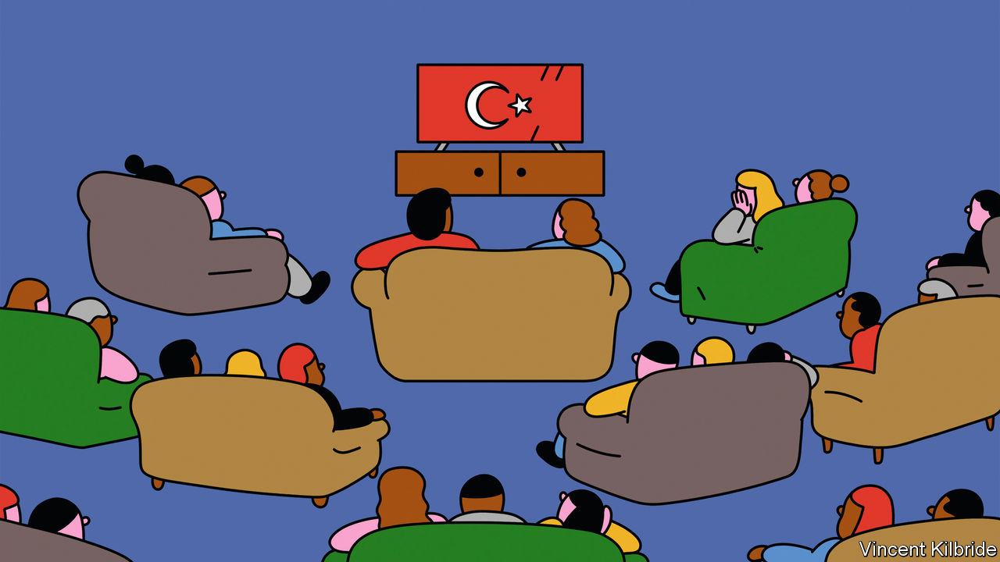

###### Turkish delight

# The third-largest exporter of television is not who you might expect 

##### After America and Britain, Turkey is the biggest seller of scripted shows 

 

> Feb 15th 2024 

Much of Ottoman history reads like a soap opera. In the 16th century Sultan  killed anyone whom he suspected of trying to rival him, including two brothers-in-law, two sons and a handful of grandsons. (And you thought your family had problems.)  about Suleiman, “Muhtesem Yuzyil” (“Magnificent Century”), first aired in 2011 and was part of the first wave of Turkish dramas to go global. Fans of the show include Cardi B, an American rapper.

Today, as popular Turkish shows proliferate, Suleiman has to share the throne with other reigning series. The latest is “Gaddar” (“No Mercy”), about a soldier who returns from war and is forced to become a hitman to protect his family. Turkey is now the third-biggest exporter of scripted series in the world—behind only America and Britain. Between 2020 and 2023 global demand for Turkish shows grew by 184%, compared with 73% for Korean dramas, according to Parrot Analytics, a data firm. 

Turkish shows are popular not just in the Middle East but also in Europe and . Last year the three biggest importers of new Turkish shows were Spain, Saudi Arabia and Egypt. The Istanbul Chamber of Commerce estimates that Turkey’s television exports earned $600m in 2022; some analysts predict their sales will soon total billions.

What makes the shows so binge-worthy? For one, they are easy on the eyes. They boast glamorous landscapes, luxurious costumes and handsome actors. Most are love stories; science-fiction series are rarely made, says Ozlem Ozsumbul, head of sales at Madd Entertainment, a distributor. Shows, including legal and period dramas, mix romance and revenge. In 2023 “Yargi” (“Family Secrets”), which follows rival lawyers who fall in love, won an international Emmy award for best telenovela.

Arab audiences appreciate that Turkish shows depict Muslims as heroes, not as terrorists or cab drivers, as Hollywood often does. The shows also bow to expectations of modesty. Turkish media watchdogs blur alcohol bottles, forbid sex scenes and issue fines for characters kissing. 

Censorship has forced directors to get creative and can even heighten sexual tension for viewers. Longing looks and lingering fingers replace gratuitous shots of romping. For example, in “Erkenci Kus” (“Early Bird”) the love interests almost brush lips as the heroine rubs her perfume on her boss’s neck. He later goes to jail for beating a man who tries to buy the rights to the scent. 

 are taking a page out of the Turkish playbook. Abby Jimenez, who wrote “Yours Truly”, a  bestselling novel, based her male protagonist on the one from “Sen Cal Kapimi” (“Love is in the Air”), an enemies-to-lovers tale in which a couple falls in love after pretending to be engaged.

In the first half of 2023, the three most popular scripted shows in Spain were Turkish, according to Glance, a TV-data firm. Spaniards and Latin Americans have a history of watching telenovelas, so they are used to the schmaltz and time commitment of Turkish programmes. And some viewers seem to welcome a break from the sex and gore of Western television. 

Spanish-speaking audiences are drawn to the high production value of Turkish dramas. Latin American telenovelas “look cheap” in comparison, says one purveyor of shows. People in Turkey and Latin America “express feelings unabashedly”, says Carolina Acosta-Alzuru of the University of Georgia: “That’s why melodrama works in both cultures.”

Broadcasters are fans of the shows, too. In Turkey, programmes are aired once a week and can last up to three hours, but when sold to foreign countries they are chopped up and run more often, sometimes daily. TV channels can stretch out the series over hundreds of episodes. Korean dramas are good, says Izzet Pinto, a television distributor, but they last only 13 commercial hours. Turkish ones can extend to around 200.

Some fans complain that they cannot get enough content in their own language. It’s a no-brainer to  in Spanish because one version can be distributed throughout Spain and much of Latin America. For languages with fewer speakers, such as Polish or Greek, TV channels resort to cheaper solutions, including subtitles. Some viewers even try to learn a bit of Turkish so they can watch dramas without having to wait for the dubbed versions to come out, says Yasemin Celikkol of Northwestern University in Qatar. Devoted super-fans dub shows for one another on social media.

Dramas have helped boost Turkey’s image, especially in former Ottoman lands. Ms Celikkol grew up in Bulgaria hearing that Turks were “evil, barbaric and terrible” but thinks Turkish dramas have helped change that perception. Bulgarians used to holiday in Greece, she says, but now they go to Turkey more often than before. 

The state has also got involved. In 2012 Turkey’s president, Recep Tayyip Erdogan, slammed “Magnificent Century” for devoting too much time to palace intrigues and not enough to Suleiman’s conquests. In response, a Turkish state broadcaster made its own historical drama, “Dirilis: Ertugrul” (“Resurrection: Ertugrul”), about a Turkic warrior in the 13th century. In May 2020, when much of the world’s population was in lockdown for covid-19, the show was the fourth-most in-demand TV series globally, according to Parrot Analytics. That year Pakistan’s then prime minister, , praised the programme for its “Islamic values”, and a statue of Ertugrul was erected in Lahore. An Urdu dubbing of the pilot episode has racked up 153m views on YouTube. 

Streaming services are creating more daring programmes. Fans are taken aback by what streamers can get away with. Netflix’s “Kulup” (“The Club”) follows an ex-convict who reconnects with her daughter after years in prison. The show depicts pogroms against minorities in Istanbul in the 1950s—a politically sensitive topic, to say the least. Streamers’ dramas tend to be shorter: so far “Kulup” has 20 episodes compared with 139 for “Magnificent Century”. Those who tune in to Amazon’s “Bihter”, a movie about a woman who cheats on her abusive elderly husband, can even watch sex scenes that brazenly feature bare buttocks. 

Relaxing what can appear on screens may improve Turkey’s chances of reaching English-speaking audiences, who have been more resistant to dubbed or subtitled series than people in many other countries. Unlike Spain (with “Money Heist”) or South Korea (), Turkey has not had a huge hit in either America or Britain. For example, “Kara Para Ask” (“Black Money Love”) was never much loved in America, even though it counts Lionel Messi, an Argentine footballer who plays in Miami, and Barbra Streisand, an American singer, as fans. 

But the world is big, and Turkey’s shows do not need to conquer Britain and America to be worth watching. Even Sultan Suleiman, who added parts of north Africa and Europe to the Ottoman Empire, did not make it that far. ■


