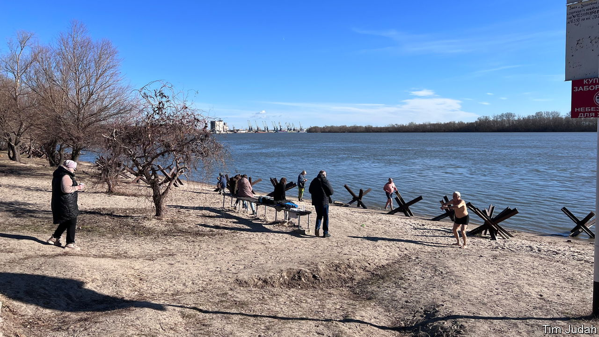
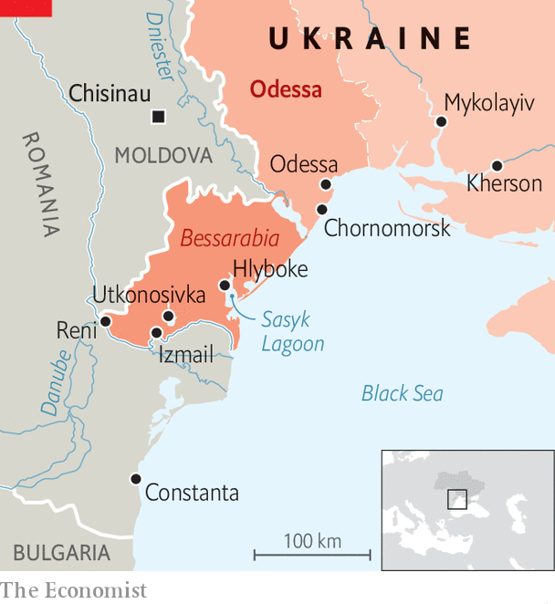

###### A new role

# After Russia’s invasion the people of Bessarabia switched sides 

##### A traditionally pro-Russian part of Ukraine now feels very differently 

 

> Feb 11th 2024 

WHEN RUSSIA first attacked Ukraine in 2014 Bessarabia was . Less than half of its people identified as Ukrainian. The region was poor and, for historical and economic reasons, many people thought that Vladimir Putin might be their saviour. But Russia’s endeavours to stir up trouble in this strategic Ukrainian borderland have failed. Ukrainian forces beat back Russian attempts to land commandos at the beginning of the full-scale invasion in 2022, and the security services arrested dozens of agents. Although the Russians damaged and closed one of the two bridges linking Bessarabia to the rest of the country, they have failed to shut down the other. 

 


In just over 200 years the ownership of what is now Ukrainian Bessarabia has changed nine times. It is bounded by the Danube and Dniester rivers, the Black Sea to the south and Moldova to the north. Seized from the Ottomans by Russia in the early 19th century, it became Romanian between the world wars and part of Soviet Ukraine after that. Apart from Ukrainians its people include Russians, Moldovans, Gagauz, Bulgarians and Albanians who speak Russian rather than Ukrainian as a lingua franca and for whom Russia was their historical patron. 


Oleh Kiper, the governor of the Odessa region, which includes Bessarabia, says that pro-Russian sentiment there dwindled after 2014 and “crashed” in the wake of the Russian invasion in February 2022. One reason why, he says, is that, thanks to help from France, “Russian satellite TV propaganda” has been blocked there since 2015. Since then Bessarabia has been not only peaceful, but a crucial lifeline for Ukraine. Hundreds of lorries thunder through daily, loaded with grain and other goods. They carry vital currency-earning exports to the Danube-river ports of Izmail and Reni, or into Romania and onwards. 

A decade ago the main road across Bessarabia from Odessa was awful, and Izmail felt like the dingy end of the world. No longer. The road has been improved and a ferry service opened in 2020, linking the region to Romania and the rest of Europe. Russian attacks have failed to put it out of service. On the Danube in Izmail a Togolese-flagged grain ship rests at anchor; hardy old men do squats on the riverbank nearby before defying a ban on swimming in the river. Others prefer a dip in Izmail’s smart new municipal sport centre.

In the past few years wineries and tourism have flourished in Bessarabia, though the post-Soviet recovery has been patchy. In Izmail money has poured in from up to 8,000 sailors who call this port home. Those who were here when the invasion happened two years ago were caught by the ban on men aged 18-60 leaving the country, but most of those who were at sea have stayed abroad. Although it has been hit by Russian rockets, Izmail has had a good war. Businesses and refugees from now-closed Black Sea ports like Kherson and Mykolaiv have moved here. “People got a sense of pride in being Ukrainian,” says Andriy Abramchenko, the mayor, who made clear in 2014 and in 2022 that his city would have no truck with Russia. 

In the predominantly Moldovan village of Hlyboke, history comes alive at the cemetery. The village lies on the banks of Sasyk, a lagoon that suffers from a disastrous Soviet-era attempt to turn it into a freshwater lake. The water is rising and the shoreline is eroding. The bones of Cossacks buried here in the 18th century, and of their descendants, jut out of the graveyard’s sandy cliff edge, eventually tumbling onto the beach below. At the other end of the cemetery lies Sasha Gorun, the school’s history teacher, who died fighting the Russians last May. 

Maria Chekir, aged 80, who taught Mr Gorun when she was the headmistress of the school, says she knows no one in the village who supports Russia. Outsiders often assume older people harbour pro-Russian sentiments and nostalgia for Soviet times. In fact, when Russia attacked in 2022, locals were terrified that their troops would land here. Now, says Mrs Chekir, “when I hear people speaking Russian I tell them off. Our guys are fighting Russians and I don’t want to speak Russian any more.” 

Hanna Shelest, an analyst in Odessa, says that she is not surprised that the Russians have failed to stir anti-Ukrainian unrest in Bessarabia. The war in Donbas, in the east, destroyed any local faith in the Kremlin’s propaganda about a peaceful “Russian World”. Meanwhile, the government in Kyiv belatedly began paying attention to the region. Ten years ago farmers from villages like Utkonosivka sold their cabbages to Russia, and blamed Ukraine’s government when war killed that business. Now they have found other markets, and resentment of the government has dissipated. 

Although the fear of separatism has evaporated, the threat from corruption has not. Ivan Rusev, an environmental researcher and activist, says that the army has sealed off parts of Bessarabia’s national parks. Park guards now have no power there. Inside the closed zones, he says, people with connections are grabbing land for farming or hunting. Letting corruption flourish under cover of fighting Russia does not bode well. Asked about Mr Rusev’s allegations, Mr Kiper, the governor, said simply: “Thank you for informing me.” ■


