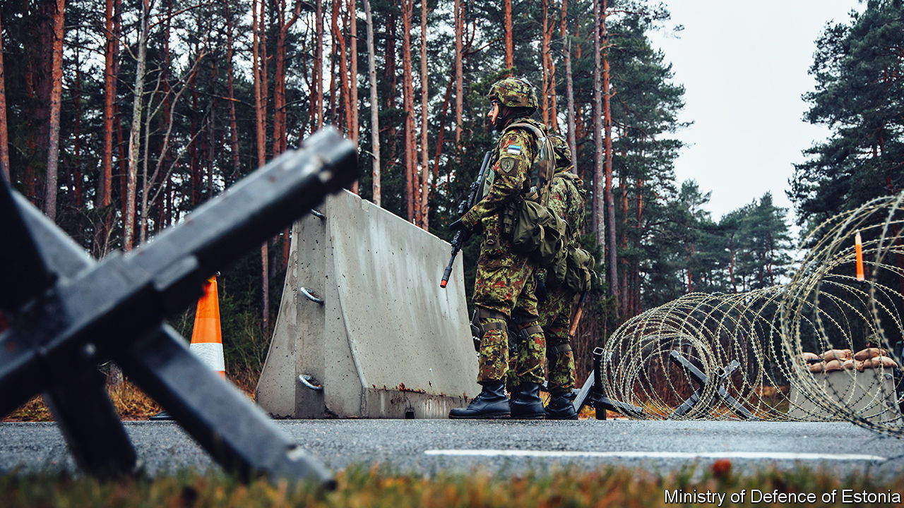
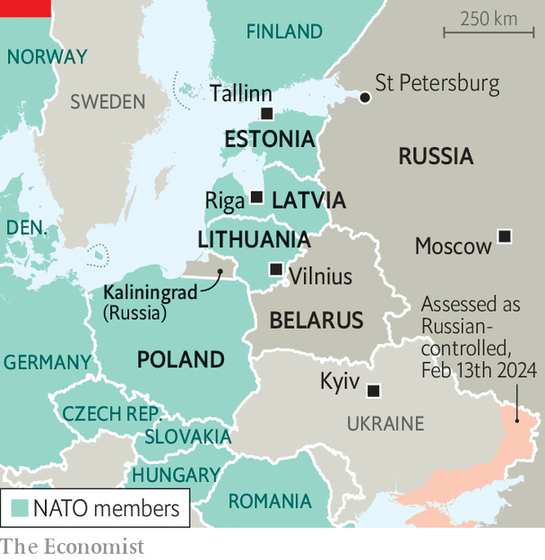

###### A concrete wall

# As Donald Trump threatens NATO, the Baltic states stiffen their defences 

##### Russia’s formidable installations in Ukraine are reviving interest in fortification 

 

> Feb 10th 2024 

THE SPECTRE of Donald Trump returned rudely to Europe on February 10th, when the former president told a campaign rally that he would encourage Russia to attack nato allies who did not meet the alliance’s target of spending 2% of GDP on defence. Mr Trump’s message jangled already frayed nerves: in recent weeks, a succession of European defence ministers and spy chiefs have warned that war with Russia is more likely and closer than assumed in the past. “It cannot be ruled out that within a three- to five-year period, Russia will test Article 5 and NATO’s solidarity,” warned Troels Lund Poulsen, Denmark’s defence minister, on February 9th. “That was not nato‘s assessment in 2023. This is new information that is coming to the fore now,” he explained.

 


Some countries are acting accordingly. In January the defence ministers of Estonia, Latvia and Lithuania announced that they would build a string of “anti-mobility defensive installations” along their border with Russia and Belarus, collectively known as the Baltic Defence Line. “We have…studied the Russian war in Ukraine,” adds Lieutenant Colonel Kaido Tiitus, a commander in the volunteer Estonian Defence League. “Our main lesson is that we need to find a way to stop the advance of Russian armoured units.”

Ukraine’s counter-offensive last year was stymied by the so-called Surovikin line: a sprawling array of Russian minefields, trenches, anti-tank obstacles and old-fashioned barbed wire, among other impediments. As Ukrainian forces slowed down to clear mines, bridge ditches and bulldoze obstacles, they were observed by drones and hit with a hail of anti-tank missiles and suicide drones. So uncharted was this territory that Valery Zaluzhny, then Ukraine’s top general, asked his staff to dig out “Breaching Fortified Defence Lines”, a book by a Soviet major-general. It was published in 1941.

Estonian officials estimate their stretch of the border will need some 600 concrete bunkers, each capable of holding around ten soldiers and taking a hit from a large shell. Prototype bunkers are being developed and construction is expected to start next year, at a cost of around €60m ($65m). The aim is not to create an impregnable fortress but to slow invaders, wear them down and buy time to bring up reinforcements. If Latvia and Lithuania were to build bunkers at a similar density, they would need 1,116 and 2,758 bunkers respectively, calculates Lukas Milevski of Leiden University in the Netherlands.

The catch is not military engineering but democratic consent. “The most important part is agreement with landowners,” says Susan Lillevali, an Estonian defence official, noting that most of the borderlands are privately owned. She says there has been little sign of pushback from Russian-speaking minorities in the area. Locals may be reassured by the fact that the armed forces do not plan to store explosives near the strongholds in peacetime, nor install anti-personnel landmines, which are illegal under the Ottawa Treaty.

The Baltic bunker-building spree is part of a wider revival of interest in fortification. In November Volodymyr Zelensky, Ukraine’s president, urged his commanders to accelerate the construction of defences in the east. Poland, too, is building up fortifications and shelters along its borders with Russia and Belarus, an ally of the Kremlin. This throws up a dilemma.

NATO armies have long preferred a more elastic defence in depth, in which forces retreat as needed and destroy the enemy on more favourable terrain. That is incompatible with defending every inch of nato soil. But with an “operationally static defence”, observes Mr Milevski, “it’s much more of an imperative to ensure that the blow, when it comes, is as weak as possible.” That puts a greater emphasis on using heavy firepower to strike deep behind Russian lines to break up the attacking force. In short: heavy bombardment of Russian soil. “Western political leaders,” he warns, “may be squeamish about such attacks.” ■


