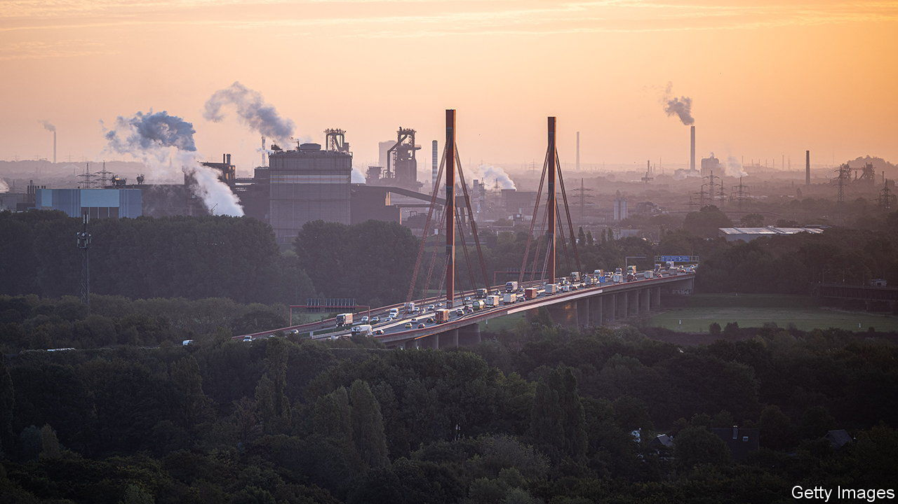
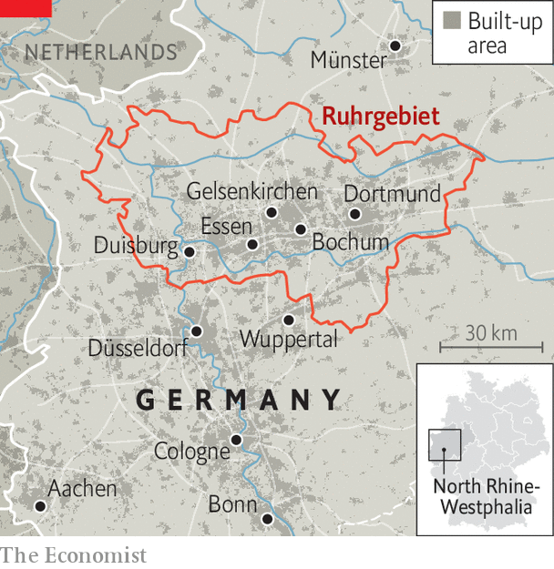

###### Back from the slagheap

# As German industry declines, the Ruhr gives hope 

##### The resilience of the old steelmaking heartland is a model for the future 

 

> Feb 15th 2024 

Germany is wilting. Last year its economy shrank by 0.3%, the worst result in the G7 group of rich countries. Deutsche Bank, the country’s biggest, reckons industrial output has sunk by 9% since 2018 and will fall another 2.5% this year. The talk in boardrooms is of creeping de-industrialisation as high domestic costs—especially for energy—push firms to relocate.

For a vision of the future look to Germany’s former industrial heartland, the Ruhrgebiet, or more simply the Ruhr. Once home to Europe’s biggest coal mine, its biggest steel mill and munitions plants that supplied two world wars, the English-county-sized region has been hollowed out. Two-thirds of its workers toiled in industry in the 1960s. Under one in five now do, as in the rest of Germany. On maps that show where factories cluster in Europe, the region pales against booming locales such as western Romania and southern Poland.

 


Focus more closely, however, and this vision of Germany’s future looks a lot less dim. American rust-belt cities such as Pittsburgh shrank by half or more after the 1960s; the Ruhr’s population fell by barely 10%. Its workforce has actually grown. With 5.1m people in a cluster of some 50 towns, it contains Germany’s biggest conurbation. The Ruhr has long since scrubbed its air and rivers, tidied slag heaps into forested hills and converted hulking factories into quirky museums. Huge investments in higher education (the region hosts 260,000 university students) have made it a centre for R&amp;D. A prime location and dense transport infrastructure have lured logistics firms, now the region’s top private employer. The Ruhr is, in short, a much nicer place to live than the chimney-studded powerhouse of old.

There are outliers, of course. The region’s southern half, with the big cities of Dortmund, Duisburg and Essen, has prospered while the more coal-dependent north has stalled. “There is huge segregation,” says Thomas Bauer of RWI-Essen, an economic research institute. “Everything north of the A40 autobahn is still problematic.” The mid-sized town of Gelsenkirchen, for instance, has suffered chronic unemployment since the last mines shut in 2018. The jobless rate in 2023 was 14.6%, nearly three times the rest of Germany’s. 

Mostly, though, the Ruhr has rebounded strongly. In its biggest city, Dortmund, the jobless rate touched 20% in 2005 after the closure of the Hoesch steelworks that once employed one in five of the town’s workers. More people now work on its abandoned factory sites than before they closed. A mill for specialised steels occupies just a corner of one vast suburban site, dwarfed by a giant logistics park next door, which is linked to rail, canal and road junctions. Another site has become a sparkling campus for corporate offices, with a derelict turbine hall converted into a venue for high-tech light spectacles. Once a slurry pit, a huge artificial lake is now ringed with fancy apartments and offices. 

Arturo de la Vega of the city’s planning department is ebullient. ”Our plan is for growth,” he enthuses. With its population projected to reach 625,000 in 2035 (up from 601,000 now), Dortmund is building new schools and a children’s museum. Having learned from the Hoesch collapse, it has focused not on winning big-name firms but on diversifying its economy and nurturing innovation. “Most companies here are less than 20 years old, and most you’ve never heard of,” says Mr de la Vega. This “centipede strategy” has paid off. Not only has the local economy weathered recent shocks, the city’s coffers are full. Its latest project is a new startup campus to revive a canalside district.

The funding is key, because sustaining the Ruhr has required lots of public money over a long period of time. Perhaps too much, thinks Christoph Schmidt, the president of RWI-Essen. A bit more “creative destruction” might have made the Ruhr adapt faster, he suggests. Some interventions have flopped. Gelsenkirchen’s prospects as a hub for solar power ended when subsidies dried up, and cheaper Chinese panels flooded in. 

A new push envisages the Ruhr as a testing ground for Germany’s ambitious plans to replace hydrocarbons with clean hydrogen. Christoph Noeres of Thyssenkrupp Nucera, a recent spin-off of the Duisburg-based steel giant that designs electrolysers to produce hydrogen, is optimistic. Typical of today’s Ruhr, his firm no longer makes things; the 500 workers at its Dortmund headquarters design and market complex processes that rely on equally complex supply chains. “Of course some operations may transfer outside of Germany,” he says. “But here we are used to transformations and innovation. It is in our DNA.” ■


