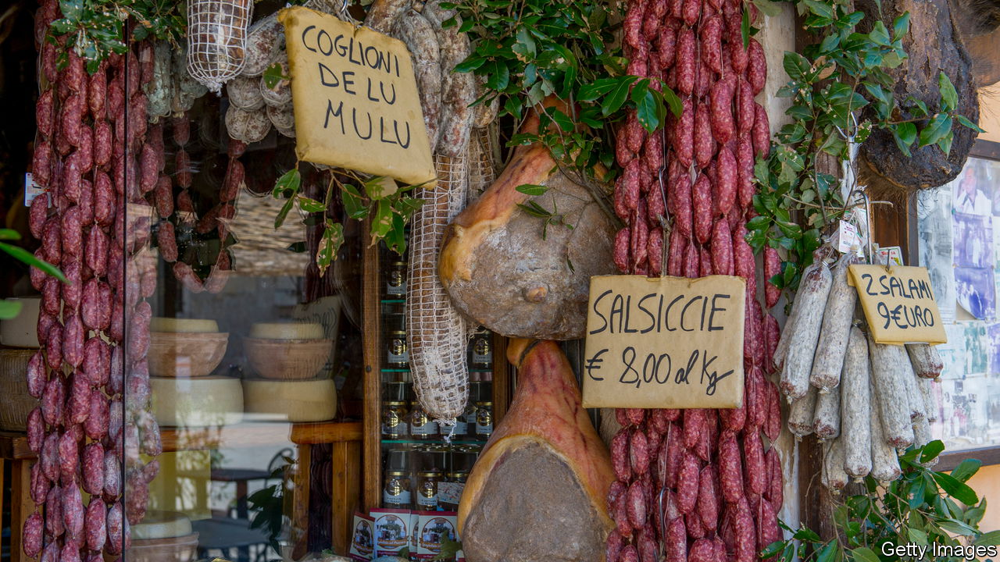

###### Overcooked controversy

# Europe decides it doesn’t like lab-grown meat before it’s tried it 

##### An Italian ban is red meat for cattle farmers 

 

> Feb 15th 2024 

For its detractors, it is an abomination—“Franken-meat”. For its advocates, meat grown from animal cells (known as lab-grown, cultured or cultivated) promises to help save the planet. It could slash the water consumption and greenhouse-gas emissions of the livestock industry (around 12% of the global total). Even if lab-grown meat merely replaced the stuff currently fed to pets, it would reduce the need to kill other animals. But it might pose an existential risk to livestock farmers, who are already protesting vigorously in Europe at rising costs, environmental restrictions and mounting paperwork.

In the EU, the controversy over cultured meat is searing. The European Commission is considering whether a ban introduced by Italy’s conservative government breaches the rules of the internal market. Since the ban was imposed last November, 11 other countries have lined up to defend “real” meat. A note from the Italian, French and Austrian delegations to the agriculture and fisheries council on January 23rd claimed the lab-grown variety threatens the “very heart of the European farming model”. They managed to corral eight other delegations in support.

Italy’s initiative was sponsored by the agriculture minister in Giorgia Meloni’s government, Francesco Lollobrigida. The bill imposing the ban includes beefy fines of up to €150,000 ($161,000) for defying it. It states that its aim is “safeguarding human health” and “preserving [Italy’s] food and agricultural heritage”. Yet no food-safety concerns have so far been raised concerning cultured meat. Any commercial product would need clearance from the European Food Safety Authority before it could be marketed.

More to the point, the fledgling lab-grown meat industry is still a very long way from producing wholly cultured products in commercial quantities at competitive prices. The first lab-grown hamburger, sampled in 2013, cost more than $300,000 to create. Companies working in the area have since faced immense problems in scaling up production and scaling down costs. Of late, many have switched to creating hybrid foodstuffs in which small amounts of cultivated meat have been added to plant-based protein. Already, hybrid products are available in small quantities in Singapore, Israel and America. 

Josh Tetrick, the CEO of Eat Just, one of the leading American startups, said this month he was taking a 50-year view of the industry’s prospects. New discoveries might change that. But until they do, the only effect of Italy’s ban will be to enable Mr Lollobrigida to bellow that he has defended his country’s livestock farmers. And the controversy in the EU will remain a storm in a Petri dish. ■


