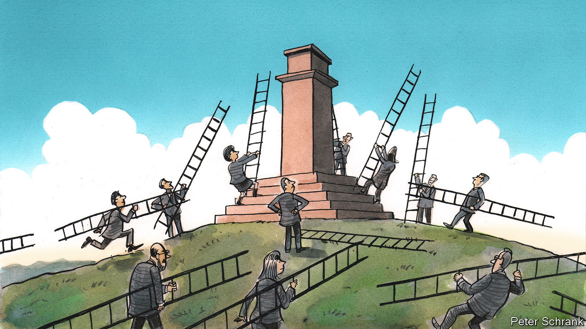

###### Charlemagne

# How not to botch the upcoming EU leadership reshuffle 

##### The great scramble for top Euro-jobs is upon us, alas 

 

> Feb 15th 2024 

Featuring on a criminal “wanted” list usually crimps one’s options for future employment. But when the country issuing the notice is Russia and the alleged outlaw is the prime minister of neighbouring Estonia, it can be a useful CV-enhancer. Reports that Kaja Kallas is one of a slew of Baltic politicians the Kremlin wants arrested—something to do with removing Soviet war memorials—may help her candidacy in the upcoming scramble for top EU jobs. The hawkish prime minister is among those who fancy their chances of trading up from a national post to a continental one, after the European Parliament elections from June 6th-9th. The process of replacing the bloc’s top officials usually entails a lot of undignified squabbling. A bit of planning would reduce the angst and avoid divisions, at a time when Europe can ill afford them.

Who gets which top Euro-job is traditionally decided by the EU’s 27 national leaders, who huddle in what might once have been a smoke-filled room a few weeks after votes are cast. In 2019 the process took two summits over five days. This time the jockeying for position is already under way. On February 19th Ursula von der Leyen, president of the European Commission, is expected to gain the formal endorsement of the Christian Democratic Union (CDU), the centre-right party of her native Germany, to serve a second five-year term atop the EU’s powerful executive arm. Having made a decent fist of running the bloc’s most important institution through covid-19 and the war in Ukraine, she is positioning herself as a safe pair of hands in a potentially unsafe Trumpian world. Assuming the centre-right comes top in European elections, as expected, few will dare challenge her. Once nominated by leaders she must be approved by a new set of European parliamentarians. A surge of support for the hard right means the centrist majority available to her is narrow. But it should be manageable.

The presidency of the European Council will prove harder to fill. Luckily it is less important. In theory the position entails chairing meetings of EU leaders, where the biggest decisions are made (as long as Viktor Orban, Hungary’s cantankerous prime minister, does not hijack proceedings). But the incumbent, Charles Michel, has embraced the job’s sideline as a ceremonial representative of the union, schmoozing the Xi Jinpings and Narendra Modis of the world. That has led to pointless turf battles between Mr Michel and Mrs von der Leyen, which have at times made the EU look as disorganised as a student society. Mercifully, term limits prohibit Mr Michel from staying on. 

Convention dictates the council job be bestowed on a sitting EU leader, or a recently retired one. The need for political balance suggests it must go to the centre-left, which will probably come second at the polls. A southern European would be ideal to achieve geographic balance. António Costa, who as Portugal’s Socialist prime minister fits the bill, was considered a shoo-in until he was forced to resign in a corruption scandal last November (he will be replaced after elections next month). Should the current judicial probe comprehensively clear him, he might still have a shot, if only because there are few other qualified lefties now running EU countries. One is Mette Frederiksen of Denmark, but her migrant-bashing stance has alienated political allies. The council’s presidency is too small for the German chancellor, Olaf Scholz. It could suit the Spanish prime minister, Pedro Sánchez, who narrowly won re-election last year. But his leaving for Brussels might leave Spain mired in political chaos, undermining him in his new role. If none of those options appeals, lots of retired Italian prime ministers might be willing to do the job. The most talented, Mario Draghi, is probably a non-starter, given his insufficient leftiness and his age—at 76 he would be young only by American standards.

The third weighty EU job is the high representative, in effect the bloc’s foreign minister. It is currently held by Josep Borrell, an affable Spaniard who candidly admits that concocting a joint foreign policy at EU level is all but impossible. Nonetheless many are keen to try. Central and eastern Europeans will fume if they are not given the post, having warned of Russia’s warmongering intent long before it was fashionable (and not having held a top EU post since 2019). They might be assuaged if a Balt or a Pole were to be appointed as secretary-general of NATO. The military alliance’s head is usually drawn from Europe and its current leader, Jens Stoltenberg, is on his fourth extension. But Mark Rutte, the outgoing Dutch prime minister, seems to be heavily favoured for NATO. Ms Kallas, as an easterner from a liberal party (the third big political family whose support Mrs von der Leyen will need) ticks many boxes. But others may yet emerge.

Holding the Leyen

Europe must avoid three pitfalls to ensure things go smoothly. First, it should rally around Mrs von der Leyen quickly, to remove any doubt she will continue to head the commission. Whatever errors she has made—some say her current support for Israel’s ferocious assault on Gaza is excessively keen—are largely overshadowed by her record. Second, Brussels must avoid being drawn into the pointless constitutional bickering that recurs each time the top jobs are refreshed, as Euro-federalist types see an opportunity for the European Parliament to leach more power away from member states. Finally, Europe would do well to pick a self-effacing president for the council, one eager to broker compromises and work smoothly with the commission.

Even if the top-jobs process goes smoothly, there will be opportunity for strife later on. A new team of commissioners will have to be appointed once their boss is in place. It is not just personnel that must be selected: their roles often change too. (Is it time for a European defence commissioner, for example?) Key issues such as the level of the EU’s green ambitions or its approach to free trade will be decided in part by who gets what position. That makes it all the more important to start by getting the biggest ones right.■


