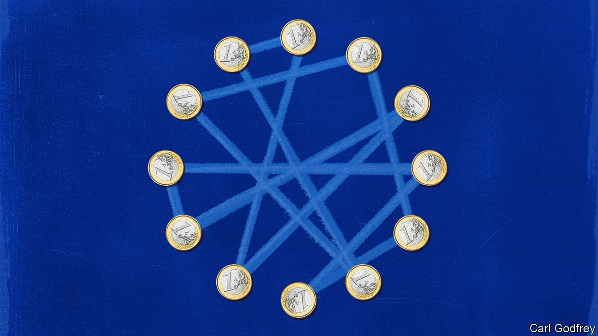
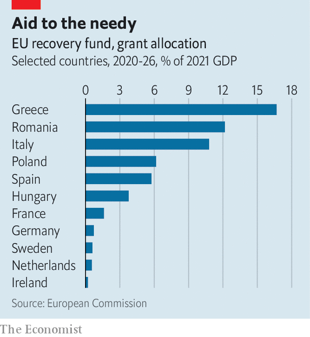

###### How to spend it

# The EU’s covid-19 recovery fund has worked, but not as intended 

##### The fund should pave the way for more collective European spending 

 

> Feb 15th 2024 

FEBRUARY 19TH will mark three years since the European Union’s recovery fund came into force. Known in Brussels jargon as NextGenerationEU (NGEU), this multi-year budget worth €832bn ($897bn, or 5.2% of the bloc’s GDP in 2022) is funded by EU debt, previously a rare commodity. It is the main political innovation to emerge from the pandemic in Europe. Some called it Europe’s Hamiltonian moment, invoking Alexander Hamilton, America’s first treasury secretary, who masterminded the fiscal federalisation of the United States. But the EU is some way from a fiscal federation. Northern finance ministers insist that the recovery fund was a one-off. And the extent of its success is still unclear. 

Next week the European Commission will present its first external review. The funds are still being spent, so the economic effect is hard to measure. More curiously, experts cannot agree on what the fund’s purpose was. But that is not surprising. Just as national fiscal policy does not serve a single purpose, neither does its equivalent at the EU level.

 


Start with its short-term purpose: to prevent a re-run of the euro crisis of 2010-12. In early 2020 the European Central Bank (ECB) had to intervene forcefully to stop interest rates on the enormous debt of Italy, which was hit hard by the pandemic, from spiralling out of control. To complement the ECB’s actions, the EU agreed to pool fiscal means to help poorer countries and those hit hard by the pandemic. The amount of aid ranged from 10.8% of GDP for Italy to 0.6% for the Netherlands (see chart). The markets learned that the ECB does “whatever it takes” to preserve the euro (as it promised during the euro crisis), and that in a crisis the EU’s richer countries will help its poorer ones. On this count, the fund has been a success. 

The fund’s second purpose was to aid the recovery from the depths of the covid recession. That was never going to work. Fiscal stimulus should focus on consumption, not investment—think American-style stimulus checks, or tax cuts. EU spending, which happens only via national governments and focuses on investment, could not possibly come fast enough to help. It might have had a signalling effect that money would flow and that governments and investors could start planning, argues Zsolt Darvas of Bruegel, a Brussels-based think-tank. In the end economists were glad the money was spent slowly: otherwise it might have fuelled inflation last year. But as a recovery tool, the fund made little difference. 

What about the green and digital transformation of the European economy? The biggest recipients got huge sums. (Richer countries got little, and will end up disproportionately paying off the debt.) Greece’s reform-minded government had already set up a commission headed by Sir Christopher Pissarides, a Nobel economics laureate, to use the money to make big changes. Some of that is working. Plans to digitise public administration and deploy solar panels grew more ambitious. Oversight by the commission prevented the most egregious white elephants, such as Italy’s proposal to build a football stadium. This performance-based approach may well be applied to most EU spending from now on. 

Still, there are problems. The EU sponsored some waste: Italy’s ludicrously generous subsidies for green renovation of houses was co-funded by €14bn of EU money. Investments such as child-care facilities need permanent staffing; the NGEU is a one-off, so that funding is unsure. Since most of the money has yet to be spent, the final verdict will have to wait. But so far the results have been mixed. “It was too much money for Italy, and there was too little time to make sure it is spent well,” argues Tito Boeri of Bocconi University. 

The cash was also meant to help countries implement politically difficult reforms to boost growth. This shows more promise. Greece’s government intends to reorder responsibilities of various levels of government, the health system and spatial planning. In Italy the government started reforming its byzantine judicial system. The money is an incentive to stick to agreed reforms, especially important in a country that changes governments frequently. But Italy has struggled to boost the level of competition in its economy. Other efforts, such as Spain’s labour-law reforms, have been less ambitious. The real test will be whether the EU insists that countries stick to their promises. 

The final purpose of the NGEU was to bribe the EU’s outcasts, countries run by the populist hard right. The smell of billions in fresh cash from Brussels led Poland and Hungary to agree reluctantly to new powers for the European Commission, to monitor whether breaches of the rule of law threaten the union’s financial interests. Both countries must pass certain “super milestones” to get any funds. (The EU’s decision in December to unfreeze €10bn for Hungary was unrelated to these new monitoring mechanisms.)

Critics argue that the milestones are superficial: in Hungary they cannot repair the damage to democracy; in Poland a new government is taking on that job itself. But for the first time, the EU has financial leverage to discourage countries from violating the rule of law. At the least, it can stop its funds from adding to autocratic governments’ power. 

The overall verdict, then, is cautiously positive. Some want more such schemes. “Whatever the issue in the EU these days, NGEU is the answer,” quips Mujtaba Rahman of Eurasia Group, a consultancy. European federalists hope collective debt, in the words of Hamilton, “will be to us a national blessing; it will be powerful cement of our union.” But another Hamilton provides better guidance. A Hamiltonian cycle in mathematics is a line that, after visiting all nodes once, returns to its origin. This is where the recovery fund will end up, too. Having spent €832bn in 27 member states, the EU will have to make the case for a larger budget and more authority anew. ■


