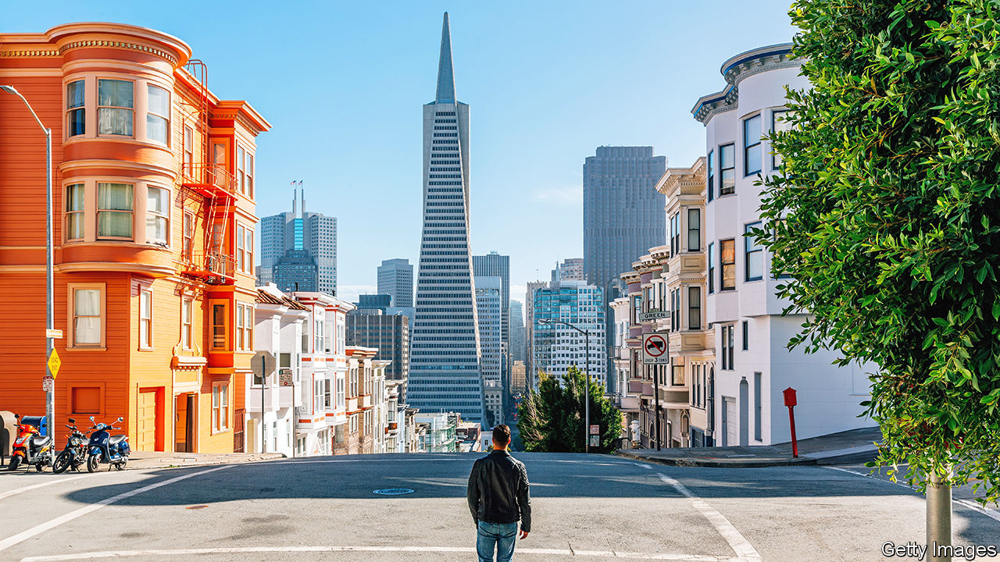
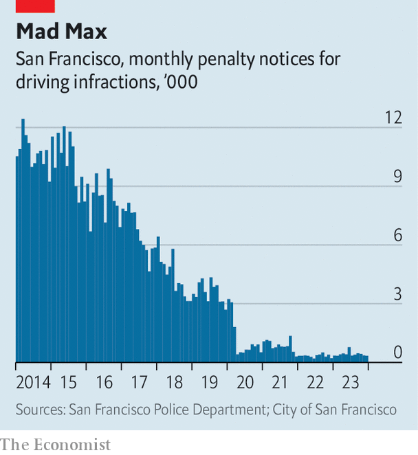
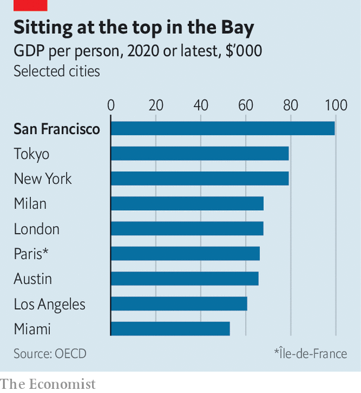
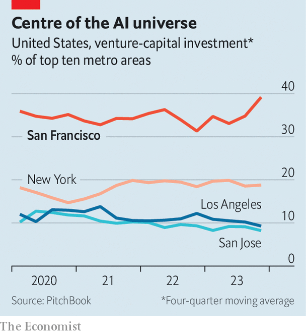

###### Artificial intelligence

# How San Francisco staged a surprising comeback 

##### Forget the controversy. America’s tech capital is building the future 

 

> Feb 12th 2024 

Whenever a global economic transformation takes place, a single city usually drives it forward. Ghent, in modern-day Belgium, was at the core of the burgeoning global wool trade in the 13th century. The first initial public offering took place in Amsterdam in 1602. London was the financial centre of the first wave of globalisation during the 19th century. And today that city is San Francisco. 

California’s commercial capital has no serious rival in generative  (AI), a breakthrough technology that has caused a bull market in American stocks, and which many hope will power a global productivity surge. Almost all big AI startups have their headquarters in the Bay Area, which includes San Francisco and Silicon Valley (largely based in Santa Clara County, to the south). OpenAI is there, of course; so are Anthropic, Databricks and Scale AI. Tech giants, including Meta and Microsoft, are also spending heavily on AI in the city. According to Brookings Metro, a think-tank, last year San Francisco accounted for close to a tenth of generative-AI job postings in America, more than anywhere else. New York, with four times as many residents, was second. 

This has changed the mood of San Francisco. When you live in the city, you can feel AI in the air. Drive to the airport and every second billboard tells you the various ways in which your business can improve by adopting AI. Go to a party and every second guest says that they are working on the tech or in an industry being transformed by it. Barely a day goes by without some nerdy event to satisfy your curiosity about the world’s liveliest intellectual field, from talks about the philosophy of artificial general intelligence to MLHops, a meet-up for AI folk who like beer. 

How is this happening somewhere supposedly falling apart? Even before the covid-19 pandemic there was a sense that the best days of San Francisco and the wider Bay Area had passed. In the late 2010s worries about crime and rising taxes saw other cities, including Austin, Los Angeles and Miami, hyped as the “next Silicon Valley”. According to data compiled by PitchBook, a financial database, at the start of 2014 firms in the Bay Area attracted four times more venture funding than New York, the next-biggest metro area. By the end of 2020 they attracted only 2.5 times as much.

Covid made the situation considerably worse. San Francisco locked down early, hard and for a long time, crushing employment in service industries. The city’s tech elite realised that they could work from home, emptying downtown. After the murder of George Floyd in 2020, many in city government turned against the police. Officers felt the city no longer had their back. From 2019 to 2022 their numbers fell by 14%. In 2021 Elon Musk left for Texas, the richest of the many thousands who vacated San Francisco that year. 

Action in startup-land moved elsewhere, too. The hottest companies were foreign, such as Ant Group, a Chinese fintech firm, at least until it was forced to abandon plans to go public, and Grab, a Singapore-based ride-hailer, which listed at a valuation of $50bn. Venture dealmaking in San Francisco inflated along with a wider market bubble. But when interest rates rose in 2022, the industry shut down. Valuations of venture-backed firms halved from the end of 2021 to the end of 2022.

 


Across the world “San Francisco” is now shorthand for a . Drug overdoses and homelessness have soared; the city’s population fell by 8% from April 2020 to July 2022. Just 52% of Americans polled by Gallup last year viewed San Francisco as a safe place to live, down by 18 percentage points from 2006. Conservatives, in particular, see the city as an example of what happens when you let social-justice warriors run amok. Today, if you so choose, you can drive through red lights at high speed with impunity—police have almost completely stopped issuing traffic citations as they prioritise other crimes. More than 30% of offices are vacant. Market Street, the city’s main drag, has an astonishing number of empty shops.

There are now signs that the local quality of life is starting to improve: overdoses have begun to fall; in the final months of 2023 car break-ins halved. Yet the start of the ai boom predated these changes. Despite headlines about an exodus of the rich, San Francisco’s tech elites mostly weathered the storm—its population decline was, in fact, mostly driven by the exit of poorer folk. As a result, inhabitants are now better paid and more educated than before covid. According to official data, San Franciscans’ average personal income per year is more than twice the American average. Even as poor residents have left, income inequality has soared.

 


Many of the people with the skills to ride the AI wave were already in San Francisco or nearby. Most of today’s tech giants were founded in the suburban neighbourhoods that make up the Valley. Today they, and other big tech firms, have huge campuses 20 or 30 miles south of San Francisco, but their young employees rent cupboard-sized flats in the city. Much of the funding for the AI boom is coming from these tech behemoths. In 2022 and 2023 firms such as Meta completed more Bay Area-based venture-capital investments than ever before, largely focused on AI. 

Owing to a mixture of government support and creative counterculture, Stanford University and the University of California, Berkeley have long been centres of AI excellence. In 2017 eight people published a paper, “Attention is all you need”, while working in the Bay Area at Google. It has become known even outside AI circles as the groundbreaking contribution to the current wave of technological progress. By 2021 San Francisco and nearby San Jose accounted for a quarter of all conference papers on the topic, according to the analysis by Brookings Metro. 

Academic excellence has fed private-sector innovation, with many researchers moving between the two spheres. Nine were hired to build OpenAI. At first, they laboured in the apartment of Greg Brockman, one of its co-founders, in the Mission District. Data from LinkedIn, a job-search platform, suggest that one in five of OpenAI’s engineering staff in America attended Berkeley or Stanford. Now San Francisco’s AI concentration has reached a critical mass, with success begetting further success. London and Paris may be AI rivals, but they are a long way behind. 

 


Thus investors are again spending big in the Bay Area. Venture funding to San Francisco-based startups halved between 2021 and 2022, but recovered to two-thirds of its peak in 2023. By contrast, in Miami just a quarter as much funding went to startups in 2023 as in 2021. Finance types who once worked in Silicon Valley are moving into the city to be closer to the action. Y Combinator, which helps startups get off the ground, recently set up shop. Venture-capital firms from General Catalyst to Pear VC have opened new offices. 

In desirable neighbourhoods competition for rental properties is fierce, as the city’s population once again grows. The arrival of lots of well-paid tech types has boosted house prices. Although they fell by more than 12% from their pandemic highs, they have risen since the start of 2023. The city has fewer restaurants than in 2019, but about the same number with two or three Michelin stars. North of the city, in wine country, there is no shortage of new, expensive hotels at which venture capitalists and founders can relax.

Some elites see San Francisco’s AI success as a precursor to a broader transformation of the city. Locals are fed up with having to call 911 because someone is overdosing in front of their children. In 2022 they ousted Chesa Boudin, a progressive district attorney, and three members of the school board who were more concerned with renaming schools than reopening them. On March 5th they will vote on measures championed by moderate Democrats, including one that will try to get homeless people suffering from mental illness off the streets. In November they will choose a raft of local officials and perhaps whether to give the mayor more power. 

London Breed, the current office-holder, sounds genuine when she talks of the need to improve public safety and cut red tape: “Rather than being a city that says ‘no’ all the time,” she explains, we need “to get to ‘yes’ by getting rid of bureaucracy.” She is being pushed by political groups that have formed as tech types take a keener interest in local politics, including GrowSF and TogetherSF, the latter co-founded by Michael Moritz, a famed venture capitalist.

Defending the indefensible

These efforts face stern resistance. Aaron Peskin, president of the Board of Supervisors, the city council, is the de facto leader of San Francisco’s progressives. He argues that Mr Moritz and his fellow campaigners are “amateurs” who are dressing up their own elite interests in the language of reform. “I generally think that people believe their own bullshit,” he says. (Unsurprisingly Mr Moritz disagrees: “It’d be easy for us to pick up roots and…go to a low-tax state or go to Europe.”) Even today plenty of the city government’s time is wasted on pointless projects such as deciding whether or not to call for a ceasefire in Gaza. The local NIMBY movement is extremely powerful. And cartoonish corruption remains a problem: in 2022 the former director of public works was sentenced to seven years in prison for taking huge bribes. 

Yet it may not matter much to the AI boom if San Francisco remains chaotic. If you want good public schools, public transport or public safety, San Francisco is not for you. If you do not need these things, or you can buy your way around them, then the city remains a great place in which to innovate. Covid tested the “network effects” that people in Silicon Valley believed were crucial to its success. It turned out they were as powerful as ever. That founders, firms, money and workers are returning to San Francisco suggests that remote work has not killed their importance. The city is still the place to be if you want to meet a co-founder by chance at a party.

Can the AI-driven excitement last? For now it is attracting people to the city; in time, it could cut the workforce needed for startups. “With AI you might not need 50 developers to start a firm—maybe you just need five,” speculates Auren Hoffman, a founder who moved from San Francisco to Washington, DC a few years ago. Another risk is that the AI boom will amount to less than the bulls hope, perhaps because fewer-than-expected businesses adopt AI tools. Yet as real as these concerns are, they are also ones that just about every other city would love to face. When it comes to governance, San Francisco breaks all the rules. At the same time, it is the richest place on Earth, and getting ever richer. ■


