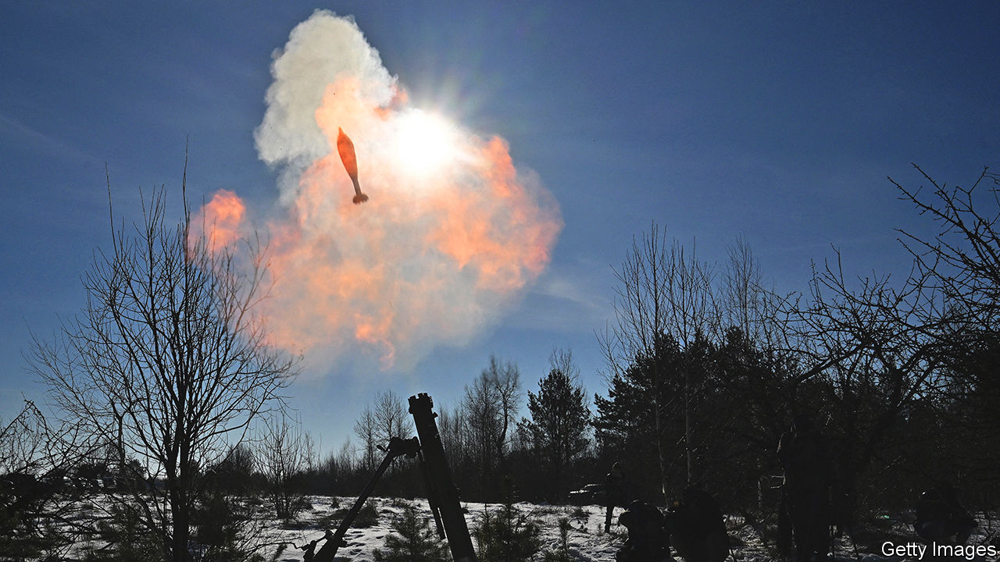

###### Putting out fires

# How the world economy learned to love chaos 

##### War, high interest rates and financial strife are yet to bring down growth 

 

> Feb 11th 2024 

Central banks have embarked on austere monetary policy to crush inflation. Worries about the financial system, from bond markets to commercial property to the health of the banks, are ever-present. Some 4bn people will head to the polls this year, with unpredictable consequences. Most concerning of all, the world is on fire, with conflicts from Ukraine to Israel and the Red Sea. Other wars, not least in Taiwan, do not feel all that far away. Little wonder that analysts speak of “polycrisis”, “hellscapes” and a “new world disorder”. 

And yet, for the moment at least, the world economy is laughing in the face of these fears. At the start of 2023 almost all economists reckoned that a global recession was due that year. Instead,  by about 3%. The early signs suggest progress is continuing at the same rate this year. Data from Goldman Sachs, a bank, indicate that global economic activity is about as lively as it was in 2019. A measure of weekly GDP produced by the OECD, a club of mostly rich countries, finds similar results. And a measure of global activity produced from surveys of purchasing managers (so-called PMI data) points to strongish growth across the world. 

. The unemployment rate across the OECD remains comfortably below 5%. The share of working-age folk actually in a job, a better measure of labour-market strength, is at an all-time high. Healthy job markets are boosting family finances, which have been hit by inflation. Real household disposable incomes across the G7 shrank by 4% in 2022, but are now growing once again. 

True, some countries are doing less well.  continue to disappoint. Some of those coming out of Europe are concerning. Germany, facing fallout from recent high energy prices and competition in its car industry from Chinese electric-vehicle exports, may be in recession. But there are also stronger showings. In January total nonfarm payroll employment in America rose by 353,000—a blowout figure, surpassing almost all expectations. In Brazil, a country that has faced a number of years of weak growth, the latest pmi data are encouraging.

So far there does not seem to be much evidence that attacks on shipping in the Red Sea are capsizing the economy. PMI data suggest that manufacturers face longer delivery times. This is consistent with ships rerouting , which increases the length of a trip between Shanghai and Rotterdam to 23,000km, from 18,000km. However in almost all economies shipping costs are just a tiny fraction of the overall price of a good. Even the most pessimistic wonks are pencilling in a rise in inflation, because of the Red Sea disruption, that amounts to little more than a rounding error. 

Why is the global economy so oblivious to the new world disorder? High interest rates have managed to bring down inflation from a peak of more than 10% across the rich world to about 6%. This not only raises households’ purchasing power; it also raises their spirits. Indeed, having hit an all-time low in 2022, rich-world consumer confidence has risen sharply. Higher borrowing costs have been muted by the fact that a lot of household and corporate debt is on fixed interest rates. 

There is also a more intriguing possibility: after so many shocking global developments, the world no longer minds chaos as much as it once did. This is consistent with academic evidence, including a recent paper by two researchers at the Federal Reserve, which suggests that the hit to output from a spike in economic uncertainty fades after a few months. 

Good economists remain vigilant. Higher interest rates may have a delayed impact on growth. Escalation in the Russia-Ukraine war or the Red Sea could provoke another round of shocks to energy supply, feeding into inflation. All bets are off if Xi Jinping decides to move on Taiwan. Yet on the flipside, falling inflation and a potential boost to productivity from generative artificial intelligence could prompt GDP to accelerate. Moreover, the global economy has already demonstrated its resilience. Polycrisis, what polycrisis? ■


