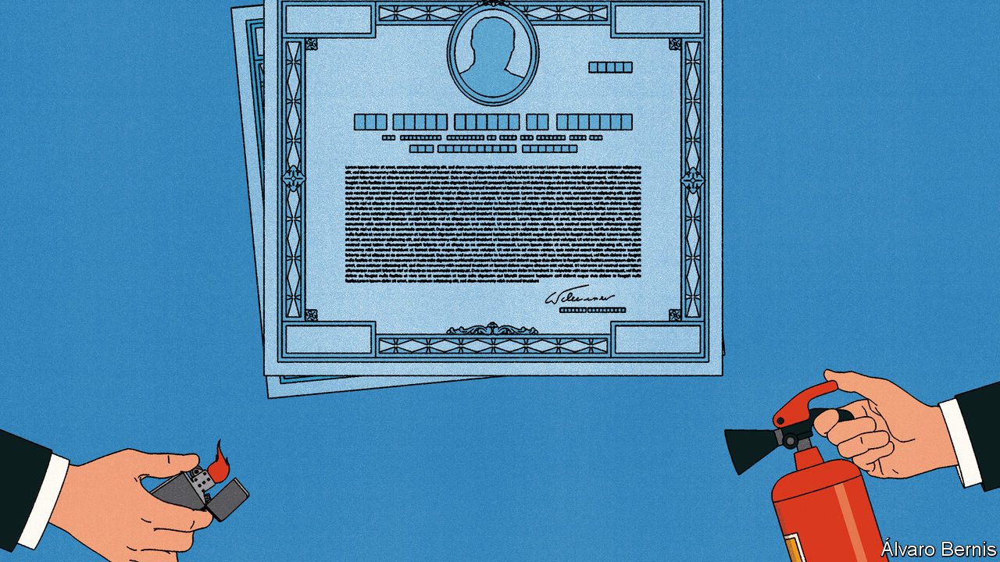

###### Free exchange

# In defence of a financial instrument that fails to do its job 

##### Inflation-linked bonds are a poor inflation hedge, but that’s not the point 

 

> Feb 15th 2024 

Although buying inflation-protected bonds to protect against inflation does not seem unreasonable, it would have been a spectacularly unprofitable move during the latest bout of inflation. One hundred dollars put into inflation-protected Treasuries in December 2021, when investors first saw American core inflation reach 5%, would have been worth just $88 a year later. Even cash under the mattress would have done better.

Safe to say, inflation-linked bonds are in trouble. Investors pulled $17bn from exchange-traded funds tied to them last year. Canada announced plans to cease issuing them in 2022; Germany did the same in November. Sweden is considering its options. Yet these countries are making a mistake. So long as their purpose is not misconstrued, inflation-linked bonds serve a vital function for markets and the governments that issue them.

Why, then, do the bonds not always offer protection against inflation? Start by breaking down the sources of return for a bondholder. First comes coupons, payments received before a bond matures. The difference between inflation-linked bonds and their conventional counterparts is that these are not fixed in dollars, euros or pounds; instead, they rise with inflation, as does the bond’s principal. Their real value is preserved if inflation is unexpectedly high. So far, so inflation-protective.

Yet for many investors a second mechanism will matter: changes in a bond’s price. Such changes reflect shifts in the market value of the future payments to which a bondholder is entitled. Here, a snag emerges. Real interest rates determine the present value of that future money: when rates rise, bond prices fall. And as was made painfully clear during 2022 and 2023, few forces raise long-term real rates as sharply as a central bank ferociously tightening monetary policy. Most of the time, this second mechanism matters more for inflation-linked-bond returns than the first. Indeed, it is what caused the $12 loss an investor would have made between December 2021 and December 2022.

Although they do not always protect against inflation, the bonds do serve a wider purpose. For markets, their main value is isolating (and pricing) beliefs about economic concepts. Conventional bond yields package together two distinct forces: inflation expectations and real interest rates. Inflation-linked bonds disentangle them: their yield more cleanly expresses the market’s pricing of real interest rates. Likewise, the gap in yields between a nominal bond and an inflation-linked one gives the market’s pricing of expected inflation, known as “breakeven inflation”.

Separating these concepts matters. For speculators, doing so means a more straightforward way to trade on macroeconomic pressures. For market observers, making real interest rates visible and tradable helps explain the pricing of almost any other financial asset. One way to view stocks, bonds and property is as a way to buy future payouts (dividends, coupons and rent, respectively). Each has real interest rates embedded in its price. And for central bankers, breakeven inflation offers a constantly traded measure of whether markets find their inflation targets credible.

In fact, with appropriate caveats, inflation-linked bonds do even offer some inflation protection. They can outperform if inflation rises and central banks fail to raise rates in response, as in 2021 when most central bankers valiantly insisted that inflation was transitory. Shorter-duration inflation-linked bonds can provide payouts with lower exposure to rising interest rates, a bet that can be magnified with leverage if a speculator wishes. And long-term investors, such as pension funds, that hold the bonds to maturity are not much affected by fluctuations in a bond’s market price. Locking in inflation-linked cashflows helps them offset liabilities that are often also indexed to inflation.

For bond issuers, this poses a trade-off. Pension funds and other risk-averse investors’ appetite for inflation-linked bonds means they may pay a premium for them. But other buyers may demand a discount because, with pension funds uninterested in selling, inflation-linked-bond markets are relatively illiquid. The empirical evidence on which effect dominates is spotty at best. Policymakers have reached varying conclusions. In 2012 analysis by New Zealand’s Debt Management Office prompted a ten-fold increase in the country’s inflation-linked bond issuance as a share of total issuance over the next decade. A study in 2017 for the Dutch government concluded the opposite: that limited liquidity made inflation-linked bonds more troublesome than helpful. 

Certainly there have been instances where governments have saved a great deal of money by issuing inflation-linked bonds. Britain’s first such bond issue in 1981 coincided with an 800-year high in British inflation. Whereas its price reflected expected annual inflation of 11.5%, it eventually paid out a realised inflation rate of just 5.9%. Recently, however, luck has run in the opposite direction for Britain and most other rich-world bond issuers. Spiking inflation has pushed up the coupon payments governments owe and prompted concern about rising debt bills. 

Sometimes, therefore, the bond issuer will win and sometimes it will lose. But in the long run the odds are in its favour. That is because inflation-linked bonds shift inflation exposure from bondholders to issuers, and markets offer compensation for those willing to take on risk. Moreover, it is risk that governments are well-placed to assume: high inflation tends to mean a higher nominal tax take, and more money to pay down debt.

Forget bitcoin and gold

One question remains. If not inflation-linked bonds, what should an investor who was worried about rising prices have held in late 2021? Stocks performed worse, even if they bounced back, as did bitcoin. Gold and oil, however, held their value. A better trade still might have been to bet on the price of bonds falling—including those that are inflation-linked. ■


