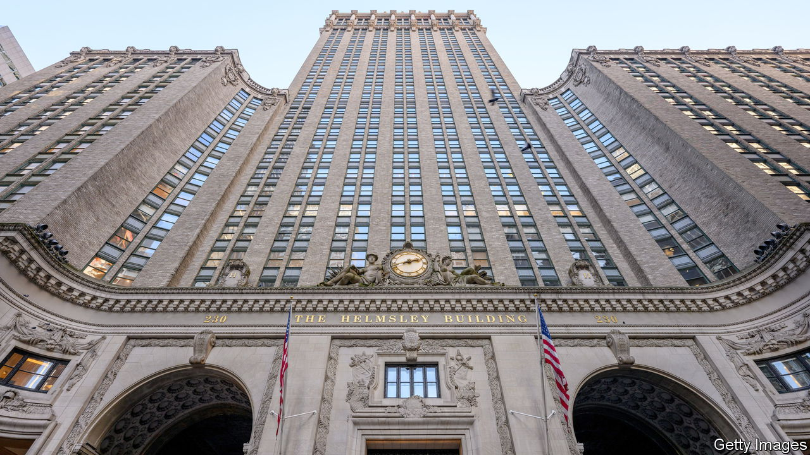

###### American banks

# Is working from home about to spark a financial crisis? 

##### That is the worry. But it is overblown 

 

> Feb 14th 2024 

In midtown manhattan reminders of commercial property’s difficulties are everywhere. On the west side, near Carnegie Hall, stands 1740 Broadway, a 26-storey building that , an investment firm, bought for $605m in 2014—only to default on its mortgage in 2022. Soaring above Grand Central station is the iconic Helmsley building. Its mortgage was recently sent to “special servicing” (it may be restructured or its owner may simply default). As the sun sets, the underlying problem becomes clear:  means fewer tenants. Floors bright with lights, where workers potter about, sit sandwiched between swathes of black.

This is not a new development. Many buildings have stood empty since covid-19 struck. At first, owners hoped to wait out the pandemic, but workers were slow to return, so employers ended up downsizing. Vacancy rates, especially in shabbier buildings, rocketed. Then interest rates rose. Most commercial buildings are financed via five- or ten-year loans. And many of these loans will be refinanced shortly, while rates remain painfully high. Some $1trn in American commercial-property loans will roll over in the next two years, an amount that represents a fifth of the total debt owed on commercial buildings.

Recently a number of office buildings in big cities have traded at less than half their pre-pandemic prices. These sorts of losses will wipe out many owners’ equity, leaving banks to swallow hefty losses of their own. Indeed, three institutions have already been hit hard. In recent weeks New York Community Bank (NYCB), a midsized lender; Aozora Bank, a Japanese institution that hoovered up American commercial-property loans; and Deutsche Pfandbrief, a German outfit with exposure to offices, all reported bad news about their loan books and saw their shares plummet. 

Meanwhile, China’s property crisis is becoming more acute. With domestic portfolios struggling, some Chinese investors, who have bought property all over the globe, may need to raise cash—and could start dumping overseas assets, depressing property values. If consumers start to seriously struggle with rising interest rates on auto loans or credit cards, it is possible more institutions will end up in a similar situation to that of nycb. Little surprise, then, that people are starting to fret that the move to working from home could end up causing a financial disaster. 

It is worth putting these problems into context, however. For a start, the troubles at NYCB really do seem specific to the institution. Although the bank has exposure to New York offices, it in fact wrote down the value of its portfolio of loans on rent-stabilised “multi-family” apartment blocks in the city. These plunged in value after legislation in 2019 restricted the ability of owners to raise rents if an apartment was vacated, or if the landlord made capital improvements. The other lender that specialised in these sorts of loans was Signature Bank, which failed last year (after which some of its assets were bought by NYCB).

Moreover, there is a limit to how big a problem offices can pose, even if the damage to them is severe. The total value of American property (not including farmland) was $66trn at the end of 2022, according to data from Savills, an estate agency. Most of that is residential. Only a quarter is commercial. And commercial property is much more than just offices. It includes retail spaces, which are struggling, but also warehouses, which are in demand as data-centres and distribution points, and multi-family buildings. Offices are therefore worth perhaps $4trn, or about 6% of the total value of property in America.

Between 2007 and 2009 residential real estate in America lost a third of its value. A similar shock today would wipe $16trn from property values. Even if every office building in America somehow lost its entire value, the losses would still be just a quarter of that size. On top of this, lenders are better protected against losses in commercial property than they were against those in the residential sort. Whereas loans for the latter were often close to 100% of a home’s value, even the most ambitious commercial-property loans tend to cover just 75% of a building’s value. 

Bloodshed

The wound inflicted on the financial system by commercial property is best likened to that caused by a slip of a kitchen knife—it is nasty, obvious and painful. Stitches might be required. But it is unlikely to grievously injure the victim.

Nor will the wound fester unnoticed. Because property problems are so visible, regulators are all over them. About half of commercial-property debt is loans from banks (and mainly from smaller ones, since rules discourage large institutions from such lending). The rest is securities or loans from insurers. The Office of the Comptroller of the Currency, a regulator, reportedly advised NYCB to write down the value of some of its loans more aggressively, making them obvious when it reported earnings on January 31st. Across the pond, the European Central Bank has asked banks to set aside extra reserves to cover loan losses in commercial property.

America’s strong economy offers extra protection. Look up at New York’s skyscrapers and it is easy to feel alarmed. But cast your gaze back to street level and you can calm yourself. The streets are bustling. Shops are packed. Restaurants are full. America is on the move, even if it could do with a bandage for that nasty cut. ■


