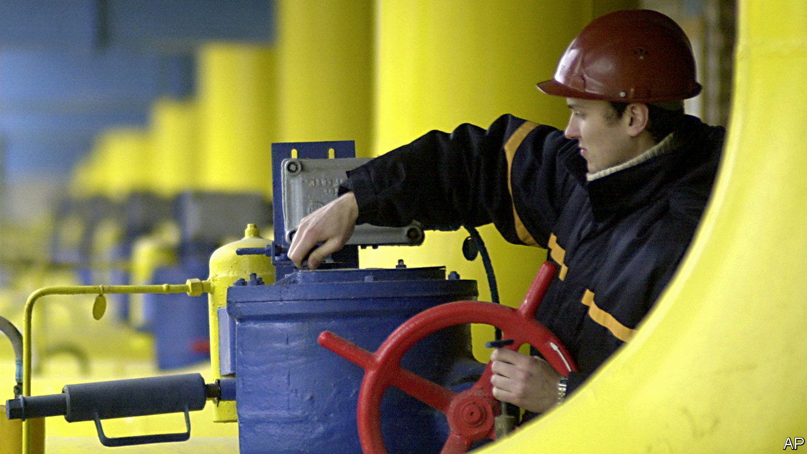

###### Conflict trading

# The Ukraine war offers energy arbitrage opportunities 

##### It also provides a glimpse at the future of European gas supplies 

 

> Feb 15th 2024 

Europe had weathered one winter since Russia’s invasion of Ukraine in 2022. But although gas prices had returned to Earth, they were sure to rise in the colder months to come. Thus if commodity merchants bought at rock-bottom rates in the summer, they could offer future delivery at much higher prices on the forward market. To make the deal work, all they needed was somewhere to store the product. The EU’s underground capacity was almost full; parking the gas in tankers offshore would have been expensive. Their solution was unorthodox: pumping 3bn cubic metres (bcm) of natural gas eastward to Ukraine. 


Stashing hydrocarbons in a war zone might seem ill-advised. Indeed, last spring analysts assumed that companies would require publicly guaranteed war insurance in order to risk such a trade. But by June the spread between summer and winter prices had widened enough that the gamble seemed worthwhile. Ukraine’s generous customs regime for short-term storage, combined with promises that gas would not be requisitioned under martial law, provided traders with extra incentive. The resulting trade helped keep the EU’s reserves stocked throughout this winter, suppressing gas prices across the continent. It also provided healthy profits for the firms involved. Akos Losz of Columbia University estimates that merchants made up to €300m ($320m) from the play.

Now the trade is looking like a test run for Europe’s future energy strategy. Ukraine is home to the continent’s second-largest gas-storage capacity, after Russia, totalling nearly 33bcm. It has more storage space than big economies like Germany, which boasts around 24bcm, and dwarfs that of next-door Poland by a factor of ten. Having mostly been developed as part of the Soviet Union’s energy infrastructure, the facilities massively exceed Ukraine’s domestic needs. Both the EU and the Ukrainian government are keen to put them to work. Denys Shmyhal, Ukraine’s prime minister, has said that he wants to turn his country into Europe’s “gas safe”. Naftogaz, a state-owned energy company, has offered up to half its storage space to European energy firms. Traders are now poised to repeat last year’s trade at bigger volumes this spring, starting from an earlier date.

The firms involved in the trade have kept quiet, partly for security reasons. Trafigura, a commodities giant, is the only one whose involvement has been confirmed, but Naftogaz reports that more than 100 European companies have made use of its storage sites. According to Natasha Fielding of Argus Media, an energy-information firm, these include “large energy companies with trading desks and smaller, local utility firms in eastern Europe”. The latter, she says, could have the most to gain from the arrangement. Countries including Moldova and Slovakia not only lack significant storage capacity of their own, but also remain heavily dependent on Russian gas, which is still delivered through Ukraine under a long-term transit agreement due to expire in December. 

Although Europe’s energy problems have become less acute, storage provides a hedge against future disruption. Ukraine is eyeing the future, too. The country still receives up to $1.5bn a year from Russian companies, which use its pipelines to deliver gas under the existing transit deal. Once that agreement lapses, the government intends to make up some of the shortfall using storage fees paid by Western firms. There is also another consideration for Ukraine’s leaders. The more they can integrate their country’s energy industry with European markets, the more invested the EU will be in their defence. At a time when support from their allies appears shaky, that is worth quite a lot. ■


