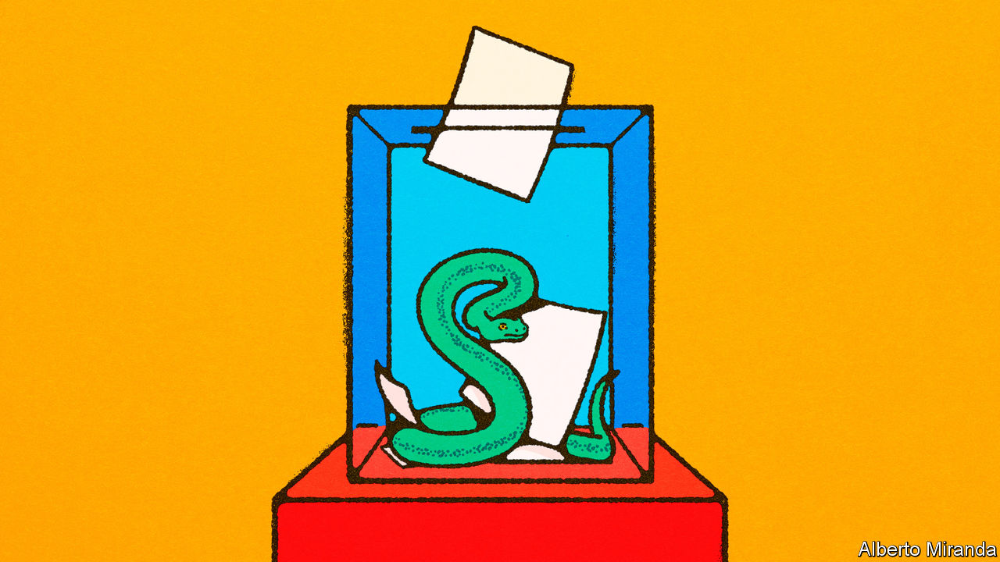
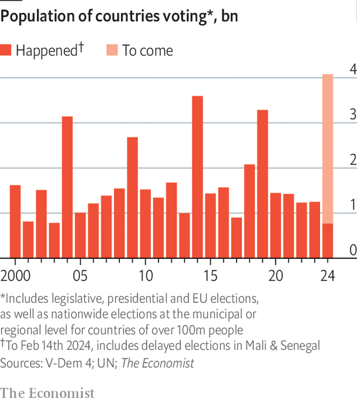
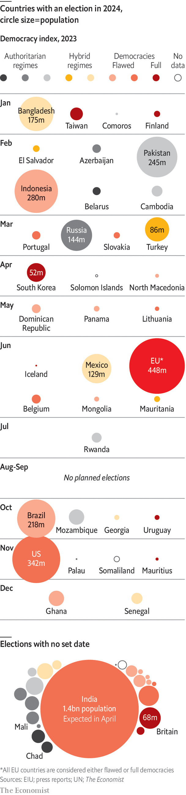

###### Counting the votes

# 2024 is a giant test of nerves for democracy 

##### A warning from election results so far—and what follows in America, Europe and India 

 

> Feb 11th 2024 

AROUND HALF the world’s population, or some 4bn people, live in places that are holding elections this year. These polls will decide who governs over 70 countries. But together they also represent a big test for the health of democratic systems; for over a decade there have been fears that democracy as a political ideal is ailing. By February 14th, when Indonesia went to the polls, we estimate that countries with 770m people had cast ballots (or prevented their citizens from doing so): or roughly 18.5% of the year’s total. That makes it possible to take an initial look at how the 2024 democracy test is going. The short answer is: not particularly well.

In one respect democracy is being modernised: a technological revolution is taking place as short-form videos and group messaging transform political campaigning around the world (artificial intelligence, including “deepfakes”, is visible everywhere but is so far not decisive). Yet in another respect democratic processes are reversing, from Pakistan, where  after a recent dubious poll, to tiny El Salvador. An alarming number of elections are being interfered with.

What do we know so far? Ten countries have held, or suspended, elections. Earlier this month minnows Azerbaijan and El Savador held polls, as did weighty Pakistan. March will feature Russia’s presidential poll (Vladimir Putin will romp to victory in an oh-so-surprising outcome). After that there will probably be votes in vast India in April and then for the European Parliament in June, among others.

The example America sets in November matters more than ever. The presidential contest is of supreme importance: whether this is a year of democratic backsliding depends disproportionately on this vote and the events surrounding it. All eyes will fix on a probable Biden-Trump rematch. 

The election results fall into three camps so far: free-and-fair; fiascos-and-farces and indeterminate. Start with the first category. On  William Lai Ching-te of Taiwan’s Democratic Progressive Party (DPP) was triumphant. China dislikes the DPP because it rejects China’s claims to sovereignty over Taiwan, but despite Chinese threats the electorate was not intimidated. The other squeaky-clean election has been in Finland.

The second category involves fiascoes and farces. Top of it is Pakistan, with its population of over 230m and history of political meddling by the armed forces. The election on February 8th was probably the country’s least clean since the 1980s. The most popular politician, , whose own democratic credentials are questionable, was given three prison sentences in quick succession in January on bogus charges. Polling day was marred by violence and no party secured a majority in the election (see Asia section). In  a poll on January 7th saw Sheikh Hasina’s party scoop up 222 of the 299 seats up for grabs; the main opposition boycotted the election. The country is now in effect a one-party state.

 


In several smaller countries a similar erosion of democracy has taken place. On February 5th  suspended its election, with its president, Macky Sall, once viewed as a defender of liberal values, sliding towards dictatorship. The country has company in the Sahel. Mali was originally due to hold an election on February 4th, which was then suspended last year; the date has passed without the poll being rescheduled. Burkina Faso, Chad and Niger have all recently had coups. On the other side of the Atlantic, on February 4th the “world’s coolest dictator”, El Salvador’s , won a second term. And Azerbaijan’s rigged election on February 7th saw its long-time dictator Ilham Aliyev win over 90% of the votes. He received congratulations from both Mr Putin and China’s leader, Xi Jinping. 

The third category involves indeterminate polls. We put Indonesia in this bucket: the vote appeared clean but the circumstances around the election suggest the country’s democratic character is strained. The outgoing president, Joko Widodo, is attempting to exert dynastic control after bending the constitution to make his son the running-mate of the victor, . There were complaints of state intimidation and other forms of interference during the campaign. Had Mr Prabowo failed to win the first round outright on February 14th, it would actually have been a sign of democratic health. 

 


The idea that democracy is under pressure around the world is hardly new. Our sister organisation, EIU, pulls together a detailed annual democracy index, which has slipped over the past decade. Its 2023 index was released this week and shows autocracies becoming more entrenched (see chart). Using a longer-term index by V-Dem, a research body, the share of countries judged to be electoral democracies soared in the 1990s but has declined slightly in recent years to stand at about 50%. Certain opinion polls show a cohort globally who are sceptical about democracy, especially among the young.

What might explain the further slippage seen so far in 2024? One possibility is technology. A striking feature of most campaigns has been the role of newer tech platforms: TikTok, the Chinese-controlled short-form video app, has about a billion users world-wide and is crucial. In India, where TikTok is banned, YouTube has been displacing Facebook as the platform of choice, while WhatsApp’s voice-note feature allows illiterate people to receive propaganda. Everywhere political discussion has moved onto private messaging groups where the degree of misinformation and orchestration is difficult to ascertain.

It is possible that these shifts favour strongmen and authoritarians, by allowing them to communicate without scrutiny. They also have the resources to manipulate private messaging groups by using armies of proxies and bots to spread fake information. Not all the signals so far in 2024 point that way, however. In both Senegal and Pakistan the authorities suspended the internet and telecoms services before scheduled polls. This suggests that they were actually concerned about losing control of online speech.

Meanwhile a lot of the coercion involves more prosaic tactics. In the past authoritarians eschewed elections, or stuffed ballot boxes. Today they maintain a charade of constitutional democracy and use “lawfare” instead, for example through courts disqualifying opposition candidates. In Bangladesh, Pakistan, Senegal and elsewhere rival politicians have been disbarred by courts in the name of the rule of law. After squashing Senegal’s election plans, Mr Sall spoke of the need for a “national dialogue” to create “conditions for a free, transparent and inclusive election”.

Alongside technology and the rise of lawfare, a final possible explanation for democratic slippage is a more permissive global environment for autocrats as the post-1989 world order comes under strain. With wars raging, the United Nations rendered ineffective by superpower splits and the West focused on trying to restrain China, Iran and Russia, upholding democracy has taken a back seat. In 2021 President Joe Biden held a global democracy summit calling the defence of democracy “the defining challenge of our times”. But America’s officials are stretched. Fresh from his fifth tour of the Middle East in four months Antony Blinken, America’s secretary of state, managed to call Senegal’s president on February 13th. He urged Mr Sall to “restore Senegal’s electoral calendar” and expressed America’s “serious concerns” over events in the country. 

Another 60-odd elections are still in the offing, in countries with 3.4bn people. Some of these will be charades, such as those in Belarus and Russia in the coming weeks. Iran’s poll in March will hardly be democratic: prominent reformist candidates have been banned. But the vote to select the 88-strong Assembly of Experts will be crucial because that body will appoint the successor to Ali Khamenei, the ailing 84-year-old supreme leader. 

Nobody doubts that elections to the European Parliament in June will be free and fair. The main concern there is that hard-right parties, which are already in government or polling above 20% in several European countries, may have a breakthrough success. But even in free and fair elections, incumbents can make the path to victory easier for their chosen successors.  holds polls in June. Andrés Manuel López Obrador, the outgoing president, is intent on helping his preferred successor, Claudia Sheinbaum, with unaffordable pre-election handouts to voters. She is likely to win. But so far Mexico’s constitution is holding up against the populist threat Mr López Obrador has posed. 

The bumpy road ahead

Two huge elections will be acid tests of the state of democracy. In , the most populous democracy of all, Narendra Modi is on track for a third term as prime minister. He is a popular politician who oversees a fast-growing economy. But the campaign has seen the rule of law stretched: journalists have been hounded, Muslims harassed and opposition politicians subject to corruption probes and arrest. After the result in May, the world may discover how much further he plans to erode India’s democratic norms and institutions. 

The other country to watch, inevitably, is . Although Mr Biden has repaired some of the damage done to the country’s reputation in recent years, it is no longer the beacon of liberty and bastion of democracy it once was. Donald Trump’s attacks on the rule of law and the judiciary come as a multitude of cases against him are litigated. If he wins in November, questions will grow concerning the ability of America’s institutions to withstand a second term under him. And if Mr Trump is prepared to mount sustained campaigns against democratic checks and balances at home, he would almost certainly abandon criticism of autocrats abroad. Whether or not he triumphs, democracy’s defenders face a tough task ahead. This year is critical for democracy, and so far developments are concerning. That means that next year could be an even greater ordeal. ■

