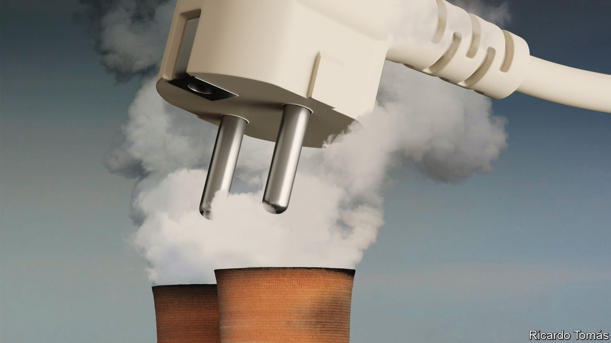

###### A shock to the system

# A new answer to the biggest climate conundrum 

##### Will electrification of industry live up to its promise? 

 

> Feb 15th 2024 

One of the more robust reasons for  comes from two simple facts and a delightful kicker. The facts are that electricity is a wonderfully versatile way of powering all sorts of things, and that lots of technologies can now generate it without emitting greenhouse gases. The kicker is that one of these technologies, , is both very cheap and getting cheaper.

This suggests a simple strategy. Make the grid emissions-free and do everything you can with electricity. The obstacles to the first part of this nostrum—which include restricted access to capital in poor countries, constrained grid capacity and a lack of storage to offset fluctuating supply—are no less daunting for their familiarity. But they are increasingly the target of policy and investment. Last year, for example, the world spent more on new stationary electricity-storage capacity than it did on constructing nuclear-power stations. 

To get the most out of all these efforts, though, electricity needs to become even more versatile. One of the key challenges is providing heat to . If you want to dry, cure, melt, smelt, set, distil, reform or otherwise change the state of something, as  so often does, heat tends to be involved. In 2016 providing such “process heat” produced almost seven gigatonnes of carbon-dioxide emissions, roughly 20% of all those from fossil fuels. 

The fact that electricity does not have much of a record of providing heat has led to the idea that these emissions are “hard to abate”. This is taken to mean that sorting them out needs new kinds of infrastructure. Carbon dioxide produced at the plant where the fuel is burned could be pumped into an underground repository, a process called carbon capture and storage (CCS); natural gas could be replaced by hydrogen. In the meantime, natural gas would continue to be used as a “bridge fuel” to a future both greener but also, alas, far off. 

This presumption is now coming under attack. Innovative entrepreneurs and imaginative incumbents are finding ways to turn electricity into useful forms of heat, from scaled-up heat pumps of the sort used in some houses to space-age containers filled with white-hot molten tin and graphite plumbing.

 These technologies offer advantages in and of themselves. Heat from renewable or nuclear sources is safe from volatile fossil-fuel prices. In general, heat pumps are a lot more energy-efficient than combustion. Systems that store heat for later use, sometimes called “thermal batteries”, can be charged up when electricity is cheap, which is good both for owners and grid operators who increasingly want demand that can be managed.

The biggest advantage, though, is that when industries use clean electricity they slash their carbon-dioxide emissions. If the world is to keep global warming well below 2°C, as it very much should, that sort of slashing is mandatory.

Unfortunately, this advantage reaches a company’s balance-sheet only when industries come under some sort of carbon-pricing scheme. Such schemes have tended to concentrate on electricity generation. One reason for this is that, unlike electricity-generating companies, industrial producers compete in global markets. If their goods carry a charge for the carbon emitted in making them, these producers will be at a disadvantage to their untaxed competitors. 

The obvious solution is a system of tariffs that level the playing-field: what is called a carbon border-adjustment mechanism. Such measures risk being captured by incumbents and becoming a channel for protectionism. But that risk is worth taking. If carbon prices are to cover more of the global economy, sorting out these trade effects well become necessary. In addition, well-designed adjustment mechanisms provide an incentive for industries outside the pricing system to decarbonise.

Pricing carbon emissions from industrial heat would help a phalanx of innovative technologies whose benefits to society are currently unrewarded. It would be bad news for the natural-gas suppliers that dominate the provision of heat. The effect on decarbonisation by way of CCS, either at the plants where heat is used or at the facilities which turn natural gas and steam into hydrogen, is harder to predict.

Worth a plug

Progress on CCS has been uninspiring, to put it mildly. Widely discussed for decades it is still, in operational terms, a rarity. It has not seen the sort of innovative ferment that electrification is exhibiting. Many climate advocates see it as an excuse for inaction that locks in fossil fuels as the default option.

CCS may, for all that, have a vital role to play, and sincere proponents of its potential should welcome the spur to innovation that increased uptake of electrical options will provide. It seems highly likely that some applications and some forms of industrial cluster will be best served by CCS or hydrogen. Competition is the best way to find out which. ■


