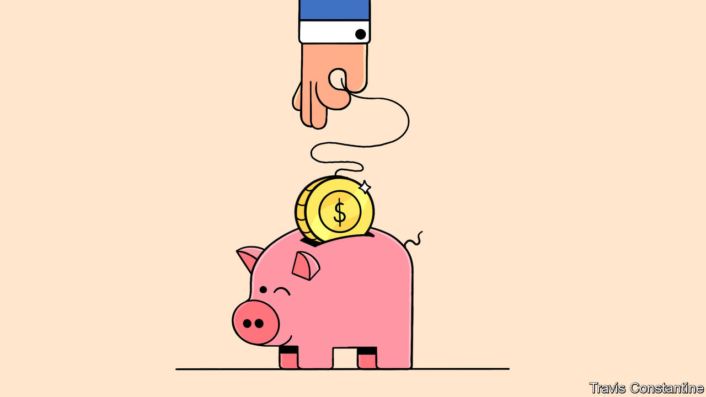

###### America’s shadow central banks

# Another bank subsidy America should kill off 

##### The Federal Home Loan Banks offer loans to Wall Street that are too cheap 

 

> Feb 13th 2024 

THE SLOW-BURNING crisis in America’s small- and medium-sized banks has entered its next phase. Nearly a year on from  (SVB), New York Community Bank  since it announced on January 31st that it was setting aside $552m to cover troubled loans secured against commercial real estate. Last spring the bank was a saviour of sorts, buying $38bn of assets from Signature Bank,  around the same time as SVB. Now it is the first example of a new set of problems facing the industry.

The good news is that commercial real estate is a smaller problem for banks than the losses on securities which brought down SVB and others. Lenders are protected by low loan-to-value ratios and not all commercial buildings are in trouble: it is rent-stabilised buildings and old, energy-inefficient office blocks that are suffering big write-downs. Banks that struggle will be those that are unusually exposed, or for which these losses are the last straw. 

Yet the new problems cast light on a deeper, structural problem with America’s financial sector: the role of the 11 Federal Home Loan Banks (FHLBs), a network of privately owned but government-sponsored lenders to banks. Many banks fund commercial real-estate investments with FHLB loans; as interest rates have risen and the financial system has wobbled, the FHLBs’ role has further grown in importance. New York Community Bank has long relied on loans from FHLBs and as of December 31st they funded nearly 20% of its $116bn balance-sheet.

The government started the FHLBs in the 1930s with the goal of promoting homeownership by lending against housing assets. With the government’s encouragement, the system has since turned into something resembling a central bank, providing vast liquidity to the financial system during moments of stress. In the spring of 2023 “advances” to its members—which include life insurers and others as well as banks—passed $1trn for the first time since the global financial crisis, up from just $335bn at the end of 2021. Today advances are about $800bn, incorporating both the run-of-the-mill lending and more recent demand for crisis liquidity. 

Ample liquidity sounds like a good thing, especially in a pinch. One problem is that it comes too cheap. The FHLBs fund their loans by selling their debt to investors (after the Treasury, they are the world’s second-biggest issuers of dollar-denominated bonds). They are owned by their member institutions but their debt is presumed by investors to be all but guaranteed by the government. They are also exempt from some taxes, among other privileges. The result is their debt trades at a similar yield to Treasuries, allowing the FHLBs to lend at below-market interest rates to banks, which also share in the FHLBs’ profits. In all the FHLBs dole out an implicit subsidy that researchers valued at around $5.5bn in 2022, when the FHLBs were smaller than they are today.

To the system’s cheerleaders the subsidy, some of which is passed on to everyday borrowers, looks like money for nothing. The FHLBs have never called on the public purse directly, in part because they only make secured loans. The trouble is that, in a crisis, the availability of FHLB funding probably postpones the moment at which banks in trouble turn to the Federal Reserve. Banks dislike going cap in hand to the Fed, which is regarded as a sign of weakness, when FHLB loans, which carry no such stigma, are available. Even rock-solid banks borrow from the FHLBs as a matter of course, in part because doing so brings some regulatory advantages.

But keeping out the Fed has consequences. An asset pledged as security cannot later be sold by regulators to compensate remaining depositors, so emergency lending to a bank can raise the costs of winding it up should it fail. As a result, central banks are supposed to lend only cautiously and at a penalty interest rate. The FHLBs appear to lend freely. SVB, as it gradually lost depositors in 2022, borrowed $15bn from the FHLB system. First Republic, another bank that failed last year, had borrowed $28bn as of March 31st. Had those banks turned to the Fed sooner, red flags might have gone up—in time, perhaps, to forestall the crisis that later struck.

Many politicians approve of the FHLBs because they must use 10% of their earnings to fund affordable housing initiatives (and have volunteered more). But the government can fund worthwhile projects directly. The FHLBs’ privileged status increasingly looks like a relic and the system’s regulators are pondering reforms to the system. They should work with Congress to remove the various taxpayer-backed privileges FHLBs enjoy and allow market forces to determine their role. Central banking should be left to the central bank. ■

