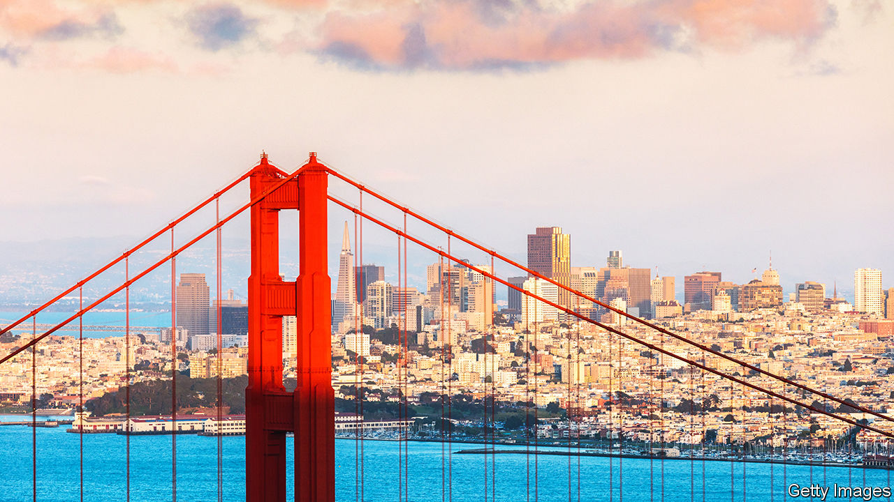

###### Silicon rally

# As San Francisco builds the future of technology, can it rebuild itself? 

##### People feared a doom loop. Reality has been more surprising 

 

> Feb 15th 2024 

San Francisco has long been a byword for . Even as its techies minted money and transformed the world, its government was incapable of providing residents with basic shelter and security. Homelessness, drug overdoses and property crime were rife. Then . The  threatened to sound the city’s death knell, as the tech industry took to its heels. As things have turned out, however, San Francisco has become host to an artificial-intelligence boom. Having been granted this piece of good fortune, the city must seize the opportunity to reform. This might be the best chance it gets. 

Only a few years ago social disorder, toxic politics, eye-watering housing costs and the pandemic were driving people away. Venture capitalists (VCs) were splashing more of their cash beyond the Bay Area. Tech workers abandoned their offices, and sometimes the city entirely. As the downtown streets emptied of workers, homelessness and public drug use became more conspicuous and intrusive. “Retail for lease” signs covered the city like wallpaper.

People keen to write San Francisco’s obituary warned of a “doom loop”. Abandoned downtown property would lead to budget cuts and the erosion of public services, which would in turn accelerate the exodus. Many people worried that the city could go the way of Detroit, which suffered a painful bust when America’s car industry started to build more plants in the suburbs and the South.

But the power of agglomeration is such that San Francisco has been given a fresh lease on life. As we report this week, the strides in artificial intelligence (AI) have only  to be the innovation capital of the world. Its proximity to Stanford and the University of California, Berkeley, two ai centres of excellence, has helped infuse its startup scene with companies that deal in the technology. No other place in the world has as many AI firms or as much tech talent: from Openai and Anthropic to Databricks and Scale ai, almost all the big startups are based in the Bay Area. Venture funding is on the rise again, and last year the vast majority of funding for firms in the region went to startups in the city itself. Despite San Francisco’s problems, and there are many, it remains a magnet for capital and talent. 

All this offers the city an opportunity to fix how it is run. It helps that voters are fed up with their city’s inane politics (owing to oppressive permit rules, the cost of one public toilet ballooned to $1.7m). From their posh neighbourhoods and their Silicon Valley headquarters, techies used to be content to watch San Francisco putrefy. Today, by contrast, the wealthy who live in the city feel a need to enter the political fray. 

The first signs that San Francisco’s residents were revolting against the status quo came in 2022 when voters ousted three members of their school board and recalled their ultra-progressive district attorney. They are not done yet. Local elections this year will be overshadowed by national races, obviously, but city contests in March and November will offer voters in San Francisco the prospect of real change. 

Moderate Democrats, such as London Breed, the current mayor, are often stymied by left-wingers who resist building houses, cutting business taxes, shrinking the bloated budget or funding the police. Electing more moderates to the board of supervisors, San Francisco’s name for the city council, could make all those things easier to accomplish. 

Even if sensible folk get into office, making big changes will be hard. The local nimby movement is entrenched, and corruption has long been a problem. And yet second chances are rare. Young people want to live and work in the City by the Bay and to be part of a technological revolution that is changing the world. San Francisco can either capitalise on their excitement and set about fixing its problems—or sink back into complacency and squander an unforeseen opportunity. ■

