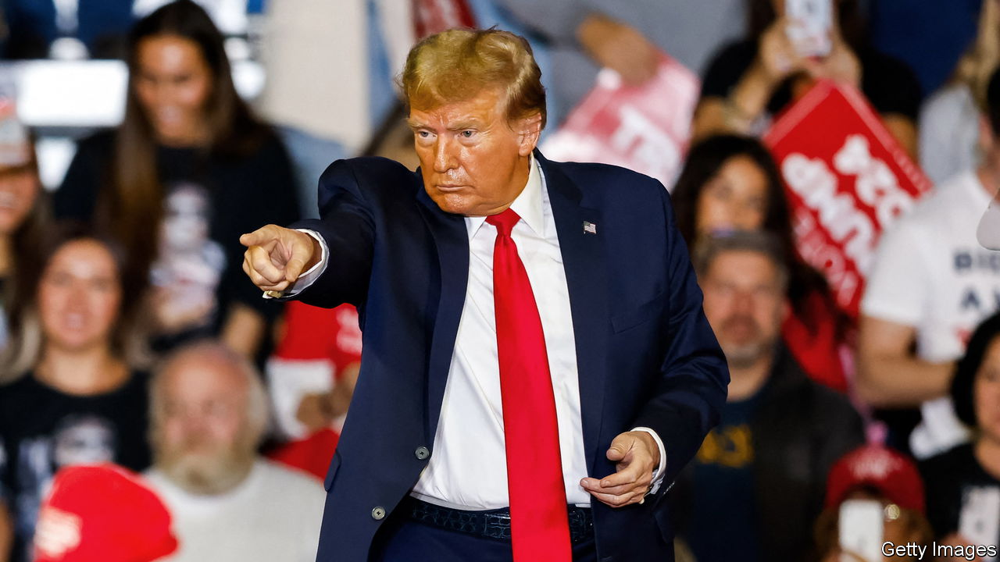

###### Prepare for President Trump

# Europe must hurry to defend itself against Russia—and Donald Trump 

##### The ex-president’s invitation to Vladimir Putin to attack American allies is an assault on NATO. Ultimately, that is bad for America 

 

> Feb 12th 2024 

If donald trump , which version will it be? Tough-love Trump who  to spend more on defence, reinforced nato troops on the eastern flank and began to arm Ukraine; or  who will act on his threats to sabotage nato? Expect sabotage.

On February 10th the near-certain Republican presidential nominee recounted how the leader of a “big country” once asked him whether he would defend an ally against the Russians, even if it was “delinquent”, by failing to spend . “No, I would not protect you,” Mr Trump recalled saying. “In fact, I would encourage them to do whatever the hell they want.”

Even if this was hyperbole, as his defenders claim, exhorting Russia to attack any ally is an assault on the sacred promise of nato’s Article 5: that an attack on one is an attack on all; and that an attack on even the smallest ally is, in effect, an attack on America. Mr Trump’s outburst is all the more dangerous now that Russia, while rearming at a furious pace, is pushing hard against ammunition-starved Ukrainian forces. A growing number of European governments believe they will face the real threat of a Russian attack in the coming years. 

nato has kept its members safe since its founding in 1949, and sustained the spread of democracy in Europe. It keeps attracting members, most recently Finland and, soon, Sweden. But without Article 5 the alliance is worth little. Merely casting doubt erodes deterrence and thereby raises the risk of war.

Mr Trump is scarcely the first president to complain of freeriding allies—and rightly so. But he is turning a democratic alliance into a mobster’s racket: no money, no protection. Mr Trump claims his bluntness succeeded in getting allies to spend billions more on their defence. The bigger impulse has been the looming threat from Russia. Defence spending started to rise before Mr Trump’s time, and has continued after it. The number of allies making the 2% target rose from just three in 2014 to 11 last year; 18 of the 31 allies are due to reach it this year. 

Mr Trump’s baleful influence is affecting Congress. A bill to renew military and civilian aid to Ukraine (and to help Israel and other allies) has belatedly cleared the Senate but may be killed by Republicans in the House. Legislation requiring the Senate to approve an actual American withdrawal from nato would not be much of a restraint. Congress cannot stop a president from, say, withdrawing American troops from Europe or simply refusing to defend allies under attack. None of this is good for America.

Europeans must . Rather than complain about Mr Trump, they should hurry to meet the 2% target and then raise it sharply: 3% of GDP is probably what is required to fulfil nato’s existing defence plans; without America, spending would have to be higher. America devoted nearly 3.5% of GDP to defence last year. Under-prepared Europeans face a more immediate threat.

Their agenda is daunting. They will need to invest in the many things that America provides at scale, from ammunition to transport and refuelling aircraft, command-and-control systems, satellites, drones and more. Europeans must also spend better, by buying more kit jointly and integrating their defence industries. They will have to think how to take over nato‘s structures if America leaves (while holding open the possibility that it might rejoin). Germany’s finance minister, Christian Lindner, has raised the most sensitive issue: how to preserve nuclear deterrence without America’s umbrella. That would probably require new guarantees from Britain and France, which hold 500 nuclear warheads between them, against nearly 6,000 for Russia.

Nothing could make up for the withdrawal of American power. But rapid rearmament serves three vital purposes: it strengthens Europe’s ability to help Ukraine and deter Russia; proves to Mr Trump that nato is a good deal for America; and creates a hedge should he turn his back on America’s allies. ■

