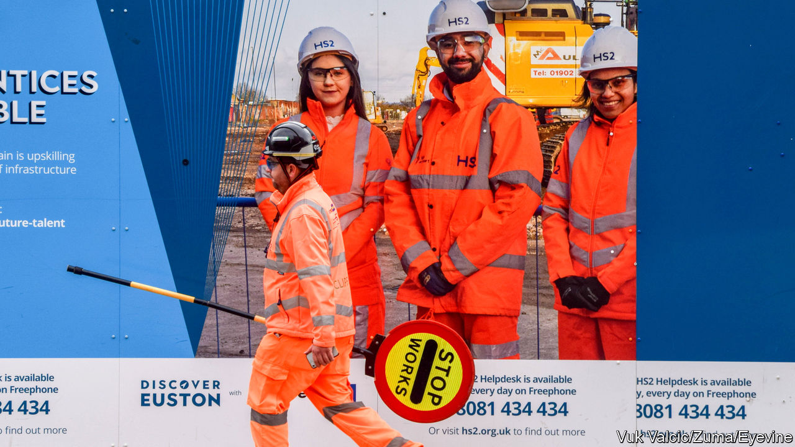

###### The ur-snafu

# How not to do a megaproject 

##### The lessons of HS2 for Britain and beyond 

 

> Feb 15th 2024 

THE LIST of the world’s  is long. The Berlin-Brandenburg Airport  (seven) that Germans joked it required a new tense, the impossible future. A high-speed train-line between Los Angeles and San Francisco was first proposed in 2008; so far $9.8bn has been spent and not a single track laid. But Britain has an entry that will prove hard to beat.

High-Speed 2 (HS2) was supposed to be a 540-km Y-shaped railway linking England’s biggest cities. At its inception in 2010, proponents from first Labour- and then Conservative-led governments argued that it would cut journey times, increase rail capacity and raise productivity in the north. Those plans proved hopelessly optimistic. As costs soared, ministers hacked off first one and then another branch of the Y to save money.

The surviving rump line, which will run from west London to Birmingham, will achieve the unusual distinction of being both eye-wateringly expensive—it is expected to cost almost £300m ($376m) for every kilometre of track—and largely pointless. The line, which is due to be operating in the early 2030s, will slightly speed up journeys between two cities that are already well-connected. But services north of Birmingham will actually be slower (high-speed trains will be unsuited to the old tracks and will have to slow down to go around corners). Capacity will be reduced, too, because the new trains will have to be split in half to serve older stations. 

Sir Keir Starmer, the Labour leader who is likely to become prime minister following an election later this year, has promised to launch a public inquiry into the mess. That would be another waste of time and money. What he should do next is clear; so, too, are the lessons of HS2 for his ambitions to upgrade Britain’s .

This newspaper has argued that the line to Manchester . That would still be a sensible goal, given that passenger demand is only set to rise. Sir Keir is understandably nervous about making spending commitments ahead of the election, but he should at least promise to complete the section of track from Birmingham to Crewe. That would ease transport problems in the North at little extra cost. 

As for the lessons to be drawn from the HS2 fiasco, three stand out. The first is to change the way Parliament legislates for big projects. Britain’s current approach allows local councils to hold national schemes to ransom. HS2 has had to obtain more than 8,000 local planning consents; councils have taken it to court more than 20 times. Most of the line has been buried in expensive tunnels or hidden in cuttings to spare NIMBYs the horror of seeing a train. Passengers will have “meaningful” views for less than ten minutes in a 45-minute journey.

Sir Keir should look to France, which has built an impressive high-speed rail network. There, national infrastructure projects are granted sweeping planning powers; in return the government adopts an efficient, standardised approach to compensating losers. Britain’s system costs much more, and still leaves everyone unhappy. 

The second lesson from HS2 is that Labour should raise the bar to constant political fiddling, which drives up construction costs. Rishi Sunak, the prime minister, took the latest decision to stop the line just north of Birmingham at the Tory party conference last October. Overturning 15 years of cross-party consensus on HS2 on the basis of a rushed decision in a hotel room is a ludicrous way for an advanced economy to make long-term infrastructure decisions. Once big projects are agreed, a vote in Parliament should be required to make big changes. 

A predictable pipeline of projects would help with the third lesson of HS2: that the British state lacks engineering expertise. Not long ago Britain was seen as having the competence needed to pull off big projects. But the public body charged with building the high-speed line botched vital early contracts and has struggled to attract and retain talent. HS2 has become a disaster. Its legacy should be to ensure that it is a one-off. ■

