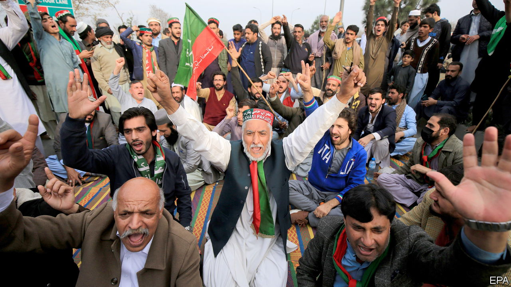

###### Decline and fall

# Pakistan is out of friends and out of money 

##### A botched election and an economic crisis show how low it has fallen 

 

> Feb 14th 2024 

PAKISTAN’S ELECTION on February 8th featured state-of-the-art avatars and TikTok videos, but the question it poses evokes an old theme. How long can the  continue before it , outside intervention or—hope against hope—political renewal? 

For decades the generals have ruled nuclear-armed  directly or via a stage-managed democracy featuring a recurring cast of corrupt dynastic parties (and the occasional political disrupter). The main political clans agreed to back a new government on February 13th. Unfortunately, after a rigged vote, it begins plagued by illegitimacy and a mounting financial crisis. 

The army prefers this shabby outcome. It fears that, if it cedes control of politics, it will forfeit its own economic privileges, and trigger instability that leaves the country vulnerable at home and abroad. Yet today’s course involves an inexorable decline that may ultimately lead to the very same outcome.

The  before any votes were cast. Pakistan’s most popular politician, Imran Khan, a celebrity ex-cricketer turned rabble-rouser, was imprisoned on bogus charges at the army’s behest before the poll, even though he had at one time worked with the generals. Independent candidates backed by his supporters won 35% of the contested seats all the same. That was impressive, but it was not a majority.

Instead the new, army-sponsored government will be backed by those two political clans, the Sharifs and the Bhuttos (their parties are, respectively, the Pakistan Muslim League-Nawaz and the Pakistan People’s Party, and together won 49% of contested seats). The compromise prime minister, Shehbaz Sharif, promises “to save the country from political instability”.

Is that possible? One scenario is that Mr Khan’s young, often urban and now-enraged supporters rise up in protest at their exclusion. After his arrest in May 2023 they stormed military buildings in Lahore. Another is that the Pakistani Taliban, a local variant of the militant movement, takes advantage of the political turmoil and stirs up further violence. 

Yet even if Mr Sharif’s government can keep control of the streets, it faces financial chaos. In order to fund its trade deficit and meet debt repayments to foreigners, Pakistan needs to find $20bn-30bn of hard currency every year. It has less than $10bn of reserves, and its dollar bonds trade at 66 cents on the dollar, indicating a high chance of default. The best Pakistan can hope for is yet another short-term lifeline from the imf.

Once Pakistan could have looked to outside benefactors for cash. Its 170 nuclear warheads mean that it will never be a strategic afterthought. But America is less interested in Pakistan than it used to be, following the wind-down of the war on terror and its exit from neighbouring Afghanistan. China remains Pakistan’s “eternal friend” but even its state capitalists have grown tired of burning money on infrastructure there. Saudi Arabia, another ally, is focused on modernising at home and in the Middle East and with India. In the long run a semi-failed state in Pakistan could become India’s problem, but for the time being the government of Narendra Modi prefers to focus on its country’s own national renewal.

Short of a revolution, only the army and the elites can alter Pakistan’s path. Military officers enjoy status, land grants and business opportunities, but also see themselves as principled guardians against chaos. In fact, they are agents of decline. Twenty years ago Pakistan’s economy was 18% the size of India’s; now that figure is only 9%. India’s stockmarket is 137 times bigger than Pakistan’s. Both India and Bangladesh have pulled far ahead in terms of GDP per person. 

A lot of ruin

The need for a deeper political reset is more urgent than ever. Even the army brass should grasp that, on today’s course, they will have less money to pay for soldiers and weapons—and less money to steal. Their immediate withdrawal from politics might cause mayhem, because Pakistan’s institutions and parties have been infantilised. The change is so profound that it will require a new national consensus on creating independent institutions that can embrace clean politics and economic reform. Pakistan’s army and its civilian elites need to engineer such a process, not profit from their country’s decay. ■

