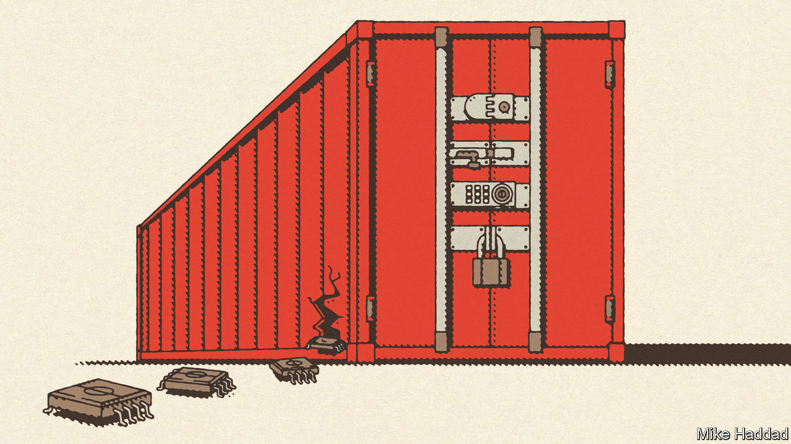
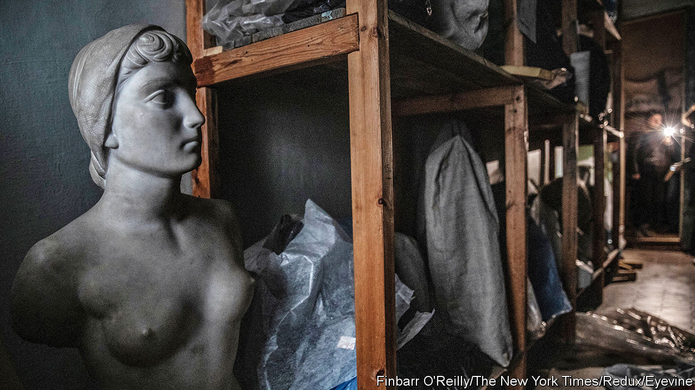
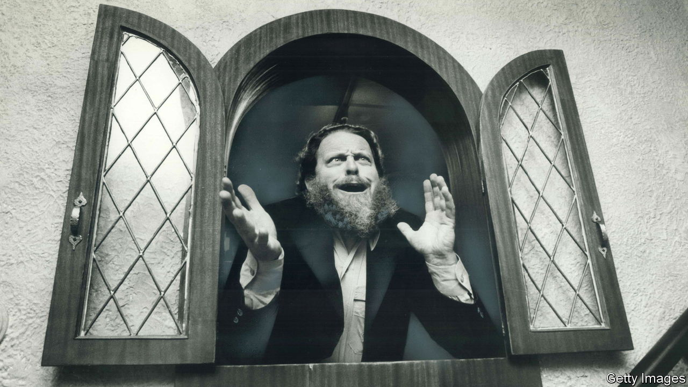

###### On export controls on China, charter schools, council tax, Ukraine, DEI, Peter Schickele, common sense

# Letters to the editor 

##### A selection of correspondence 

 

> Feb 15th 2024 


Chips and China

 contends that technology controls on China are ineffective and counter-productive (“”, January 27th). I take a more positive view. The purpose of export controls is to raise costs to competitors by impeding access to better technologies. Those who impose and implement such controls are well aware that countries subject to them try to circumvent them through smuggling, buying substitutes from alternative suppliers, or developing replacement products. These activities are costly. Smuggling is a poor substitute for having an established arrangement with a supplier. For products that need a steady source of chips, it is impossible to guarantee a secure supply if one relies on smuggling. The current embargo on microchips to Russia has had a notable impact on Russian arms production even as the Russian government has sought to purchase chips illegally.

During the cold war, export controls caused the Soviet Union to invest heavily in inferior electronics, diverting resources that could have gone to other uses. In the case of China, developing alternative chip-manufacturing equipment or cutting-edge microchips will be difficult, especially when Chinese companies and universities are hindered from participating in the free flow of ideas and technologies. China has many capable people, but when confined to collaborating solely with Chinese colleagues, they do not fully share in the developments taking place elsewhere. Moreover, China had pursued policies to develop its own technologies in these areas long before the embargoes. Being cut off from collaboration with Western companies is unlikely to make its efforts more successful. 

The article notes that Nvidia will lose sales because of the controls. Many of the sales of Nvidia chips to China go into products that are then exported by China back to the rest of the world. One of the reasons the controls were imposed was to diversify suppliers of these products to Western markets. Many of Nvidia’s chip sales will not disappear; they will go to countries that will pick up the assembly operations that used to take place in China.

In short,  is wrong to say that controls are ineffective and counter- productive. They are leaky and do not preclude China from developing alternatives, but they impose costs that are much higher for China than for America and its allies.

Dr Keith Crane

Senior economist

RAND


 


School choice

Your leader on charter schools overlooked a big factor influencing the educational effectiveness of public schools in America (“”, February 3rd). The overwhelming majority of American children are assigned to one local neighbourhood school based on their address, without a single tuition-free alternative. Although some K-12 students may be able to choose a “magnet” school instead, it will still be managed (and often mismanaged) by the same school district that operates their local school and all of the publicly funded schools in that geographic area. Charter schools, which are publicly funded schools authorised and regulated by state or local authorities, do not have students assigned to them, and their students are free to return to their traditional assigned school at any time.

Running a successful school requires persistent hard work, difficult choices and often uncomfortable conversations. Which organisation has the greater incentive to succeed in that difficult work? The traditional school, whose student admissions (and the funding per-student it represents) is virtually guaranteed, regardless of results? Or the school that must strive to meet its students’ needs, or risk losing them and the public funding that came with them?

James Mills


 


Is the council tax unfair?

Regarding Britain’s council tax, or property tax (“”, January 27th), councils are necessarily local, and it makes sense for the cost of the services they provide to be borne locally. So what if a dwelling of a particular value attracts significantly less council tax in one council than another? So what if one council’s property prices have risen four times faster than another council’s? What is relevant is whether there have been disproportionate price rises of the properties within each council. By all means revalue everything every ten years, but this is not a fundamental issue.

Moreover, a family of four in a £2m ($2.5m) “mansion” uses no more (and probably much less) council services than a family of four in a £250,000 semi-detached. A direct correlation between property values and council tax is both nonsensical and unreasonable.

Nick Hill


 


A future for Ukrainian art

Thank you for highlighting the extensive plunder and destruction of Ukrainian art carried out by Russian forces (“”, January 13th). Like numerous autocrats before him, Vladimir Putin understands the significant influence that culture and language have in strengthening a nation’s identity. This is why artists, writers, journalists and dissidents are often the first to be targeted in times of war.


Although it is probably true that, “unless Ukraine wins the war, there is no way to recover what Russia has looted,” please note that amid the dangers and challenges, new Ukrainian art continues to be created. A Ukraine National Pavilion will be at the Venice Biennale, and our organisation is partnering with the curators. PEN America’s Artists at Risk Connection has provided financial and other support to nearly 500 Ukrainian visual artists whose lives and livelihoods have been impacted by the conflict.


Art has the potential to preserve memories, translate emotions and ideas and foster open dialogue. It can ignite protests and kindle dreams. As long as art exists, there remains hope for a brighter future.

Julie Trébault 

Director

Artists at Risk Connection (ARC)

PEN America


 


The neuro basis of bias

As a neurobiologist, I endorse fully the letter () from Scott Simmons about the hopeless mismanagement of diversity, equity and inclusion. I hope that it is read meticulously by the leaders of all institutions, and above all the heads of human-resources departments.

The letter should be a wake-up call for bosses to take a mandatory course in the neurobiology of behaviour, instead of aping mindlessly the unscientific mantras of DEI. Any programme that deals with human conduct and does not take brain realities, as expressed in human conduct, into account is doomed to fail. 

Semir Zeki

Professor of neuroaesthetics

University College London

 


P.D.Q. Bach

As well as being a musical satirist, Peter Schickele was, perhaps inadvertently, an effective teacher in the history of music (, February 3rd). I first heard of him during my studies at university when I took a course on music appreciation (known to students as “name that tune”). The professor played for us a recording of Schickele doing colour commentary on a performance of Beethoven’s 5th symphony. It was pointed out to us that Schickele’s astounded remarks indicated just those aspects of Beethoven’s music that shocked his contemporary listeners and made it revolutionary. 

John Fox


 


Start making sense

I enjoyed the article on researching common sense, but I thought the definition was incomplete (“”, January 20th). For many of us, common sense isn’t related so much to factual information (a triangle has three sides) as it is to behaviour, specifically, our ability to understand and employ the norms of successful life. 

Common sense says don’t let your children play in traffic. Don’t laugh out loud at your boss’s big idea. Don’t taunt a bear in the woods. Be very polite to the proctologist. And so on. How do we measure that ability?

Carl Sessions Stepp

Emeritus professor at the University of Maryland


I am reminded of an old saying. Two of the most common things are rare: common sense and common courtesy.

Philip Rakita


