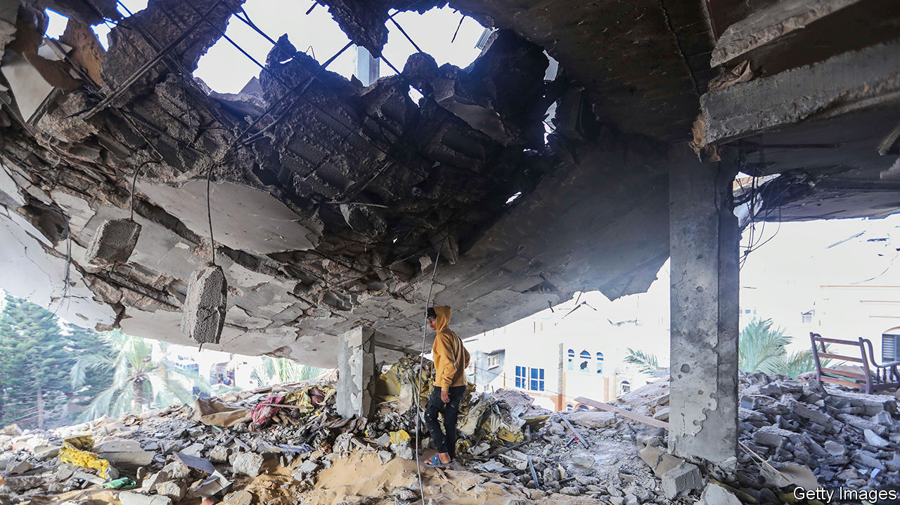
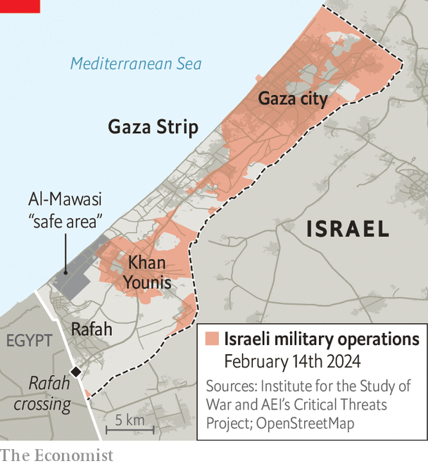

###### The next phase of the Gaza war

# If Israel invades, hell looms in Rafah 

##### Binyamin Netanyahu wants to attack now. His generals don’t 

 

> Feb 13th 2024 

AS CEASEFIRE talks bog down in the Middle East, the threat is building of a new and devastating level of violence. On February 14th Binyamin Netanyahu, Israel’s prime minister, said he would not send a team to negotiate a truce in Gaza in exchange for the release of hostages by Hamas, citing the group’s “delusional demands”. Simultaneously fears have been rising for days of a massive Israeli army invasion of Rafah, Gaza’s southernmost city that is hemmed along the border with Egypt, where 1m or more Palestinians are located. Any expansion of the fighting will probably have devastating consequences for civilians, detonate Israel’s relationship with Egypt and exhaust American patience. Yet Mr Netanyahu is intent on escalating, insisting that it may be necessary in order to achieve “total victory”. 

Mr Netanyahu’s emphasis on Rafah is in part an attempt to boost his standing by promising Israelis a decisive result in the war. On February 12th the embattled prime minister was given a fillip when commandos rescued two hostages from the Al-Shabura neighbourhood in Rafah (diversionary bombardments killed 74 Palestinians). “Only continued military pressure…will bring about the relief of all our hostages,” he said afterwards. Yet the focus on Rafah is not just about Mr Netanyahu’s self-preservation. Within the Israeli security establishment there is an acknowledgment of the benefits of taking on Hamas there, in its last major stronghold, and of gaining control of the border with Egypt, the main channel for arms-smuggling.


In the assessment of security officials, Hamas is on the back foot. The movement’s leader in Gaza, Yahya Sinwar, is the subject of a manhunt in Khan Younis, the largest city in southern Gaza. He is understood to be increasingly incapable of communicating with his men. 

The group has been trying to re-establish its presence in Gaza city, in the north, by putting police on the streets and paying civil servants. Yet Israeli intelligence officials believe Hamas leaders worry they are losing control over the population. More than 10,000 Hamas members are believed to have been killed and thousands more wounded or captured. The Israel Defence Forces (IDF) says around 18 of Hamas’s 24 battalions have been “dismantled”. The remaining fighters are in “guerrilla mode” and are losing their ability to rule Gaza. 

Trapped in the crossfire

Attacking Rafah would squeeze Hamas further, yet the toll could be huge. The generals know that there may be no effective way of moving civilians out of harm’s way. In the previous stages of the war, Israel urged residents of Gaza city and Khan Younis to move south, away from the war zone. Now it would have to get those who had fled to Rafah to move again, this time to the shrinking “safe areas”—makeshift tent-cities on the coast (see map). 

 


Neighbouring Egypt is desperate to avoid the war spilling into its territory. It is refusing to allow many refugees to leave Gaza and has warned Israel a war in the border area could have “dire consequences”. Egyptian officials have threatened to suspend a peace treaty signed with Israel in 1979 if desperate Palestinians surge into Egypt, according to the .

The prospect of high civilian casualties has Israel’s allies anxious. On February 12th President Joe Biden said that “a major military operation in Rafah should not proceed without a credible plan for ensuring the safety and support of more than 1m people sheltering there”. David Cameron, Britain’s foreign secretary, also called for restraint. “It is impossible to see how you can fight a war amongst these people [in Rafah],” he said. “There’s nowhere for them to go.” In all nearly 29,000 people have been killed in the Gaza Strip since Hamas attacked Israel on October 7th.

Whether Israel now goes ahead and attacks Rafah depends on two factors. One is whether Mr Netanyahu can rally domestic momentum for a new front in the war. This is by no means assured. The operation he is touting would be large and include entire brigades that would probably remain there for weeks. The IDF has yet to start mustering troops for a manoeuvre of this scale. Instead the generals have been pulling troops out of Gaza and demobilising many of the 300,000 reservists called up on October 7th. Meanwhile the economic costs of the conflict are mounting. On February 9th Moody’s, a credit-rating agency, downgraded Israel from A1 to A2. It warned that a prolonged war could “weaken executive and legislative institutions”. 

Mr Netanyahu’s popularity continues to plummet in the polls, with his rival in the war cabinet, Benny Gantz, outstripping him both in personal ratings and in voting intentions. If elections were held now, Mr Gantz’s centrist National Unity party would get more than twice the votes of Mr Netanyahu’s Likud. Although Mr Netanyahu’s predicament gives him an incentive to gamble on redemption by escalating in Rafah, the generals and the pragmatic wing of the war cabinet, led by Mr Gantz, prefer to pursue a deal to free more hostages. For them, Rafah can come later.

Whether such a deal might happen depends on the talks in Cairo resuming, and on Hamas. Israel has flatly rejected its demands for a full ceasefire and the permanent withdrawal of Israeli troops in Gaza before any exchange of hostages for Palestinian prisoners. Despite Israel withdrawing its negotiators from the talks, the Israeli assessment remains that Hamas’s demand is just an opening gambit and that a deal can be reached on a temporary truce. Israeli officials believe that Hamas’s need to regroup and provide the population with some desperately needed respite before the holy fasting month of Ramadan, which is expected to start on March 10th, could force it to show more flexibility on hostage negotiations. To avoid hell in Rafah, one side needs to blink first. ■


