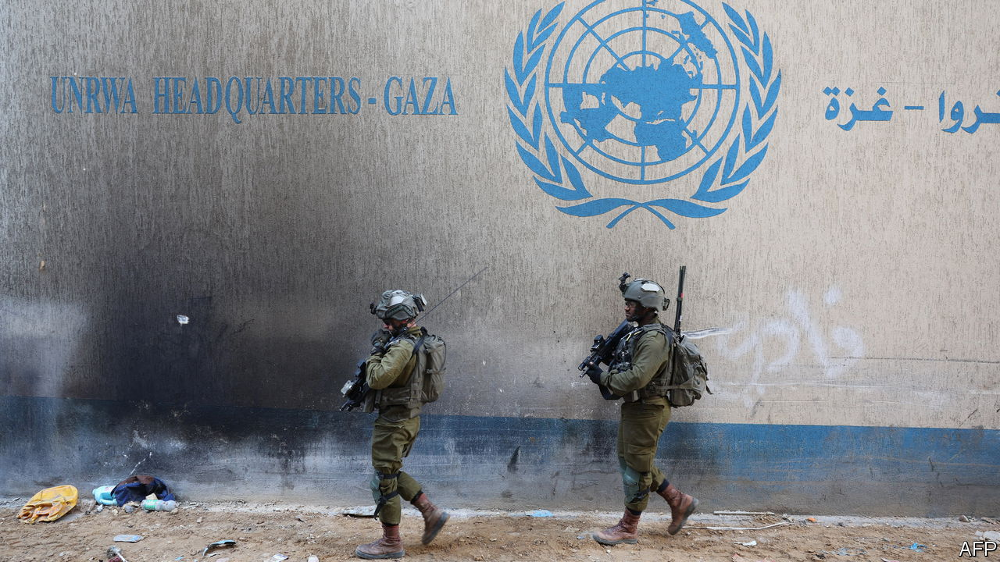

###### The case against UNRWA

# The real problem with the UN’s agency for Palestinians 

##### It has perpetuated the misery of Palestinians 

 

> Feb 15th 2024 

NOTHING is permanent, but in the Holy Land some things come close. The UN Relief and Works Agency (UNRWA) was founded in 1949 to aid 700,000 Palestinian refugees displaced by the creation of Israel. Meant as a temporary fix, its mandate has been renewed every few years since. This year it will turn 75—if it survives that long.

Last month Israel alleged that 12 UNRWA employees took part in the October 7th massacre, in which Hamas militants murdered some 1,200 Israelis. It has also claimed, without publicly offering any evidence, that 10% of the agency’s 13,000 employees in Gaza are members of Hamas. In early February the Israeli army took journalists on a tour of a tunnel beneath UNRWA’s headquarters in Gaza, which it said housed Hamas military infrastructure.

Philippe Lazzarini, the agency’s director, says he fired nine of the 12 employees named by Israel (two others were already dead). The agency denies any knowledge of the tunnel. But the charges had an immediate effect: some of UNRWA’s biggest donors, including America and Germany, quickly suspended their funding.

Hamas has ruled Gaza as a one-party statelet since 2007. No one should be surprised if it has stuck its members on the UNRWA payroll or stashed weapons in UNRWA facilities. The UN acknowledges that both have happened before. Aid workers have had death threats for looking into such incidents. Almost by definition the job of providing aid in rough places requires dealing with bad actors: the alternative is not to do the job at all.

That seems exactly the point of the latest allegations. Some Israeli officials have wanted to shut down UNRWA for years, accusing the agency of helping to prolong the conflict. They have seized the moment to press their case. For its supporters, meanwhile, the agency is above reproach, a group of selfless humanitarians doing vital work. As ever, life is more complicated than a morality play. The continued existence of UNRWA is a problem—but not for the reasons its critics think.

Around the world, displaced people are the responsibility of the UN High Commissioner for Refugees (UNHCR). Only the 6m Palestinian refugees scattered across the Middle East have a separate dedicated caretaker. Before the war perhaps a few tens of thousands were refugees in the literal sense: people forced to flee a conflict. The rest are their descendants, by now three or four generations of them. Most Palestinian refugees, in other words, are not displaced. 

This is the core of Israel’s case against UNRWA: that its definition of “refugee” is too expansive, without parallel, and nurtures false hope that all Palestinians will return. Both parts of the argument are flawed. There are other long-running crises, such as Afghanistan, where UNHCR recognises children of refugees as refugees themselves. If the numbers are more lopsided in the case of Palestinians, it is because their displacement has gone on for so long. And it is ironic to hear Israelis argue that Palestinians only hold fast to their territorial claims because of the UN—when their own national project rests on a millennia-old attachment to the same land.

Yet it holds a grain of truth, too. The UNHCR does not only care for refugees. It also has a mandate to seek “durable solutions”, such as integrating them into host countries that offer refugees citizenship. Yet UNRWA can only provide aid.

This is a problem—but not one of UNRWA’s making. Blame instead the Arab states that have refused, for decades, to offer citizenship to the Palestinians in their midst. The 1.7m registered refugees in Gaza (or their ancestors) lived under Egyptian control for almost two decades until 1967. Instead of offering them rights, Egypt left them in squalor.

Syria insists that Palestinians enjoy the same rights as Syrians, except for citizenship and suffrage (not that the latter is very valuable). In practice, though, they face discrimination, such as a prohibition on owning farmland. The situation is far worse in Lebanon: Palestinians cannot own property, hold certain jobs or have access to many government services. Jordan is the exception, yet UNRWA continues to serve the 2m Palestinian refugees there—even though most are also citizens of Jordan, which, in any other context, would mean they were no longer refugees.

Whether UNRWA can continue to provide those services is now in doubt. It relies on mostly Western donor countries. Of the $1.2bn UNRWA raised in 2022, 44% came from the EU and its members and 29% from America. The agency says it may cease operations by the end of February if donors do not resume their contributions.

Some diplomats think that warning is exaggerated. America, UNRWA‘s largest funder, had already sent $121m since October, about one-third of its usual annual contribution. It was due to send roughly $300,000 this month, which is now suspended, but did not expect to send more until the summer. Germany had no pending payments. The EU had planned to send €82m ($88m) by early March, which may be delayed. If donors do not relent soon, though, the agency would undoubtedly have to start paring down its operations. It would probably prioritise work in Gaza, where it is now keeping 2.2m people alive.

Before the war more than half of Gazan students, almost 300,000 children, attended UNRWA schools. Half of the population (1.2m people) relied on UNRWA for health care. A similar share received food aid. Aside from the Hamas government, UNRWA was the largest employer in Gaza, and its salaries were vital to the economy.

In many ways, UNRWA was the government. Hamas officials have all but admitted this in interviews over the past few months. They said Hamas’s role was to build up its military capabilities, not to care for their people—they had do-gooders for that. Israel, too, relied on UNRWA to mitigate the consequences of the draconian blockade that it (along with Egypt) imposed on Gaza. Even today, as Israel tries to abolish UNRWA, it still relies on the agency to prevent mass starvation in Gaza.

On visits to the enclave over the past 15 years, your correspondent heard periodic criticisms of the agency from the very people it served. “Imagine that you have cancer,” said one young man, himself a graduate of an UNRWA school, in 2022. “And your doctor has a cure, but instead he gives you painkillers.” That was the role of UNRWA: to preserve the status quo.

Since 1949 that status quo has sometimes served the interests of regional powers. Arab countries could avoid caring for and integrating Palestinians. Israel could keep Gaza sealed off without worrying that it would implode. Hamas could be an absentee ruler, fobbing off the hard work of governance and providing services on someone else. Abolishing UNRWA would not kill the Palestinian cause. It would merely make clear that, for nearly 80 years, far too many governments have not cared about the well-being of Palestinians. ■

