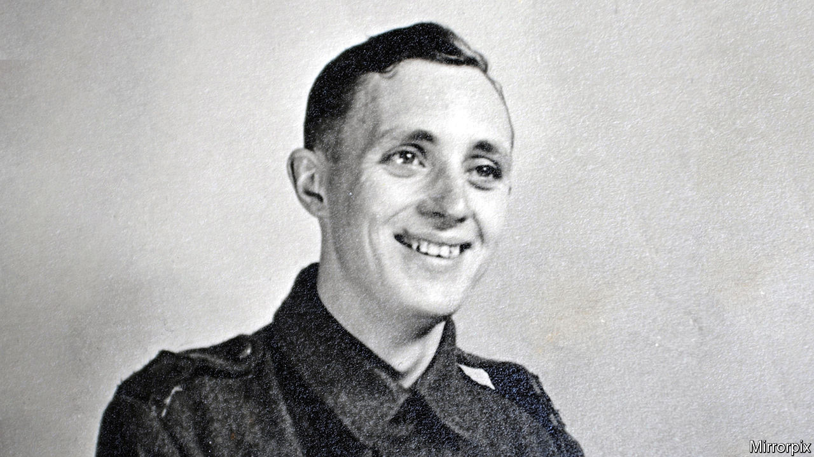

###### A line through the jungle

# Jack Jennings was one of the Allied POWs who built the Burma Railway 

##### The slave labourer for the Japanese died on January 19th, aged 104 

 

> Feb 14th 2024 

Even as a young man, Jack Jennings was something of an expert on wood. He knew his oak from his ash, and his elm from his beech. Since leaving school at 14 he had worked with wood, first on the four-cutter moulding machine and then by hand as a joiner. Over five years of classes at Dudley Art College, in the Midlands, he made a work shed and workbench, a succession of stools and a complete bedroom suite, all French polished, in oak. He had just finished the wardrobe when in 1939, aged 20, he was called up.

 He also knew his tools: the different saws, hammers, chisels and blades, and the long-handled adze which smoothed rough trunks into planks. What he did not expect was that, with hand-held implements like these, he would have to build a railway.

 The railway in question was to run from Ban Pong in Thailand to Thanbyuzayat in Burma (now Myanmar), for roughly 250 miles. Much of its route lay through dense, sticky jungle. It was a project of the occupying Japanese army, which used as slave labour around 200,000 Asian civilians and 60,000 Allied prisoners-of-war. Mr Jennings found himself in that category in February 1942, after his battalion in the 1st Cambridgeshire regiment was forced to surrender to the Japanese during the fall of Singapore. With that defeat, he began a forced trail from railway camp to railway camp that lasted for three and a half years. 

To build the embankments he and the others were given shovels, small picks and wicker baskets for the earth. To make sure the bank was firm he would have to tread it in, up and down, for hours. As the days passed, the earth-loads had to be carried ever farther and higher. In the scalding heat, sweat poured off him; he worked near-naked, and on his tired, bony body mosquitoes feasted. 

 Most of the time, though, he worked as a carpenter. The railway, save the narrow-gauge track, was built almost entirely of hardwoods and bamboo. Trees had to be felled, debarked, cut into baulks and stacked by the line, or tapered with an axe to make piles. Some had to be bodily lifted by teams of men and cantilevered into place as bridges over dips and streams. Hardwoods, he soon found, were as tough as they sounded, and felling them could disturb a swarm of big red ants that bit like hell. Bamboo, used also for fuel, sent splinters into flesh that could infect it. He protected his feet by making wooden shoes fitted with a cross-strap, but a bamboo shaft still caught his left leg and caused an ulcer as big as a pear. 

 Illness and accidents were legion. In all, the railway cost the lives of perhaps 90,000 Asian civilians and 16,000 prisoners-of-war. He himself got malaria, dysentery and renal colic that put him in a hospital camp for nine months. Of course, he was weak to start with: sleeping, as they all were, on filthy bamboo slats in muddy shelters, subsisting on rice, vegetable water and a teaspoon of sugar, and working 11-hour shifts. But at least he didn’t get the cholera which at one point was claiming 15 victims a day. And at least he didn’t fall into the depression that made a friend die one night from, as it seemed to him, simply giving up. 

Giving up didn’t run in his family. He had grown up poor, with nine people sharing three bedrooms in a barely heated house. As a child he would scrounge coal from the railway line that ran nearby, gathering whatever fell from the steam trains. His father had died when he was eight; he therefore had to leave school early, while his mother took in washing. His joinery he learned at evening classes after work, rather wearily, struggling to transport the lengths of timber on his bike. But he was proud of what he made. 

His attitude, in fact, was almost chirpy. As chirpy as the harmonica he had played since he was six, even joining a band in his teens to give concerts in smart grey flannel trousers and a blue-and-white striped tie. In his first wartime billets in England he would play at the drop of a hat; so much so, that on the long voyage to Singapore he found that his harmonica had no voice left, and threw it overboard. He felt sorry, in the railway years, that he had done that. But he put away thoughts of home in England, even of his fiancée Mary waiting patiently in Staffordshire, and pretended instead that home was where he was, croaking bullfrogs, gruel and all. He would put up with it and get on with it. Oddly enough, things seemed better then. 

 His various illnesses also had a positive side. They allowed him spells of rest to get over them, and carpentry duties, in any case, were less strenuous than bank-building. He was lucky that way. In the spare time he could find he carved a chess set and made an octagonal table to play on, which got good use. The pieces began as off-cuts from bed boards, half of them carefully blackened with permanganate of potash. To bring back something beautiful from his prison was deeply satisfying. 

What he could not improve or change was the behaviour of the Japanese guards. Prisoners who broke the rules might be clapped in bamboo cages. Those who tried to escape were beheaded. If his pace of work slackened, he got jabbed with a rifle butt. “” was the usual shout from the guards: “Useless, no good!” Once, when he saluted a Japanese guard (as was required), he got slapped in the face for it. He could not guess why. His happy-go-lucky attitude never applied as far as his captors were concerned. 

When the war at last ended, he quickly resumed the life he had intended to have in 1939. He married Mary, had two daughters, went back to joinery and bought a new harmonica, which he played into his 100s, leading singalongs at his favourite local café in Devon. “Onward Christian Soldiers” was a favourite party piece, and “Name that Tune” another. 

 As for the Burma Railway, he buried it deep. Only in the 1990s did he start to write and talk about it. Four times after that he went back to Thailand, and was surprised to find how cared-for and lovely the camp sites and graveyards were. Even the sight of the railway he had built, though almost all of it had gone, raised a smile from him. The ghosts of the past were laid; he could again be happy wherever he was. ■

