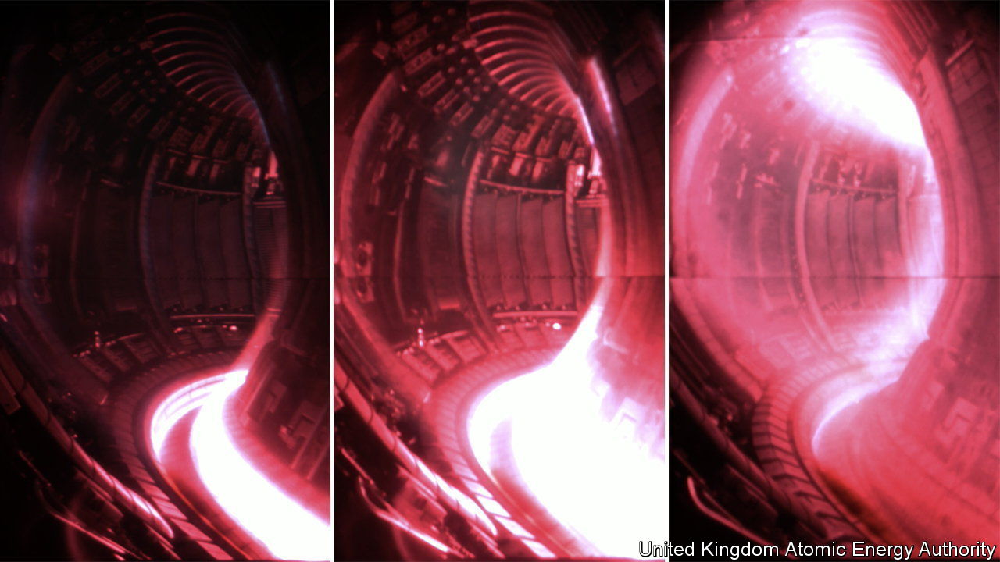

###### JET off

# A 40-year-old nuclear-fusion experiment bows out in style 

##### Its final run set a record for how much energy such reactions can produce 

 

> Feb 9th 2024 

THE HORSE archers of ancient Iran had a trick known as the Parthian shot. When retreating after a charge they were able to twist their bodies around in the saddle and loose a final salvo. That is not a bad description of the announcement made on February 8th by the controllers of the Joint European Torus (JET), a fusion experiment at Culham, England. After 40 years of operation, JET shut up shop in December. But the result of one of its final runs, conducted on October 3rd of last year, makes an excellent Parthian shot.

Fusion reactors are sometimes said to mimic the process that keeps the sun shining. That is not quite accurate. The raw materials of solar fusion are protons, the nuclei of the lightest and most abundant form of hydrogen. The process that turns them into a helium nucleus (two protons and two neutrons) has several steps. The approach used in JET, a type of reactor called a tokamak, creates helium in a single step by reacting together the nuclei of two heavier types of hydrogen: deuterium, with a proton and a neutron, and tritium, with a proton and two neutrons. Both the solar and the terrestrial transmutations release lots of energy, but they have different subatomic by-products—two positrons and two neutrinos in the case of the former, and a neutron in the latter.

JET’s reaction vessel was, as the name suggests, toroidal. Magnetic fields confined and heated the deuterium and tritium within this doughnut-shaped void to create a plasma (a gas-like form of matter in which atomic nuclei and electrons are separate) with a volume of 90 cubic metres. At temperatures of 150m kelvin, nuclei colliding in such a plasma will fuse.

JET never pretended to be a prototype for commercial-power production. It was there to study the physics of fusable plasmas, not to put out more energy than it consumed. But when its operators cranked the dial up to 11 in October last year, they managed on one occasion to achieve 5.2 seconds of continuous fusion, yielding 69 megajoules of energy, for an average power output of 13 megawatts. Though tiny by the gigawatt standards of modern power stations, that is a record for a tokamak and so a good step in the right direction. What comes next, though, is much debated.

Some look to ITER, an experimental tokamak under construction in France by a consortium of governments. This, when it opens on a date as yet to be determined, will have nine times the plasma volume of JET. Meanwhile, on the other side of the Atlantic, in Massachusetts, private enterprise in the form of Commonwealth Fusion Systems is constructing SPARC, a tokamak it hopes to switch on next year. SPARC will have a smaller plasma volume than JET but should, because of design advances using superconducting magnets, put out twice as much energy as is put into it. It will, the firm hopes, be the last step before a fully commercial machine.

Besides these projects, a second private reactor is planned in Culham itself by a firm called Tokamak Energy. Other firms in both North America and Britain, using , are also joining the fray. And Britain’s government hopes to join in, too, with a tokamak called STEP. All of these enterprises, though, have been helped by JET’s results over the decades. Hail and farewell, then, to one of fusion-research’s workhorses. ■


