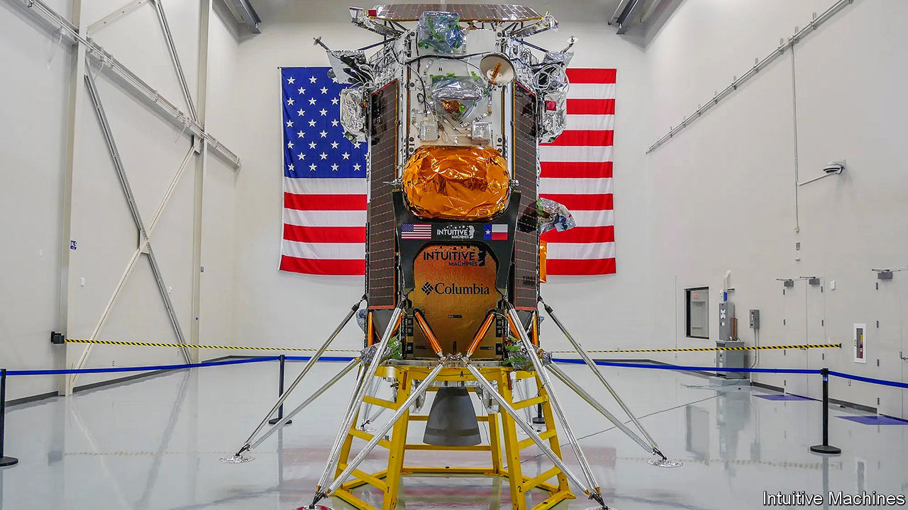

###### Lunar odyssey

# A private Moon mission hopes to succeed where others have failed 

##### The odds are stacked against it 

 

> Feb 15th 2024 


LANDING ON THE Moon is difficult. Of the five robotic landers that have made the attempt in the past year, only two succeeded. Both successful landers were sent by national space agencies—those of  and Japan—though the Japanese probe, called SLIM, suffered an engine failure and landed upside down. , a lander sent by , Russia’s space agency, collided with the lunar surface after going into the wrong orbit. Two landers from private companies also failed: , sent by a Japanese firm, crashed during landing, and , made by Astrobotic, an American company, suffered a propellant leak and never made it to the Moon.

As a result, all eyes are now on , another private lander which set off for the Moon on a SpaceX Falcon 9 shortly after 6am GMT on February 15th. All being well it should land within eight days. 

Built by Intuitive Machines, another American firm, is, like Astrobotic’s ill-fated , part-funded by America’s space agency, NASA, as part of its “commercial lunar payload services” (CLPS) programme. This involves NASA acting as an “anchor tenant” on commercial landers and buying several payload slots, rather than building and operating such vehicles itself. Intuitive Machines is contracted under CLPS to send three landers to the Moon, of which this is the first.

Intuitive Machines is aiming to land near the Moon’s south pole, an area never visited before and deemed rich with promise because of the presence of frozen liquids and gases in some of its craters. Those deposits are of great interest to scientists and may also be of practical use, providing water or rocket fuel to future lunar bases and the rockets launching from them. The planned landing site is near a crater called Malapert A, close to many of the candidate landing sites for NASA’s proposed Artemis III mission, which is intended to take humans back to the Moon later this decade.

 


But if all goes well, a successful lunar landing by would not just be the first by a private company. It would also be the first soft landing on the Moon by an American-made spacecraft since the Apollo 17 mission of 1972, the last time astronauts visited.

So there is a lot riding on —both figuratively and practically. The two-tonne lander, roughly the size of a telephone box, is carrying six NASA payloads that are intended to pave the way for future human visits and a potential long-term presence. Five of NASA’s instruments will test various navigation and landing technologies. The sixth will assess the Moon’s potential as a site for radio astronomy, as well as the challenges of radio communication from a location where Earth is always low on the lunar horizon. 

The probe is also carrying six commercial payloads, including ILO-X, which will test astronomical imaging equipment for a future lunar observatory; EagleCam, a “selfie” camera intended to detach from the probe just before it touches down, letting it snap its own landing; and a set of tiny sculptures by Jeff Koons, an American artist, called “Moon Phases”.

A large number of things have to go right for the landing to succeed—and the failures of other recent lunar missions demonstrate the sheer variety of ways in which things can go wrong. Sometimes the problem is software-related: failed last April because its navigation software was confused by the unexpectedly high rim of a crater near the landing site. Assuming that the probe was close to the surface, the software initiated a low-speed powered descent. In fact the probe was 5km above the lunar soil, and soon depleted its fuel supply, after which it fell to the surface and was destroyed.

In other cases, hardware is at fault.  crashed in August because its engine failed to shut down correctly while it was manoeuvring into a pre-landing orbit, putting it instead on a collision course with the Moon. ’s propellant leak last month seems to have occurred after a valve failed to close properly, causing a build-up of pressure and a rupture in its oxidiser tank. As a result, it had insufficient fuel to complete its mission, and burned up in Earth’s atmosphere on January 18th.

The following day, the SLIM probe lost one of its two engine nozzles in the final seconds of its descent to the lunar surface, but its software was smart enough to compensate, bringing it to a soft landing within 55 metres of its target—astonishingly close for a mission to a different world. However, instead of landing on its side as intended, SLIM tipped over onto its nose, ending up with its engines pointing upward and leaving its solar panels in shadow. SLIM’s controllers shut the probe down to conserve power, but were able to power it up again nine days later, when the Sun was at a more suitable angle.

The fate of SLIM shows that mishaps need not always lead to mission failure. Its troubled landing was nevertheless the most precise in spacefaring history, demonstrating the potential of its novel vision-based navigation system. And, scientific achievements aside, the mission also made Japan the fifth country to have soft-landed a craft on the Moon.

Whether succeeds or fails in the coming days, many other private landing attempts are planned for later in 2024. NASA has several CLPS missions lined up: at least one (and possibly two) by Intuitive Machines, using the same type of lander as ; another mission by Astrobotic, using a larger lander called , carrying a NASA-built robotic rover called VIPER; and a lander called , built by Firefly Aerospace, yet another American company which, like Intuitive Machines and Astrobotic, has no track record in the landing game. Ispace, the Japanese firm behind last year’s failed  mission, also hopes to have another try this year. And those are just the private missions slated for 2024; China’s space agency also intends to launch , the latest in its successful series of Moon landers, in the next few months.

But for now the immediate question is whether can succeed where all previous private landers have failed. The companies involved in this private Moon race insist that it does not really matter which of them comes first—their shared aim is to provide regular service to the Moon’s surface, for both public and private entities. “We are all standing on the shoulders of those that attempted, failed and succeeded,” says Steve Altemus, the boss of Intuitive Machines, whose fingers are no doubt firmly crossed. The return to the Moon is proving difficult. But the direction of travel is clear. ■


