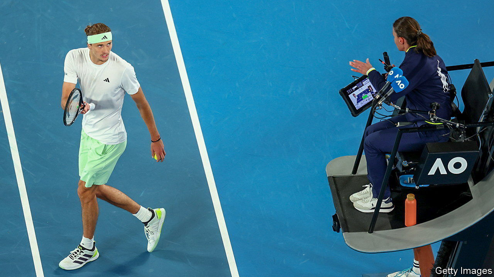

###### Shame, set and match

# What tennis reveals about AI’s impact on human behaviour 

##### Since the introduction of Hawk-Eye, umpires have been biting their tongues 

 

> Feb 15th 2024 

Wimbledon’s centre court has seen its share of rivalries; think of McEnroe v Borg, or Williams v Williams. But for David Almog, a behavioural economist at Northwestern University, the match worth tuning in for is umpire v machine. 

How AI oversight affects human decision-making is an important question in a world where algorithms play an ever-larger role in everyday life. Car drivers, financial traders and air-traffic controllers already routinely see their decisions overruled by AI systems put in place to rapidly correct poor judgment. Doctors, judges and even soldiers could be next.

Much of this correction happens out of the public eye, thwarting would-be analysts. But, says Mr Almog, “tennis is one of the most visible settings where final decision rights are granted to AI.” That is why, together with colleagues in America and Australia, he has looked at whether tennis umpires and line judges correctly called balls in or out during nearly 100,000 points played in some 700 matches across the world, both before and after the introduction of the Hawk-Eye ball-tracking system in 2006. 

The Hawk-Eye system, now used at most elite tournaments, uses between six and ten cameras positioned around the court to create a three-dimensional representation of the ball’s trajectory. This can then be presented on a screen visible to players, spectators and officials—as well as tv viewers. Players can use it to appeal human decisions, with the AI’s verdict considered final. Bad calls from line judges and umpires are now often overturned.

The latest analysis from Mr Almog and his colleagues, published as a last month, showed that Hawk-Eye oversight has prompted human officials to up their game and make 8% less mistakes than before it was introduced. (That comparison can be made thanks to a 2005 trial period in which Hawk-Eye was used without the ability to influence calls.) Such an improvement in performance is to be expected, the researchers say, given the heightened watchfulness that accompanies the threat of public shaming. 

Most of the improvement came during the multi-shot rallies that follow a successful serve and return. But when the researchers looked at serves in particular, and especially in cases where the served ball landed within 20mm either side of a line, they were surprised to see the error rate soar. The umpires and line judges, it turned out, had switched strategy. Before Hawk-Eye, they were more likely to call a serve out when it was in. But afterwards, they were even more likely to wave through balls that were actually out. For every 100 mis-hit serves, post-Hawk-Eye umpires left 39 unchallenged. The comparable figure in the earlier era was 26.

Such a shift is easily understood. Overlooked faults are less disruptive in tennis than incorrect cries of “out” because these end the point prematurely. They can also trigger dissent from both the player and crowd when the error is identified on the big screen. It seems that human officials take the less reputationally risky option, even if it leads to more incorrect calls. 

Tennis, with its binary outcomes and clear evidence of whether a decision was right or wrong, offers a highly simplified model for AI oversight. But many of the same tendencies will be at play in fields like medicine and law, says Mr Almog, and should be considered before algorithms are allowed to trump human decisions. Most important, perhaps, is the social cost of getting an important call wrong, which will vary between disciplines, and could distort decision-making in different ways. Judges, for example, may prefer to under-convict. Doctors, on the other hand, might over-diagnose. Stay tuned. ■


