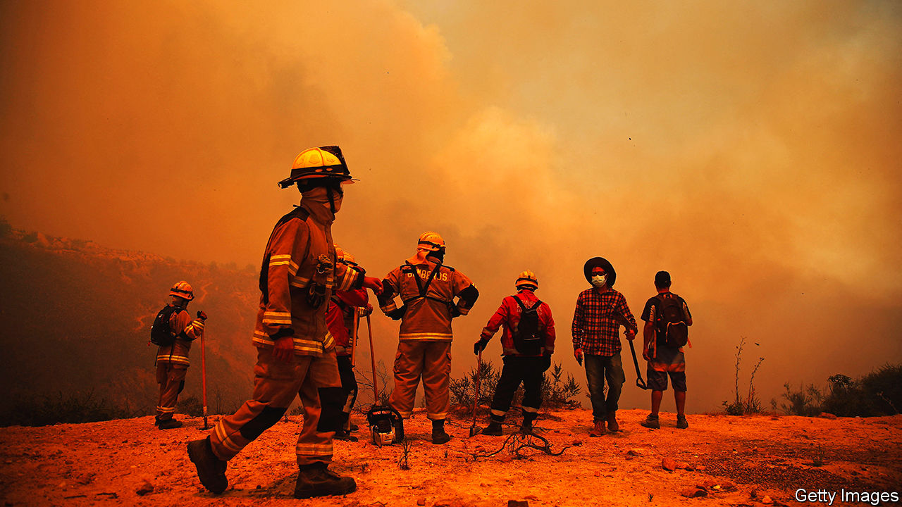
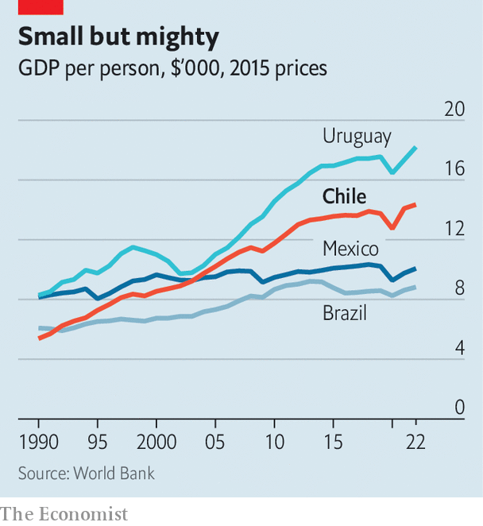

###### From model to muddle

# Chile’s crisis is not over yet 

##### Political tumult is now the norm in the country 

 

> Feb 15th 2024 

A sense of fatigue hangs over Santiago, the capital of Chile. Since 2019 the place once considered the poster child of Latin America has instead been the site of tumult. This has included the election of Gabriel Boric, the country’s most left-wing president in half a century, along with the growth of a powerful party of the hard-right. There have been two failed attempts to write a new constitution. To top it all, this month deadly forest fires have raged. Can Chile get back on track? 

For a quarter of a century after the end of the dictatorship of General Augusto Pinochet in 1990, the country had moderate, consensual politics and faster economic growth than much of Latin America. Those living below the official poverty line fell from 45% of the population in the mid-1980s to 9% in 2017. By that year two-thirds of Chileans were middle class, up from 24% two decades before, according to the World Bank. With its vigorous market economy and a commitment to the rule of law, Chile was one of the few countries in the region that looked likely to reach developed status within a generation. 

Stability was shattered in 2019 by what Chileans call  (the social explosion). This involved two months of massive protests and vandalism, in which metro stations and several churches were destroyed by arson and supermarkets looted. The conservative government of Sebastián Piñera, who died this month in a helicopter crash, came close to falling. The demands of the protesters were for better pensions and health care, free education and an end to “the neoliberal model” originally installed by the dictatorship. What they got was an agreement from the politicians to set up a constitutional convention to replace Chile’s charter of 1980.

 


The convention that was voted in was dominated by the far left. It wrote a utopian text that was plainly unworkable. In a plebiscite in 2022 this was rejected by nearly 62% of voters. That was a crushing defeat for Mr Boric, who was elected on the back of the  and whose Broad Front coalition had supported the revised text. 

There followed a second convention in which the right won a big majority, led by the Republican Party, a newish hard-right outfit. It made the same mistake: the draft was filled with conservative moralism and was rejected by 56% of voters in a plebiscite in December last year. That in turn was a rebuke for José Antonio Kast, the founder of the Republicans who lost a presidential run-off to Mr Boric in 2021. 

Constitutional cracks

“Chile shows that it’s very difficult in a democracy to start from a blank sheet of paper,” says Sergio Bitar, a former minister of the centre-left. For some Chileans this outcome suggests a rejection of the political class as a whole. Did the first convention misrepresent public opinion? Or have priorities changed? It is a bit of both. 

For a start, conservative concerns have become more prominent because of a crime wave. By regional standards, Chile remains a safe country. But the murder rate has risen from 4.6 per 100,000 people in 2021 to 6.5. Extortion and the use of firearms, previously rare, have spread, especially in poorer urban neighbourhoods. This has coincided with, and is partly linked to, the arrival of some 1m immigrants since 2015, many from Venezuela. Most are hard-working; some are part of criminal gangs. As a result, the demands of the protesters in 2019 have seemed far less pressing than dealing with crime. 

A second problem is that Mr Boric overestimated his ability to implement change. Both he and the Broad Front came to office scorning the timidity of the centre-left Concertación alliance which governed Chile for 20 years until 2010, mixing respect for the market economy with gradual social reform. However, Mr Boric’s party lacks a majority in Congress. His ambitious plans to raise taxes and reform pensions and health care have foundered in the face of a conservative opposition.

Mr Boric also inherited an overheated economy from Mr Piñera. Lavish pandemic aid combined with legislators’ reckless approvals of early withdrawals from pension funds injected an astonishing 35% of GDP into the economy, according to Mario Marcel, the finance minister. Mr Marcel’s first task was to apply a fiscal squeeze that cut the deficit by 10% of GDP in 2022. The independent central bank also raised interest rates. The result was a mild recession. 

All this meant that Mr Boric had to move to the centre. He sacrificed his initial team of fellow former student leaders, and called on experienced cadres from the centre-left, including Carolina Tohá, the interior minister, as well as Mr Marcel. The government is now implementing several policies associated with the right. 

Instead of its plan to increase the tax take by 4% of GDP, it now hopes for only half of that, mainly by cracking down on evasion, as part of a “fiscal pact” which also involves a promise to cut wasteful spending. It is pushing through a law aimed at cutting red tape. Instead of the promised abolition of private pension funds, the government is arguing with the right over the fine detail of how to assign a new employers’ contribution to pensions. 

A crackdown on crime includes laws to increase sentences and set up a national organised-crime unit at the public prosecutor’s office. The government has given extra money and equipment to the police, vilified by the left for their sometimes brutal handling of the protests but now once again among the country’s most trusted institutions. “Progressive politics can’t flourish without security,” says Ms Tohá. 

Mr Boric has managed this shift with surprisingly little dissent. Achieving change “will be a long road”, recognises Giorgio Jackson, Mr Boric’s campaign chief in 2021. “The left understands that and so has given its consent to pragmatism.” The president’s approval rating quickly fell to 30% but has not sunk any further. 

The assumption in Santiago is that the next government is likely to be of the right. Mr Kast remains influential, but his moral conservatism is rejected by many in an increasingly socially liberal country. He says he has his sights set on Congress. Moderation may prevail on the left too: the three parties in the Broad Front are poised to merge later this year. The new party will be “much more measured and less antagonistic but still critical,” says Mr Jackson. 

Nobody has any appetite for more constitution writing. But there is a need for reform. Congress has made that easier: it approved changes that have reduced the majority needed for constitutional amendments in the legislature from two-thirds to four-sevenths. Three big things need fixing: politics, education and the economy.

Take politics first. An electoral reform in 2015 scrapped rules that favoured a two-party system and introduced proportional representation. The result has been extreme fragmentation: the 155-seat lower house of Congress has 22 parties and 40 independents, making negotiation tricky. 

In terms of education, between 1995 and 2020 public spending on it increased from 2.3% of GDP to 5.6%. Yet outcomes as measured in international tests have barely improved. Meanwhile an economic slowdown was a big—though not the sole—cause of the. Mr Kast insists that the solution is to shrink the state and cut taxes. The left counters that while that formula produced growth under Pinochet, Chile’s economy is now more sophisticated. Officials have high hopes for lithium and copper. Chile has ample reserves of both. They will help, but not enough. Growth now requires reforms to promote innovation and incentives for businesses to take risks, says Eduardo Engel at the University of Chile. 

The saw “a sense of guilt among the political class and business”, according to Eugenio Tironi, a political consultant. But in many cases that was short-lived. To move on, the country needs broad agreements on questions of politics and growth. “If there’s no flexibility and pragmatism to reach solutions, Chile could remain stuck in a cycle of frustration,” warns Ms Tohá. ■

