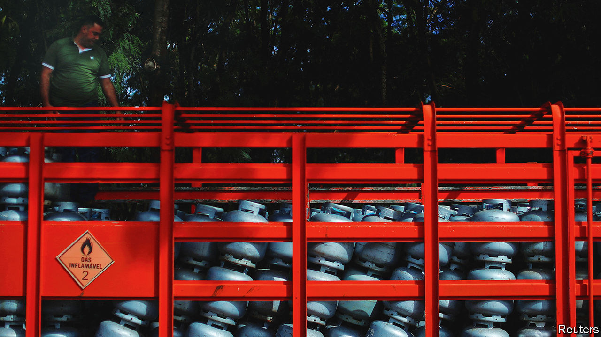
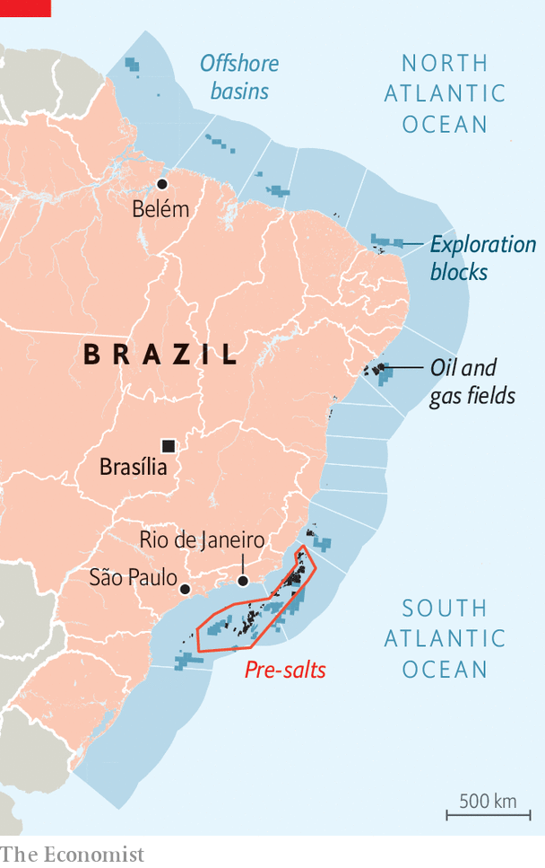

###### The perils of Petrobras

# Why Lula keeps meddling with Latin America’s top oil company 

##### His worst instincts are undermining the national oil company’s hard-won gains 

 

> Feb 15th 2024 

On February 1st Petrobras, Brazil’s state-owned oil company, reached a value of $551bn reais ($112bn) on the country’s stockmarket, a record in the local currency. Its shares have outperformed those of ExxonMobil and Chevron in the past year. Months before, it had laid out an investment strategy costing $102bn over the next five years, the largest such plan for nearly a decade. Most of the investment will go to the expansion of offshore basins in the country’s south-east, known as the pre-salts, and the development of new offshore fields in the north-east. The expansion could help Brazil become the world’s fourth-biggest oil producer by the end of the decade, up from seventh today, according to Rystad Energy, a consultancy.

Yet despite the glowing headlines, investors should be vigilant. Under the administration of President Luiz Inácio Lula da Silva (or Lula), who was previously in power from 2003 to 2010, the government is increasingly meddling in Petobras’s decisions, after several years during which state interference had declined. That is leading to poor business choices. It also increases the possibility of corruption.

 


Petrobras’s success is all the more striking given its recent history. In 2014, under Lula’s hand-picked successor, Dilma Rousseff, Petrobras was found to be at the centre of a sprawling kickbacks scheme in which it doled out contracts at inflated prices. Contractors paid bribes to certain executives at Petrobras using this extra cash. These executives and contractors also funnelled money to dozens of politicians. 

Under pressure from Ms Rousseff, Petrobras lost $40bn between 2011 and 2014 by keeping domestic petrol prices artificially low. Partly in order to pay for this, and partly because interest rates were low, the company took on enormous dollar-denominated debts. When oil prices collapsed in 2014, the corruption scandal erupted and the real depreciated, Petrobras hit a nadir. By 2015 it had debts totalling almost $130bn, making it the world’s most-indebted oil firm. The following year it had lost 90% of its value compared with 2011.

 


The company owes much of its turnaround to Pedro Parente, a far-sighted CEO who was appointed under the centrist government of Michel Temer in 2016. When asked to take the helm, Mr Parente says he set two conditions: “The company has to be guided by good business principles, and there must be no political interference.” Mr Temer acquiesced for a while.

Mr Parente ran Petrobras like a private firm, despite the government having a controlling vote on the board. The domestic price of fuel was linked to its cost on international markets. To raise revenue and pay off debts, Mr Parente sold billions of dollars worth of assets in fertilisers, distribution and petrochemicals. The company also focused on the business of drilling for deep-sea oil. 

Oil be back, interfering

To prevent another corruption scandal, Mr Parente set up an independent compliance department and a robust channel for whistleblowers. Crucially, it has become harder for corrupt executives to make individual procurement decisions. Now a team of managers from different departments must sign them off. By 2021, the value of the company was around $70bn and its debts were down to $37bn.

For a while, politics helped. In 2016 Brazil’s Congress passed the “state-owned companies law”, which made it harder to appoint politicians to state-owned firms. But this gentlemen’s accord began to unravel in 2018, when Mr Parente resigned after lorry-drivers went on strike to demand lower fuel prices. Mr Temer’s populist right-wing successor, Jair Bolsonaro, appointed four CEOs in as many years, including a general with no previous experience in oil. Mr Bolsonaro also appointed three political allies to Petrobras’s 11-member board, even though many people worried they lacked industry experience. 

Lula has not only continued this political interference, but ramped it up. Like Mr Bolsonaro, he forced two of his picks onto Petrobras’s board shortly after taking office, despite Brazil’s securities and exchange committee deeming them ineligible: one is a politician; the other works for the energy ministry. More worryingly, Lula’s intervention also goes further than his predecessor. Jean Paul Prates, the new CEO, supported a campaign promise Lula made to “Brazilianise” fuel prices—meaning to lower them. 

In May the firm announced changes to its pricing policy that lowered the cost of diesel and fuel prices from its refineries by 12%, and cooking gas by a fifth. Though Petrobras does have leeway to lower prices within market parameters by using its own refineries more, the new pricing policy is confusing. Adriano Pires, an energy analyst in Rio de Janeiro, calls it “a black box”. Markets reacted positively to the announcement not because of the policy’s merits, but because they had been expecting more intervention. It is unclear how the policy will work when oil prices rise.

Yet even this was not enough. Alexandre Silveira, the energy minister, has repeatedly criticised Mr Prates for not lowering prices more. Petrobras’s blockbuster new business plan appears to respond to pressures from Lula to boost local jobs, diversify into renewable energy and expand Petrobras’s reach abroad. 

The government is also trying to reverse Petrobras’s divestment policy. Petrobras’s big new investment plan includes an 80% increase in investments for refineries, transport and marketing. In November Petrobras cancelled the $34m sale of a refinery it had agreed to sell in 2020, claiming that the terms of the contract had not been fulfilled. The purchaser, Grepar, is demanding compensation.

It is unlikely the government will stop there. Partly as a result of the corruption investigations after 2014, Petrobras signed a deal with Brazil’s antitrust body in which it pledged to sell eight of its 13 refineries in the country in order to reduce its dominant market share. It had put four of these up for sale, including the one bought by Grepar, and was preparing to let go of the other half, too. In November the government asked the antitrust body to review the agreements on the sale of refineries. Mr Prates says that Petrobras’s ownership of refineries is not monopolistic and that “it’s a false obligation to sell those refineries”. Petrobras is currently in negotiations to take back partial control of a refinery that was sold to Abu Dhabi’s sovereign-wealth fund in 2021, and which accounts for 10% of Brazil’s oil-refining capacity. 

Lula’s recent moves suggest he has not learned from past failures. On January 18th he announced that Petrobras would expand a refinery in his home state of Pernambuco that has been mired in scandal for years. Lula suggested the reason the refinery was incomplete was because the United States does not want Brazil to become an oil power and was in cahoots with anti-corruption prosecutors. In fact, in 2016 a federal court determined that the cost of building the refinery had been inflated by a fifth. It never operated at capacity and caused Petrobras to lose over $3bn. 

Other unsettling signs abound. Last March Ricardo Lewandowski, then a judge on Brazil’s Supreme Court, suspended a section of the “state-owned companies law”, thus allowing national firms to appoint politicians to leadership roles if they want to. (Mr Lewandowski is now justice minister.) Minority shareholders on Petrobras’s board resisted changing the company bylaws, but in November the government overpowered them. 

Mr Prates said the change was “innocuous” because it simply aligns Petrobras’s bylaws with a change in federal law. But Marcelo Mesquita, the representative of minority shareholders on the board, disagrees. “As an isolated case, this may not be a scandal. But it is the beginning of a ‘let’s see [how much we can get away with]’ approach. It shows the government is worried about something.”

Brazil is unlikely to experience the kind of gigantic corruption scandal it did in 2014. The firm’s compliance mechanisms are stronger. The scandal traumatised Petrobras employees, making them more vigilant to graft among higher-ups. In addition, the government has less power over Petrobras than other Latin American governments do over their national oil firms. Despite it having the controlling vote on the board, the vast majority of capital in Petrobras comes from private stakeholders. Mr Pires thinks the problem with Lula’s Workers’ Party is that it “treats Petrobras as if it were 100% state-owned.”

Though it is unlikely that Petrobras will plummet to the depths it did a decade ago, the government’s recent moves could undermine the company’s hard-won success. Mr Mesquita says minority shareholders “made a lot of noise” when it changed its bylaws. “If you are not constantly vigilant, things can go back to the way they were.” That would be bad news for Petrobras, and worse news for Brazil. ■

