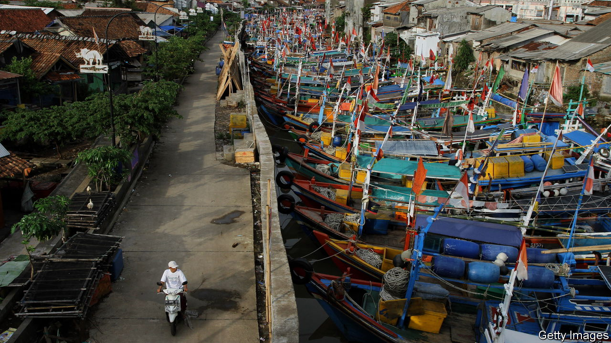

###### The Economist reads

# What to read about Indonesia 

##### There’s much more to the country than Bali’s beaches, as these six books demonstrate 

 

> Feb 13th 2024 


INDONESIA HAS been called the biggest invisible country. It is the world’s fourth most populous. With more than 13,000 islands, it is the biggest archipelago. Yet few outsiders know much about it except that one of its islands, Bali, has nice beaches. Indonesia has the world’s largest Muslim population, but it is almost bewilderingly diverse. Islam is just one of six officially recognised religions. The country’s 280m people belong to around 1,300 ethnic groups and speak more than 700 languages. The Indonesian language itself uses words from English, Arabic, Dutch, Portuguese, Malay and several Chinese dialects. 

Indonesia declared independence from the Netherlands in 1945 (but the Dutch waited until 1949 to recognise its sovereignty). Sukarno, the first president, initially led a fissiparous parliamentary democracy but declared martial law in 1957. Thereafter he presided over an authoritarian “guided democracy”, backed by the army. In 1965 a failed coup, which the army blamed on the Communist Party, gave it an excuse to take power directly. Suharto, a general, ousted Sukarno and ruled as a dictator for the next 32 years, a period of both political repression and rapid economic development. The CIA has described the massacres of communists that took place under Suharto as “one of the worst mass murders of the 20th century”. They continue to haunt the country. Unrest brought his rule to an end, leading to the restoration of democracy and the beginning of a more hopeful period of “. But Indonesia’s democracy is an imperfect one, in which politicians exchange favours for political support. On February 14th Indonesia, the world’s third-largest democracy, elected a new president, . He will succeed the popular Joki Widodo, known as Jokowi. The six books we’ve chosen illuminate the invisible country.

By Elizabeth Pisani. W. W. Norton; 

If you read only one book about Indonesia, let it be this one. Elizabeth Pisani, who worked there as an epidemiologist for many years, took a year off to travel across the archipelago by boat, bus and bike.  is her account of that journey. Ms Pisani sleeps under a tree with a family of nomads who wear little more than loincloths, rubs shoulders with the bohemian glitterati of Jakarta, the capital, and has tea with a young man and the body of his deceased grandmother, who were receiving visitors before her funeral. Ms Pisani paints a portrait of a country that is democratic and diverse. Different “groups are essentially living at different points in human history, all at the same time”, she writes. She also shows that Indonesia is prey to corruption and to the malign influence of patronage networks. Like any traveller in Indonesia Ms Pisani experienced the unstinting generosity of its people. She describes them vividly and with affection. 

By Richard Borsuk and Nancy Chng. 

The “nine dragons” are business empires controlled by Indonesians of Chinese heritage who have outsize influence on the economy and politics. These have become bigger and more complicated over time. Many are run by the third or fourth generation of their founding families. To understand how business and politics intersect, read “Liem Sioe Liong’s Salim Group. The book relates the history of Indonesia under Suharto using as its frame the commercial conglomerate that was then the country’s most powerful. It traces the life of Liem Sioe Liong, who was born poor in China and escaped conscription by fleeing to Indonesia on a cargo ship. He built the Salim Group, which has interests in many industries, including construction, coal and forestry. It owns Indomie, one of the world’s biggest makers of instant noodles. Enriched by interviews with Liem and his son Anthony, who inherited the business, this is the best history yet of the sort of Indonesian conglomerate that remains a central player in the country. 

. By Pramoedya Ananta Toer. Translated by Max Lane

 “This Earth of Mankind”, Indonesia’s most famous historical novel, is the first book in the Buru Quartet, a series written during the 1970s in a detention camp for suspected communists on Buru island. Pramoedya Ananta Toer first told the novel’s story, set in Java in the final years of Dutch colonial rule, to his cellmates. Eventually, after he was allowed to write, Catholic priests and other visitors smuggled his papers out of the penal colony. The quartet’s protagonist is Minke, a journalist and revolutionary who comes of age as Indonesian nationalism begins to spread. An everyman of sorts, Minke befriends characters who exemplify the kaleidoscope of Indonesia, from the formidable concubine of a crazed Dutch man to a working-class soldier turned servant. The Buru Quartet was published after Pramoedya’s release in 1979 but Suharto’s government banned its sale. Even though the ban was lifted in 2010, high schools do not include Pramoedya’s works in their curriculums. That omission shows how nervous the government remains about his Marxist ideology. The author was widely thought to be South-East Asia’s leading candidate to win the Nobel prize for literature, though he did not receive it before his death in 2006.

By Andreas Harsono

The collapse of Suharto’s dictatorship in 1998 was hailed by many as the rebirth of Indonesian democracy. The country did become more liberal: Indonesians were freer to practise their religions and speak their languages. At the same time, politicians increasingly used Islam to accumulate power, argues Andreas Harsono in this travelogue. “Race, Islam and Power” examines religious and ethnic tensions since the fall of Suharto, which sometimes led to violence across the archipelago, from Aceh, the only province with  law, to West Papua, where conflict continues between Papuan separatists and the government. A culture of impunity “expresses itself in a systematic failure to hold accountable members of the security forces and Islamist militants who commit abuses against religious and gender minorities across Indonesia”, Mr Harsono writes. He takes readers back to the Indonesian revolution, introduces them to Nahdlatul Ulama, the world’s largest Muslim organisation, and interviews pilgrims at Sukarno’s grave. Although Mr Harsono’s prose is occasionally wooden, the book is a readable account of the ways that Islam has shaped Indonesia and been shaped by it. 

By Vincent Bevins. 

Bali is a surfer’s paradise. But in 1966 Indonesia’s armed forces killed at least 80,000 Balinese, 5% of the island’s population, many of them on the beaches. They were among 500,000-1m suspected communists slaughtered by the army between 1965 and 1968. Many were not in fact communists. “The Jakarta Method tells this history in the context of the cold war. America viewed Indonesia, which had the largest Communist Party outside China and the Soviet Union, as the biggest of the South-East Asian “dominoes” that could fall to a communist revolution, Vincent Bevins writes. The American government gave the army lists of supposed communists to be murdered. Mr Bevins uses interviews with survivors and declassified documents to trace the history of America’s interference not just in Indonesia but across South-East Asia and in Latin America. The offensive against the Indonesian communists succeeded. The party’s liquidation by government decree in 1966 “greatly reduced America’s stakes in Vietnam”, where America was fighting a war to prevent a communist takeover, Mr Bevins writes. Indonesia is still feeling the consequences of America’s cold-war machinations. Although communists have little political influence, anti-communism helps justify the power exercised by a few rich families.

By Laksmi Pamuntjak. 

“The Question of Red” is the tragic story of Amba and Bhisma, lovers separated during the massacres of the 1960s. The novel also takes inspiration from the “Mahabharata”, an ancient Indian epic about a warring family, and extols the role of Buddhism, Hinduism and animism in shaping Indonesia. The colour in question refers to communism and the blood spilt in expunging it, among other things. The novel challenges the state’s version of the communist purges, humanising the thousands of prisoners held on Buru island. (Pramoedya makes a brief appearance.) Laksmi Pamuntjak weaves together Hindu epics and cold-war history with an account of a grim period in the late 1990s when Christians and Muslims massacred one another in the province of Maluku, 2,400km east of Jakarta. Ms Pamuntjak wrote the novel in English, then translated it into Indonesian, in which language it became a bestseller. “Cigarette Girl”, a popular Indonesian television show now streaming on Netflix, is a gripping love story that, like “The Question of Red”, challenges the official narrative of Indonesia’s dark history during the 1960s.


Mr Prabowo, Indonesia’s new president, has a . One big reason for his victory is that he had the , one of the most popular world leaders. Jokowi seems to be building a dynasty. A  court decision allowed his son to become Mr Prabowo’s running-mate. Our pre-election leader lays out what  means for Indonesia. During his time in office Jokowi focused on promoting , mostly by championing . New technology could secure Indonesia’s role as the biggest producer of , a component of batteries for electric vehicles. We  across the country to show how Indonesia is changing. Here is the story of a  that is the world’s fifth-largest fast-food chain; it is ubiquitous in Indonesia yet almost unknown in the rich world. The country’s largest  is spreading its moderate views across the Muslim world. 

