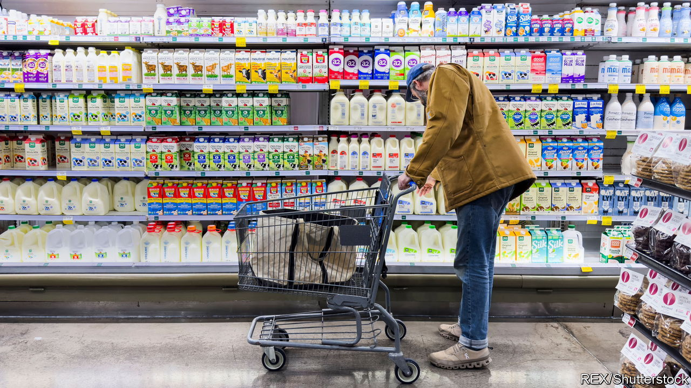
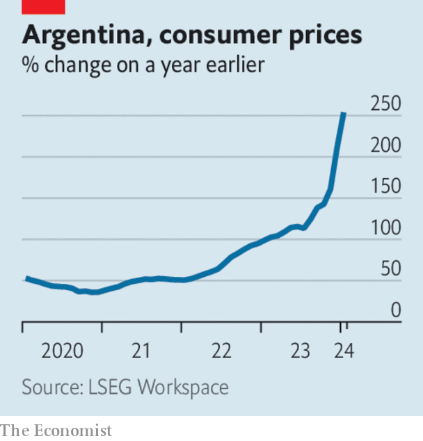

###### The world this week

# Business 

#####  

 

> Feb 15th 2024 

America’s annual  rate slowed to 3.1% in January. Although that was down from the 3.4% recorded in December, the dip was smaller than had been expected. Stockmarkets shuddered, as investors reduced their bets for an early interest-rate cut by the Federal Reserve. The Dow Jones Industrial Average had its worst day in almost a year. The next day traders in Britain seemed to be more optimistic about a cut to interest rates there when inflation came in at 4% for January, below forecasts. 

 


 inflation rate surged to 254% in January from 211% in December, when it overtook Venezuela as the country with the highest price rises in Latin America. Javier Milei, Argentina’s new president, put a rocket under inflation when he devalued the peso and abolished price controls, part of his “shock therapy” package of economic reforms. He has warned of more pain ahead in his effort to stabilise the economy. 

The economies of  and  fell into recession at the end of 2023. Japan’s GDP unexpectedly shrank by 0.1% in the fourth quarter compared with the third. In July to September it contracted by 0.8%. It has now slipped from being the world’s third- to fourth-largest economy. British GDP was 0.3% smaller in the fourth quarter, after shrinking by 0.1% in the third. 

 acknowledged that consumers are pushing back against price rises. The food and beverages giant jacked up the price of its products in 2022 and 2023, but it recorded a decline in the volume of snacks and soft drinks it sold last year. Ramon Laguarta, the chief executive, said that was in part due to pricing. Carrefour, a big supermarket chain in France, has stopped stocking Pepsi’s goods because of its “unacceptable price increases”. 

Come fly with me

Cost of living concerns are not stopping people from travelling. , Europe’s biggest tour operator, reported a big surge in quarterly revenue, and confirmed it expects sales to rise by 10% this year. Separately, TUI’s shareholders voted to retain a sole listing in Frankfurt and delist from the London Stock Exchange, another blow to the City’s reputation. 

The wave of consolidation in America’s Permian Basin shale oilfield continued, when  struck a $26bn deal to buy . The combined company will be the third-largest operator in the Permian, behind ExxonMobil and Chevron.

Arjuna Capital and Follow This, two activist-shareholder groups, asked a court to throw out  against them for the proxy motion they had proposed that called on the company to slash emissions. Arjuna and Follow This withdrew their motion when Exxon lodged the suit, but Exxon is still pursuing it, because it wants “clarity on a process that has become ripe for abuse”. The two investors argue that Exxon’s legal action is unnecessary, and that Exxon instead wants to establish “the novel position” that it can haul its shareholders into court for submitting proxy proposals. 

, which has chipmakers in the market for high-end AI chips, hit a market capitalisation of $1.8trn, pushing it past Amazon’s stockmarket value. Meanwhile Jeff Bezos,  founder and executive chairman, sold $4bn-worth of stock in the company recently, according to reports. He is still Amazon’s biggest shareholder, holding about 9% of the stock. 

A lawsuit was filed in a federal court seeking class-action status to sue Amazon for misleading users when it introduced ads to its  service. The suit alleges breach of contract by making subscribers pay an extra $2.99 a month for the ad-free service they had signed up to. The case may sound trivial, but for Amazon it is another unwelcome focus on its terms for Prime. The Federal Trade Commission brought a suit against it last year for allegedly duping consumers into signing up to the service. 

 put its business in Britain into administration, just five weeks after its new private-equity owner took over operations. The cosmetics and beauty retailer pioneered ethical shopping when it was founded by Anita Roddick in 1976, becoming a ubiquitous presence on British high streets. It runs around 200 shops in Britain now (and many more internationally). 

All for nought

 share price got an unexpected lift when the ride-hailing company made a clerical error in its earnings. The error stated that its adjusted profit margin was expected to rise by 500 basis points (or 5 percentage points) in 2024, rather than 50 basis points (0.5 points). Before the mistake was realised the stock soared by 60%, which was blamed on trading bots for not recognising an obvious typo. Still, Lyft delivered strong results otherwise. Its stock ended the day at its highest point in a year.

