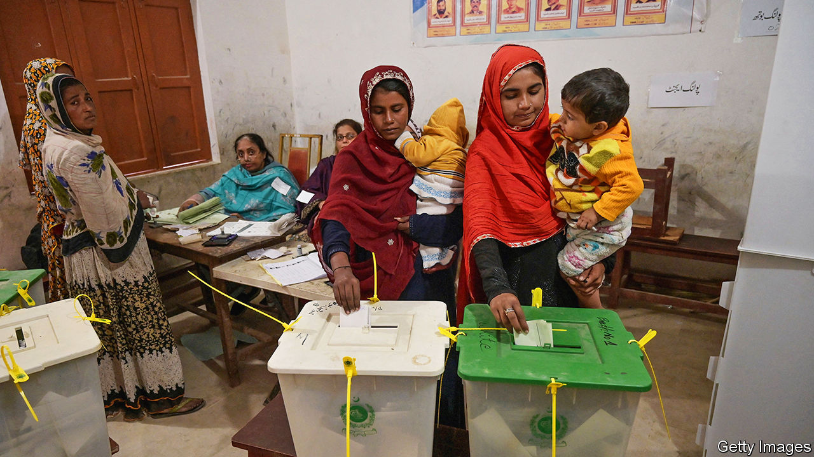
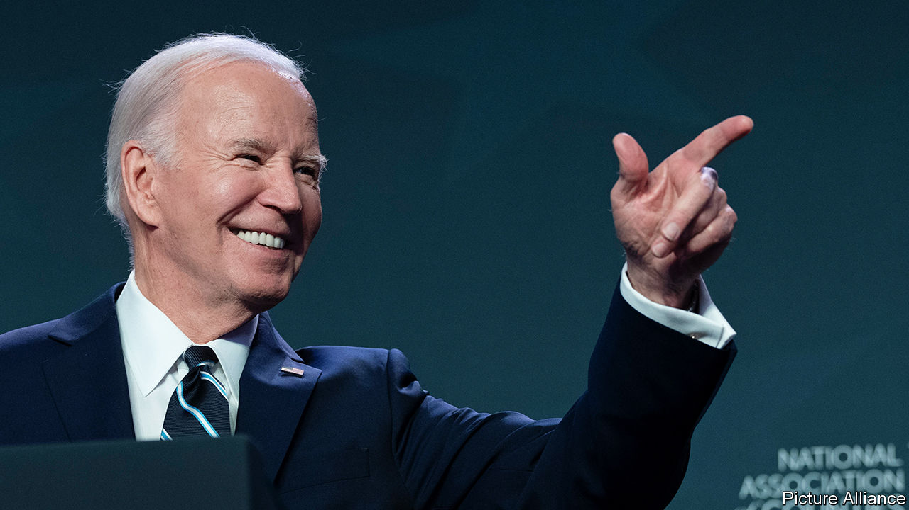

###### The world this week

# Politics 

#####  

 

> Feb 15th 2024 

Candidates tied to Tehreek-e-Insaf (PTI), the party of Imran Khan, won the most seats in  general election, despite a de facto ban on their campaign. Mr Khan is in prison on multiple charges, which he says are politically motivated. The Pakistan Muslim League-Nawaz (PML-N), which was widely expected to win, came second. PML-N is the party of Nawaz Sharif, Mr Khan’s arch-rival. It will form a coalition government with the Pakistan Peoples Party, which came third. Mr Khan’s supporters said the election had been rigged, which the PML-N denied. The head of the army claimed the poll had been “free and unhindered”.

Prabowo Subianto,  defence minister,  in the country’s presidential election. Mr Prabowo is mired in controversy. He lost the past two elections to Joko Widodo (or Jokowi), claiming that the vote was stolen from him. And he has been accused of committing atrocities, which he denies, when he was in the army, notably in East Timor, where the independence movement had been brutally suppressed.

In  police fired tear-gas at thousands of farmers trying to reach Delhi to stage a mass protest. Similar demonstrations were held in 2020 and 2021. Farmers are an important voting bloc in India’s general election, due to be held probably in April and May.

After months of negotiations with the Indian government, Qatar released eight  who had been sentenced to death for reportedly spying for Israel.

Thaksin Shinawatra, a former prime minister, was granted parole in , six months into serving a sentence for graft. Mr Thaksin was ousted in a coup in 2006 and returned from exile last August. He was originally sentenced to eight years, which was reduced to one year by the king, and served his six months in a hospital. 

A commander-in-chief?

The chairman of America’s joint chiefs of staff, General Charles Brown, warned that America’s credibility was at stake, following Donald Trump’s comment that he would not protect  countries in Europe from a Russian attack if the countries missed NATO targets on defence spending. Mr Trump said he would in fact encourage Russia to attack (he was recalling a conversation with a European leader). General Brown reaffirmed America’s commitment to the military alliance. 

, America’s defence secretary, was hospitalised again for complications related to surgery for prostate cancer, causing him to pull out of a trip to Brussels for a meeting with NATO allies. 

Mr Trump meanwhile asked the  for a quick ruling on whether to pause the recent decision by an appeals-court panel that he is not immune from prosecution. 

 


 made a crack about his age. “I’ve been around a while,” he said, “I do remember that.” Earlier, the special counsel investigating the president’s misuse of classified documents concluded that no charges would be made, because of Mr Biden’s age and mental fitness. He is a “sympathetic, well-meaning, elderly man with a poor memory”, said the report. Democrats rallied to Mr Biden’s defence. 

Mike Johnson, the speaker of America’s House of Representatives, suggested that the Senate’s package of  (and humanitarian aid for Gaza) would go nowhere in his chamber. Twenty-two Republican senators joined Democrats in voting for the bill, but Mr Johnson wants measures on beefing up border security included in a previous version of the legislation to be restored. 

The House voted to  Alejandro Mayorkas, the secretary of homeland security. An earlier vote had decided not to impeach, but the return of one Republican from cancer treatment to vote yes helped to put the yeas over the line. There is little chance of Mr Mayorkas being found guilty of a “systematic refusal” to enforce border policy when he is tried in the Senate. 

Clinging on

The Democrats won the special election for the  vacated by George Santos, a disgraced Republican, which reduces the Republicans’ already razor-thin majority in the House. 

Palestinian sources said that 74 people, including civilians, were killed in an bombardment of Rafah, the southernmost city in , as part of a raid to rescue two hostages held by Hamas. America, Britain and France are among the countries that have urged Israel not to mount a full-scale invasion of Rafah because of the number of civilians who would probably be killed. Meanwhile talks in Cairo over a temporary ceasefire and the release of hostages in exchange for Palestinian prisoners appear to have become deadlocked. 

America urged  president, Mack Sall, to hold the presidential election on schedule. Mr Sall unconstitutionally cancelled the poll, citing a dispute between some legislators and the Constitutional Council, which determines the eligibility of candidates. 

 plans to introduce a gold-backed currency to replace the slumping Zimbabwean dollar, which fell by 90% last year and a further 50% so far this year against the US dollar. This would be the second time in little more than a decade that Zimbabwe has scrapped its currency after mismanaging it.

The UN Security Council expressed concern about escalating violence in eastern  as the Rwandan-backed M23 rebel group advanced on Goma, the capital of North Kivu province. South Africa is to send 2,900 troops to fight armed groups as part of a force deployed by SADC, the regional bloc.

 Labour Party, which is expected to form the next government, had a bad week. Its leader, Sir Keir Starmer, belatedly withdrew support for the party’s candidate in a by-election in Rochdale after he had made controversial comments about Israel; another Labour candidate was later suspended for similar reasons. Sir Keir was also accused of dithering before a decision to slash the party’s flagship spending commitments on green investment. 

 attacked an army post in  close to their border, the first fatal skirmish between the two countries since Azeri troops recaptured the region of Nagorno-Karabakh last September. Azerbaijan said the attack was in retaliation for an earlier infraction. Armenia said four of its soldiers were killed. 

Volodymyr Zelensky made more changes to the top brass of  armed forces following his dismissal of General Valery Zaluzhny, the country’s most senior commanding officer. General Zaluzhny is given much of the credit for stopping Russia’s invasion in February 2022, but has warned that the war has settled into a stalemate. His replacement is Colonel-General Oleksandr Syrsky, who led the reconquest of Kharkiv from Russian forces towards the end of 2022. Meanwhile, Ukraine sank a Russian naval vessel off the coast of Crimea.

 has put  prime minister, Kaja Kallas, on a “wanted” list for taking “hostile actions against historical memory and our country”, according to a Kremlin spokesman. Ms Kallas responded on social media that this is “more proof that I am doing the right thing” in supporting Ukraine.

