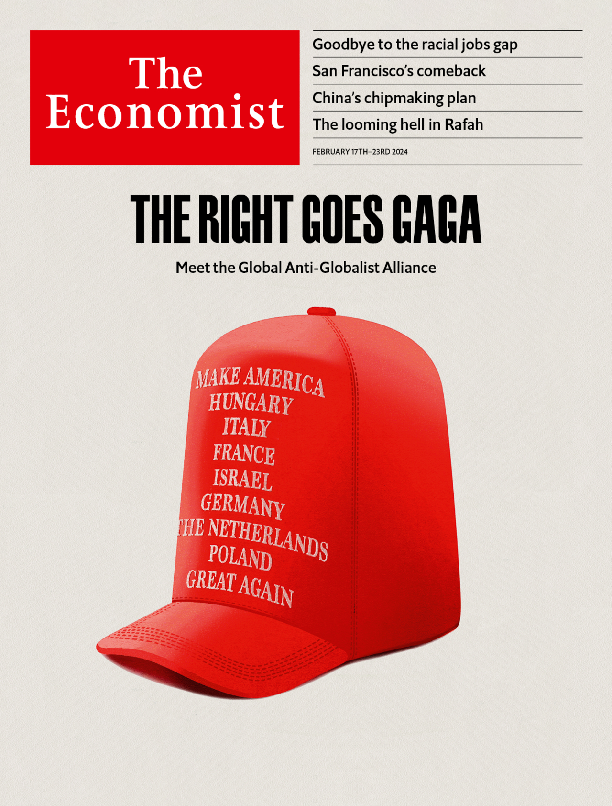

###### The world this week

# This week’s cover 

##### How we saw the world 

> Feb 15th 2024 

This week, our cover focuses on the rise of national conservatism—statist, “anti-woke” politics that puts national sovereignty before the individual. Donald Trump, Viktor Orban and a motley crew of other Western politicians have shattered the conservatism which Margaret Thatcher and Ronald Reagan built during the 1980s. Rather than emphasising individual liberty and free markets, national conservatives think ordinary people are beset by impersonal global forces and that the state is their saviour. They suspect free markets of being rigged by the elites, they are hostile to migration and they despise pluralism. How, then, should old-style conservatives and classical liberals deal with national conservatism? One answer is to take people’s legitimate grievances seriously; sneering at them only confirms how out of touch elites have become. Liberalism’s great strength is that it is adaptable, and it can adapt to national conservatism. Right now, it is falling behind.

 


