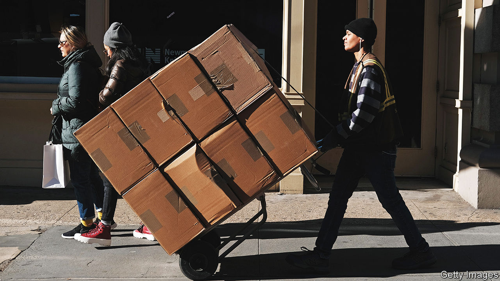
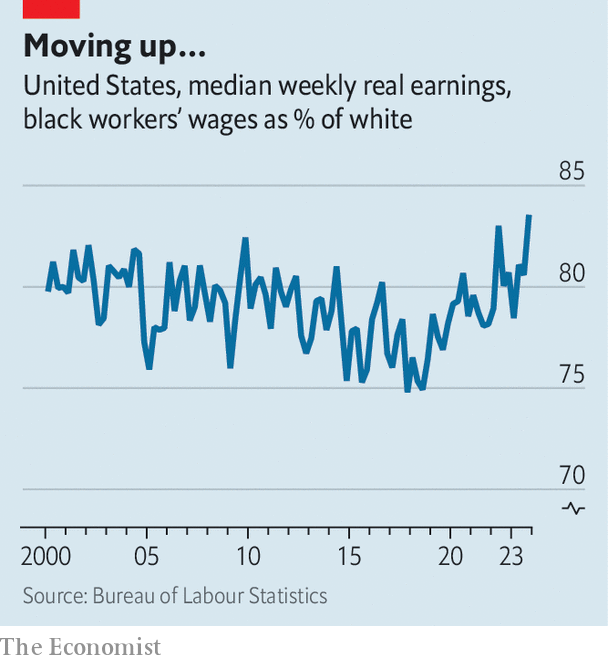
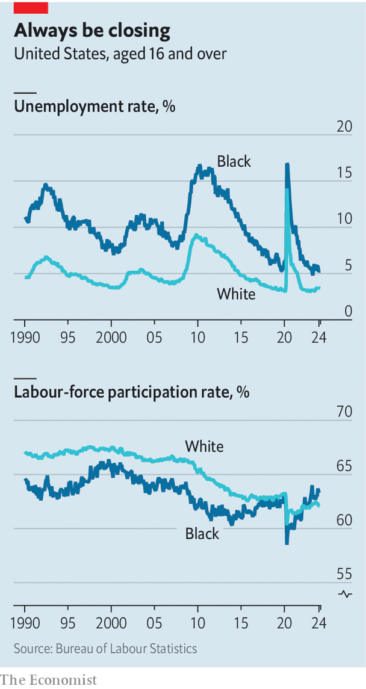

###### Racial progress in America

# Black workers are enjoying a jobs boom in America 

##### A tight labour market chips away at some of the most stubborn inequalities 

 

> Feb 14th 2024 

It is a grim fact of American life that black people have long  white folk in the world of work, with higher unemployment, lower wages and a larger share giving up on job searches altogether. A much more hopeful fact is that many of these inequalities now appear to be shrinking. In the half-century before the covid-19 pandemic, the black unemployment rate was on average twice as high as the white one. At the end of last year jobless rates were, respectively, 5.2% for black Americans and 3.7% for white people—equalling the narrowest gap on record.

 


Even more striking are shifting tides in labour-force participation. About 63% of black Americans are now deemed to be either in work or searching for jobs, more than the 62% level for white Americans—an inversion of the pattern seen in previous decades. In part this reflects demographic differences, because the median white American is about a decade older than the median black American and thus more likely to be retired. But it also testifies to better job prospects for black Americans: their median earnings were about 84% of those of white Americans at the end of 2023, a sharp rise from the 79% average of the preceding two decades.

The underlying cause of all of these changes is America’s run of . The labour market has been so tight for the past couple of years that it has benefited all workers but especially the most marginalised, helping to create opportunities that were once much harder to come by. Although it is only natural to worry whether these advances will endure when growth eventually slows, it is important to recognise that, for the moment, they are reducing some of America’s most persistent inequalities.

The improvement for black Americans has been broad-based, with gains for blue-collar and white-collar workers alike. Eddie Smith in Charlotte, North Carolina was struggling to get by with occasional jobs mixing concrete until last summer, when he took a four-week course to obtain his commercial driver’s licence. Now he pilots an 18-wheeler and delivers crates of beer around the city for a base salary of about $60,000. “It’s the best job I’ve ever had. The pay is good, and I work at my own pace on my own schedule,” he says. He is not alone. According to official data, the economy has added about 1.6m jobs in “transportation and material moving”—a category which includes driving delivery trucks—since the end of 2019, and about 20% of these have gone to black Americans, above their 14% share of the population.

 


At the opposite end of the labour market is Lloyd Bolodeoku, a senior in computer science at Bowie State University, one of America’s historically black universities. He has already accepted a job offer from Adobe, a software company, and will start in a cyber-security role in May, mere days after he graduates. Mr Bolodeoku recalls the words of a teacher from his high school just outside Baltimore, where the student body was more than 90% black: “His saying was you either want the router or you want the spatula.” That is, if you do not learn about technology, you may end up flipping burgers. Although black Americans are still underrepresented in high-tech work, they have gained about 130,000 jobs in computer-related occupations in the past three years.

One reason that a strong labour market is valuable for black Americans is that many work in highly cyclical sectors such as freight delivery. That makes them vulnerable to recessions but also well placed during periods of growth (a similar dynamic exists for Hispanics). A tight labour market also blunts some of the discrimination that black applicants may face when looking for jobs. “During cyclical downturns employers can afford to pick and choose, but when workers are really needed, they are penalised for their biases,” says Michelle Holder, an economist at John Jay College, City University of New York.

The evolution of America’s economic structure is probably also playing a role. Concentrated in lower-skill jobs, black men were hit especially hard by the decline of factories and unions from the 1970s on. But lower-skilled workers are once again in high demand in a range of occupations that are increasingly central to the economy, from stocking warehouses to assisting nurses. Real-wage growth for the bottom 10% of earners has consistently outstripped all others since 2020—a boon for black Americans.

Another factor is a decline in incarceration. About 590,000 black adults were in prison in 2021, down by more than a quarter from a decade earlier. Black Americans are still nearly five times more likely than white ones to go to jail, but a lower incarceration rate is progress nonetheless, freeing more people for work. 

Sam Schaeffer, head of the Centre for Employment Opportunities, which helps Americans find work after leaving prison, has also seen increased openness to “second-chance hiring” by companies. He says that stems in part from executives making commitments to racial justice but also, crucially, from the tight labour market. One of his organisation’s success stories is Mr Smith, the beer-delivery man in Charlotte. He was behind bars for 34 years before getting parole. Many firms were afraid to hire someone with his background, but thankfully not all. “It’s just hard for them to find drivers these days,” he says.

A strong labour market is, by itself, far from a cure-all for racial inequality. Although the black-white wage gap has narrowed in the past two years, the  has widened over the same period, because white Americans own more stocks than black Americans and so have benefited more from the market rally.

What’s more, unfairness goes well beyond hiring decisions. For decades the received wisdom was that black Americans would pull closer to white Americans if they had similar academic qualifications. But Valerie Wilson of the Economic Policy Institute, a think-tank based in Washington, DC, has shown that wages for black and white college graduates have instead drifted further apart in recent decades. “In addition to pay discrimination, a lot has to do with disparities in the jobs that people go into and in opportunities for promotion,” says Ms Wilson.

One question is whether historically black colleges, which produce about 40% of America’s black engineers, can help reverse this dismal trend for graduates. The computer-science department at Bowie State, where Mr Bolodeoku is finishing his degree, has built up an internship-placement programme that links students with companies and government agencies, starting in their first year and continuing throughout their studies. “They get to be mentored and get the confidence they need,” says Rose Shumba, chair of Bowie’s computer-science department. Not coincidentally, its enrolment has more than doubled from 190 in 2019 to about 500 today.

For black women more generally, investment in early education would be even more significant. A big stumbling block for their careers is the need to . Nearly 50% of black children live only with their mothers, compared with less than 20% of white children. That is one of the motivations for the Biden administration’s proposal to subsidise child care and make pre-kindergarten free, a policy which would need a Democratic sweep in the election later this year to get through Congress. “You would get a return on investment both in terms of lifting kids out of poverty and freeing up their parents to be able to pursue more opportunities,” says Lael Brainard, director of the National Economic Council in the White House.

For now, the test of whether black Americans are truly faring better in the workplace will arise whenever the economy next hits a soft patch. Historically, many have fallen prey to a “last hired, first fired” mode of employment. But William Rodgers of the Federal Reserve’s branch in St Louis is cautiously optimistic that a future downturn may play out differently. He has homed in on some of the workers most likely to be fired—young black Americans with no college degrees—and found that their unemployment rate has barely risen since 2022 even as the number of job openings has fallen. This, he thinks, may be a sign that gains of the past few years are sustainable. “People have come in, gotten a toehold and built up experience,” he says. With any luck, more black Americans will go from last hired to lastingly hired.■


