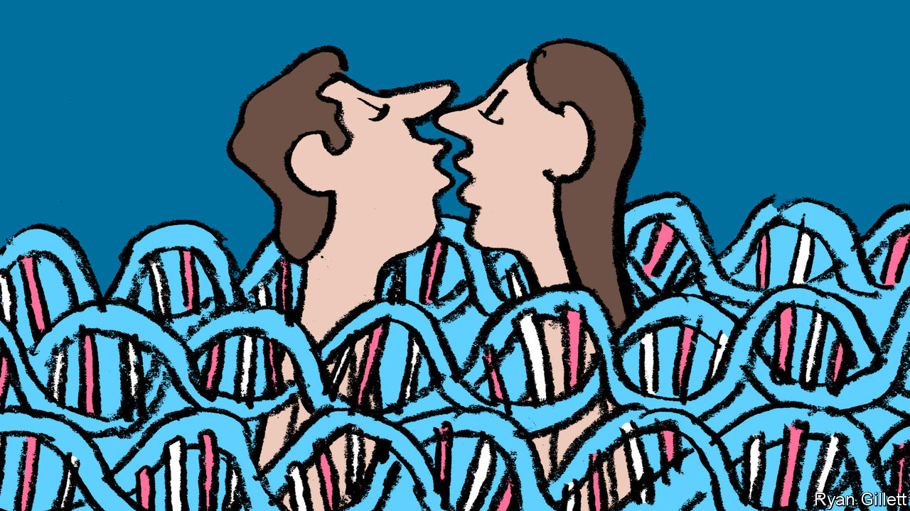

###### All in the family

# Cousin marriage is probably fine in most cases 

##### It is also illegal in 25 American states 

 

> Feb 15th 2024 

IT JUST SEEMED so wrong. In January Nick Wilson, a Kentucky state legislator who achieved reality-TV fame for winning “Survivor” in 2018, created a frenzy on social media when he sponsored a bill that removed “first cousin” from the list of incestuous family relations. Mr Wilson said that the omission was a mistake and the bill was quickly withdrawn. The new draft put “first cousin” back on the list of criminal sexual relations, alongside parent, sibling, grandchild and other blood relatives.

Since much of Kentucky is covered by the Appalachian mountains, a region stereotyped for encouraging incestuous sexual behaviour, jokes quickly spread online. The reactions on X (formerly known as Twitter) ranged from humour to disgust to fear for the resulting offspring. Only a few pointed out that in many states it is legal to have sexual relations and marry one’s first cousin. Is it really OK to kiss your cousin?

Geneticists mostly say that it is, with some caveats. In 2021 the National Society of Genetic Counsellors (NSGC) published updated guidelines for consanguineous couples (people descended from the same ancestor) and their offspring. The risk to offspring is greater, but the increase is quite small. According to the Centres for Disease Control and Prevention about 3% of all babies born in America have birth defects. The NSGC guidelines state that for “couples with no known genetic disorders in the family, there is an additional 1.7% to 2.8% risk for significant birth defects.” 

Many other couples face far higher risks of genetic complications for their offspring, and those unions are not banned. Classic Mendelian genetics (the kind taught in biology class) predicts that if two people each have a recessive gene for certain disorders, such as cystic fibrosis or sickle-cell anaemia, there is a 25% chance their child will be born with that disorder. Yet those marriages are allowed. “The law against first-cousin marriage is a major form of discrimination,” says Robin Bennett of the University of Washington’s department of medicine, who was a co-author of the NSGC guidelines. For offspring “the risks are very low and not much different than for any other couple,” she says.

Throughout Western history attitudes about consanguineous marriages have varied. The Bible does not directly ban sexual relations between cousins—how else would all of mankind have descended from Adam and Eve? The Roman Catholic Church did later prohibit first cousins from marrying, though exceptions were made for a fee. Martin Luther, the father of Protestantism, objected to such payments, so many Protestant denominations allowed these marriages free of charge. As is clear from novels such as “Mansfield Park” and “Wuthering Heights”, the people of Georgian and Victorian England were not too squeamish about such relations. Queen Victoria was married to her first cousin, as were both Albert Einstein and Edgar Allan Poe. 

In some cultures, marriage between close family members is encouraged today. It secures wealth and reinforces social connections within the family. It might even make marriages easier, on the optimistic assumption that the in-laws are more likely to get along. In some areas of the world (Pakistan, the Middle East), nearly half of all marriages are between close relations. No European countries ban marriages between first cousins (though Norwegian policymakers recently debated doing so).

There are limits to the amount of intermarriage that is healthy. Charles Darwin, the father of evolutionary biology, who married his first cousin in 1839, was reportedly conflicted about his own arrangement. The Darwins had ten children, but three of them died during childhood and three of his surviving children never had any offspring with their spouses. Some historians surmise that the children suffered from genetic abnormalities due to their parents being closely related—the families of Darwin and his wife had a long history of intermarriage.

Yet despite the fairly low genetic risk for most couples, the “ick” factor prevails in Western culture. The family dynamics can be difficult to explain to others. Many consanguineous couples choose to keep quiet, says Ms Bennett. For this reason it is difficult to know how many of these couples exist in America.

Despite the fact that first-cousin marriages are pretty low-risk for offspring, 25 states do not allow first cousins to marry. In six states, it is legal to marry a first cousin, but with caveats (if one person is unable to reproduce or elderly, for example). However, if Mr Wilson’s experience in Kentucky is indicative of the public’s reaction, it will be a long time before such laws will be stricken from the books. ■


