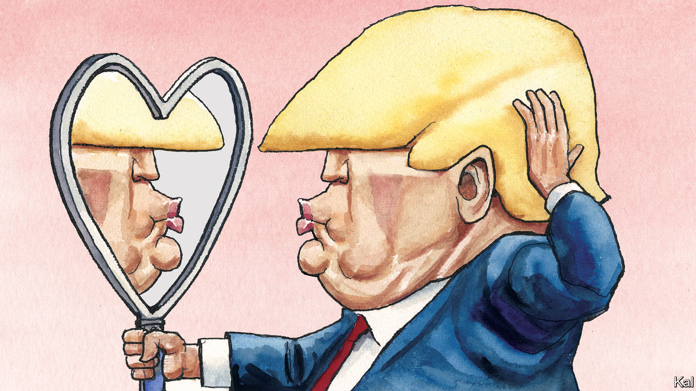

###### Lexington

# Donald Trump’s tremendous love 

##### His politics may seem hostile, yet he talks like a Valentine’s Day card 

 

> Feb 13th 2024 

What does Donald Trump talk about when he talks about love? For the man presents himself as being full of it. He is associated with a politics of grievance and retribution that has boiled over at times into violence, most infamously in the attack on the Capitol on January 6th 2021. And yet no other president, or presidential candidate, has so wreathed himself in valentines. 

In speeches and blast emails, Mr Trump romances his supporters with constant reminders of his love. Among those for whom he has declared his love over the years are “the Hispanics”, “the Saudis”, “the poorly educated” and officers of the Central Intelligence Agency. His heart often has reasons of which reason would appear to know nothing. Like Titania he has tumbled for the most improbable of creatures (“We fell in love,” he gushed of North Korea’s supreme leader, Kim Jong Un). Like Rihanna he has found love in hopeless places, including the Soviet Union (“you could see it was a country where there was a lot of love”) and even in that crowd on January 6th (“There was a lot of love out there. There was tremendous love”).


Pretty much by definition, presidents are not normal people. But even by their abnormal standard Mr Trump is an unusual character. His detractors like to point out that he had a head start in life as the son of a millionaire real-estate developer. They may not give him enough credit, though, for how through daring, determination and a certain ethical flexibility he willed himself into becoming a billionaire, a flamboyant celebrity, a reality-television star and then the president—how, like F. Scott Fitzgerald’s Jay Gatsby, Donald Trump “sprang from his Platonic conception of himself”. His insistence on this conception overwhelmed the scoffers at his candidacy eight years ago, bulldozed most Republicans into believing he did not lose in 2020 and may now  to return him to the White House.

Biographers of Mr Trump have recounted how, as he discovered he could dominate and bamboozle others, he acquired some contempt for them as well. Once he became known for his wealth people would claw at him for favours. He marvelled, as a candidate in 2015, how easy it was to woo voters with the slightest gesture. 

Wayne Barrett, a New York journalist who was probably the closest student of Mr Trump’s rise, fall and fragile recovery into the early 1990s, writes in “Trump” that people who worked for the mogul longed for him to find love but “did not really believe he had the capacity for it.” Mr Barrett quotes one such person as saying Mr Trump was “unaware of his own tragedy” and then continues, “As they saw it, his deeply ingrained remoteness was so much a part of his unexamined life that he neither understood it nor regretted it.” When one friend, irritated by Mr Trump’s uninterest in his troubles, accused him of being a shallow person, he replied, “That’s one of my strengths.” 

The Great Gatsby was laid low by love, but that seems to have little chance of undoing The Donald, as his first wife, Ivana Trump, called him. Outsiders can never know what really goes on inside a marriage, but journalists, lawyers and the participants themselves have rendered some of Mr Trump’s marriages more transparent than most. Ideals of love have not tended to predominate. 

“If you don’t marry me you’ll ruin your life,” were the words with which Mr Trump proposed to Ivana, according to her book “Raising Trump”. “Continuing love and affection was not a material part” of their nuptial agreement, read a court filing from Mr Trump as the couple split up. “I was bored when she was walking down the aisle,” Mr Trump later recalled of Marla Maples, the woman for whom he left Ivana. “I kept thinking, ‘What the hell am I doing here?’” Probably no Valentine’s Day card will ever invoke Mr Trump’s advice about how best to behave toward women: “You have to treat ’em like shit.”

Outside his family, Mr Trump did not express much love for the people who helped build his fortune. “Look at those losers,” he remarked to an associate as he watched people gambling in one of his Atlantic City casinos, according to “Confidence Man” by Maggie Haberman. 

To Mr Trump, hate could be a virtue. Back in 1989, New York’s mayor, Ed Koch, urged citizens not to have rancour toward five black youths arrested for the rape of a white jogger in Central Park. Mr Trump, then beginning to dabble in politics, took out full-page ads in the four daily New York papers calling for reinstatement of the death penalty and declaring, “I want to hate these murderers and I always will.” The youths served years in prison, but even after they were exonerated Mr Trump would not recant, saying in 2014 that they did “not exactly have the pasts of angels”. (Hate can mean never having to say you’re sorry.)

As president in 2020, Mr Trump attended the National Prayer Breakfast, devoted that year to the theme of “loving your enemy”. “I don’t know if I agree,” he mused, when he stepped behind the lectern. He had recently been impeached for the first time and was not inclined to forgive people he thought of as enemies. “They have done everything possible to destroy us,” he said, “and by so doing, very badly hurt our nation.”

Say that you love me

Mr Trump’s love has limit and conditions. He seems to need to feel appreciated and admired, to feel loved, and then he will complete the transaction by declaring his own affection. “I’ll never stop loving you,” he vowed in a recent mass email seeking donations. “Why? Because you’ve always loved me!” That is a deal his supporters are eager to make. They have their own unmet needs for recognition and affirmation. They know their guy is not perfect; in fact, it seems probable that when their love swears he is made of truth they believe him even though they know he lies. They will not risk his love by doubting him. This codependence has become the strongest force in American politics. ■


