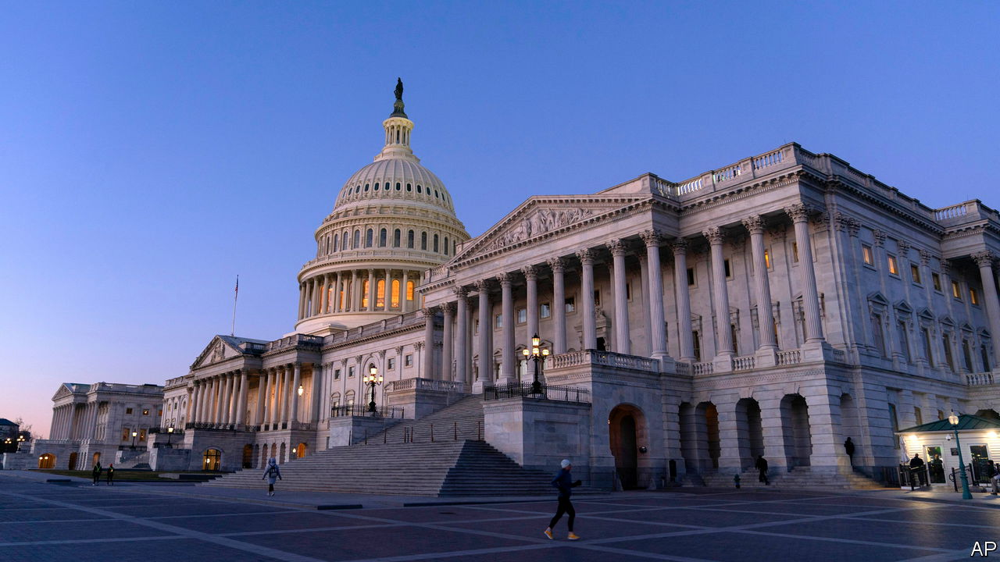

###### House of cowards

# House Republicans fear Trump too much to aid Ukraine 

##### They include the speaker, Mike Johnson, who won’t allow a vote 

 

> Feb 14th 2024 

America’s Congress does not have a reputation for productivity, but its failure to authorise more aid for Ukraine is unusual even for the underachievers on Capitol Hill. And the legislation’s already grim prospects are diminishing as the presidential election approaches.

On February 13th the  approved a $95bn bill. Most of that funding is meant to assist Ukraine and replenish America’s dwindling weapons stocks. The legislation also includes $14bn for Israel, $9.2bn for humanitarian relief and some $8bn for the Indo-Pacific. Almost every Democrat and 22 Republicans voted in favour.


That is as far as the legislation is likely to go. A wing of isolationist Republicans has always opposed helping Ukraine, but now some legislators previously supportive of Ukraine argue that they shouldn’t help until America resolves its border crisis. Donald Trump, aiming to keep America’s immigration mess as a campaign issue, ordered Republicans to oppose a compromise. He also has insisted any foreign assistance should come in the form of loans to be repaid in the future.

Chuck Schumer, the Senate majority leader, called on the House to take up the bill, as it would almost certainly pass the House if voted on. But Mike Johnson, the Republican House speaker, listens more closely to Mr Trump than he does to Democratic senators. “The mandate of national-security supplemental legislation was to secure America’s own border before sending additional foreign aid,” Mr Johnson said before the bill passed. “Now, in the absence of having received any single border policy change from the Senate, the House will have to continue to work its own will.”

Republicans apparently had the great misfortune of getting what they asked for. First, they demanded that the border and Ukraine to be linked. When Senate negotiators offered the toughest immigration law in decades, most Republicans rejected the offer. A foreign-aid-only bill passed, and now Mr Johnson is complaining that it does nothing to control immigration.

Republicans have such a small majority in the House that a few anti-Ukraine congressmen could challenge Mr Johnson as speaker if he were to allow a vote on military aid. He could theoretically offer amendments or restart the whole process, though there is little evidence that this House is capable of doing much. He could also split the bill into pieces and offer separate votes for Ukraine and Israel, for example, though that too appears unlikely. 

Perhaps the only hope for Ukraine funding is a parliamentary manoeuvre known as a discharge petition. The time-consuming, multi-step process allows a simple majority of the House to force a vote on legislation. The mechanism could take more than a month to play out, and it hasn’t been successfully used in nearly a decade. Both sides seem to agree the tactic is unlikely to succeed.

Even though a majority of the House still supports Ukraine, many Republicans don’t feel strongly enough to defy House leadership and Mr Trump. It’s one thing to support Ukraine; it’s another to risk losing a primary to a Trump-backed challenger. And some House Democrats plan to reject the bill because of its support for Israel. Every Democratic defection will require another Republican to step up.

Time is running out for Ukraine funding, but it’s not the only item on Mr Johnson’s agenda. The House impeached Alejandro Mayorkas, the secretary of , on the same day that the Senate passed the aid bill. And a partial government shutdown will begin on March 1st in the absence of legislative action. Mr Johnson says that is where he has directed his attention now. Yet a lapse in government funding looks increasingly likely: House Republicans have shown themselves to be as feckless on setting a budget as they have been on helping allies. ■


