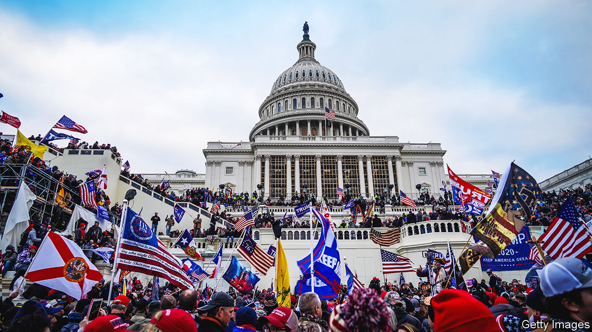

###### Parler games

# The far-right’s favoured social-media platform plots a comeback 

##### What to make of Parler’s return 

 

> Feb 15th 2024 

AH, TWITTER IN 2020. X was just a letter in the alphabet. Elon Musk was preoccupied with implanting computer chips into pigs. Donald Trump wasn’t yet banned, though his tweets were loud, alarming—and getting fact-checked by the platform itself. Tired of liberal  telling them what they could post, some Republicans had started to defect to a rival platform launched two years earlier: Parler. It looked similar to Twitter, but with less content moderation. More began to announce their migration from the nest with the hashtag #Twexit. “Hey @twitter, your days are numbered,” tweeted Brad Parscale, then Mr Trump’s campaign manager, with a link to Parler. 

Parler has since earned a darker reputation. Messages exchanged on Parler have been presented in court as evidence to convict rioters who broke into the Capitol on January 6th 2021. Misinformation and far-right conspiracy theories shared on the platform came to the fore. The app was taken off the Apple and Google app stores (although it was later restored). A legal battle with Amazon Web Services, the cloud platform that hosted Parler, ensued. For a brief moment in 2022 Kanye West, a controversial rapper, attempted to buy it. The app eventually went down altogether. 

Now it is promising a “big comeback” after being acquired by PDS Partners, a Texas-based company. Parler rejects its association with January 6th. Shortly after the insurrection, the platform’s previous ownership denounced “Big Tech’s scapegoating of Parler” in a letter to the House Oversight Committee (HOC) and said that Parler had shared concerns about violent activity with law enforcement before January 6th.

“Many people organised to be at that event on all different platforms,” says Elise Pierotti, the firm’s returning chief marketing officer. “Parler was the only one that was scrutinised.” Ms Pierotti, who claims that Parler’s move to return in an election year is coincidental and that the firm is “not thinking about politics”, says that the platform will allow users to say that the 2020 election was stolen (“because that is a personal opinion”) and that mail-in ballots are fraudulent. “When it comes to open discussion, or people presenting, you know, different ideas, that’s not up to us.”

Parler is not the only fringe platform to have won favour among those on the right, but it is the best-known. Nor was it the only social-media service to be cited in the House’s January 6th report, though the committee notes that it found “alarmingly violent and specific posts that in some cases advocated for civil war” on Parler. “It’s hard to imagine that the brand itself, the name Parler, has shed the public understanding of the app as being a place [where] many who were part of January 6th got organised and shared resources,” says Joan Donovan of Boston University. 

Will fans of Parler return? Twitter (now known as X) looks  under Mr Musk’s ownership; these days it is liberal users who threaten to go elsewhere. Mr Musk has dismantled or weakened X’s fact-checking tools as part of his own free-speech crusade, claiming that the platform “has interfered in elections”. He recently shared posts about America’s “insane” voting system and why “you can’t trust the media” to his 172m followers (by comparison, Ms Pierotti estimates that Parler had almost 20m users at its peak).

If Parler does return, how concerning would that be? Social media’s ability to influence extreme political acts is notoriously difficult to quantify. Several papers published since January 6th 2021 have begun to paint a more  of the link between platforms of all stripes, polarisation and violence. Parler’s unique contribution to January 6th is “very unclear”, reckons Daniel Karell, a sociology professor at Yale University who co-authored a study on Parler, platforms like it and civil unrest. He found that while it is unlikely someone could have been radicalised by posts on Parler alone, the platform did attract like-minded people with extreme views and gave them a space to affirm each other’s ideas. In other words, a loosely moderated forum made storming the Capitol seem almost like a normal thing to do. 

As private, encrypted channels—which can offer both unfiltered conversation and fewer prying eyes—grow in popularity, such conversations will become harder to see. One thing supersedes the power of content moderation altogether: the charismatic figure that rallies others to their cause (or social platform of choice). Ms Donovan says her own research into networked incitement has found a common thread among those who were arrested at the Capitol: “they came because Trump asked them to, very simple.” Whether Parler’s user base will return or grow remains to be seen. The conversations it hosted never went away. ■


