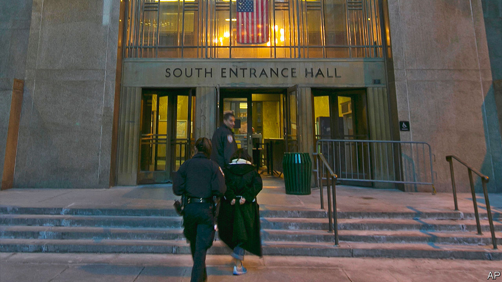

###### Night court

# The search for justice in America is not a nine-to-five job 

##### Courts should stay open later. New York City has been doing that since before it was cool 

 

> Feb 15th 2024 

“I APPRECIATE everything that you’ve done,” Judge Jonathan Svetkey told a team of defence lawyers at a recent Night Court arraignment in Manhattan. The lawyers had asked for their client to be released under supervision. They had been working on getting mental-health services and a bed for the night. The judge was sceptical the defendant would accompany them to a shelter. “What if he says, ‘I’m going the other way?’ What are you going to do?” He set bail for $5,000. Judge Svetkey moved on; Night Court usually must handle 70-90 cases a shift.

By day, Manhattan’s Criminal Court is a bustling building. Long queues snake through the metal detectors at the entrance. Lawyers, jurors, defendants and police fill the corridors. But come 5pm, the building clears out, except for two courtrooms, which remain open until 1am to handle arraignments.

Night Court has been around a long time, and without it, New York City’s criminal courts would be even more  than they already are. These days, however, late shifts in courts also reflect a national effort to use alternative hours to improve efficiency and engender public trust in the justice system. 

To aid rule-breaking drivers who hold down day jobs, many Californian counties offer late hours for traffic court, from 5pm-7.30pm. Forced online by covid, courts around the country continue to hold virtual hearings. Getting to court might be unsafe if someone needs a protection order against a violent partner, so Cook County, which includes Chicago, offers remote proceedings from 9pm until 3am on weekdays, as well as on weekend afternoons. Alternative hours can be used to increase participation, among other benefits, says Danielle Hirsch of the National Centre for State Courts, a non-profit group that promotes court innovations.

Swamped by criminal defendants, New York embraced alternative hours before it was a cause of better-government types. Until 2003, Manhattan’s arraignment court was open 24 hours a day. A third session known as the “lobster shift” ran from 1am until 9am. But during the 1990s, Gotham became one of the safest big cities in America. Fewer arrests meant fewer arraignments. More recently district attorneys have stopped prosecuting marijuana-possession cases, which used to jam up arraignment court. But the remaining shift of Night Court remains busy most nights. 

Arrests related to domestic-violence are rising. The influx of migrants has put a strain on the city’s social and judicial services. More migrants are appearing before a criminal-court judge, often for shoplifting necessities such as nappies or stealing something to sell on. A few face charges for more serious crimes such as assault.

New York City law requires, with some exceptions, that defendants appear before a judge within 24 hours of arrest. It would be difficult to meet this goal without Night Court. The arraignment process is no different from during the day. The prosecutor presents the charges and requests that the defendant post bail, be released under supervision or be remanded to jail. Perhaps because it is night, however, some of the emotions seem heightened and many of the defendants can look fragile. Shelter and other services are not as readily available at a late hour, which can be especially worrying on cold winter nights. 

Late-night feelings

As in day court, many defendants have  and some suffer from drug addiction. Most are poor. Some do not have coats. One former Legal Aid Society lawyer says she had to run out to a 24-hour pharmacy to buy shoes for a client. Taramanie Sukhu, an arraignment supervisor, often shares food.

Ed McCarthy, of Legal Aid, has been working Night Court for more than two decades. He says there is not always a social worker available in the evening or on weekends. (Court is in session seven days and nights each week in New York City.) Defendants can languish at , the city’s largest and most notorious jail, Mr McCarthy says, “only because there’s nobody to offer a programme or a way of giving judges reasons to release you.” 

Aubrey Fox of New York City Criminal Justice Agency, a charity supporting pre-trial defendants, says that an infrastructure to promote release instead of detention does function quietly in the background. For every person held at Rikers, nine are released into the community. Many are candidates for treatment and other social services. About 85% make all their court dates. “That gives judges more confidence that if they release someone they will be taken care of,” Mr Fox says. 

Night Court is one place where this triage begins. The public gallery tends to be quiet, except for the occasional family member. One family drove from Michigan when a close relative was arrested. The late-shift courtrooms also attract tourists. Kathrin Kolvenbach, a trainee lawyer from Germany, said she had heard about it from a guidebook. She was there to learn about America’s court system. Others are there to gawk, looking for gritty entertainment. Tourists give Night Court tips to each other on Tripadvisor, a travel website. One defence lawyer said seeing tourists, who tend to be white Europeans, leaves a bad taste in her mouth and unsettles her clients, who are mostly African-American or Hispanic.

Krystal Rodriguez, policy head of the Data Collaborative for Justice at John Jay College, says arraignments both night and day are a “snapshot of how the criminal-justice system becomes the unfortunate repository for all these other social issues that outside of the criminal legal system we haven’t been able to address”. Many Americans learned about Night Court from an eponymous sitcom that ran from 1984 until 1992. It was recently rebooted and is not very funny. There are few laughs in the real one either. ■


