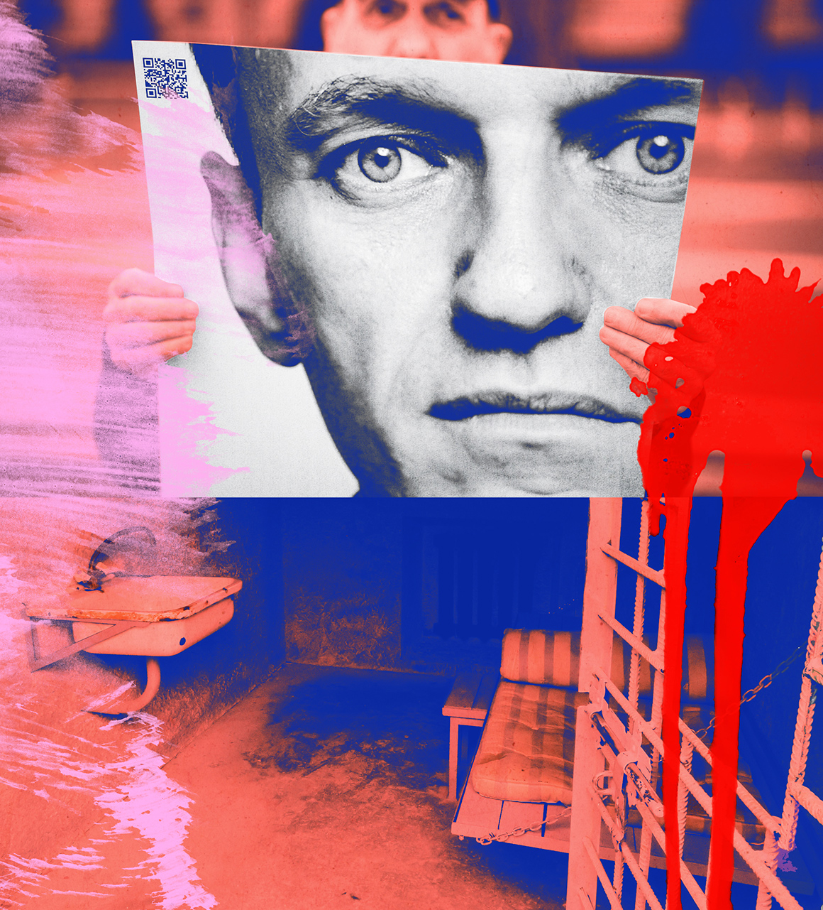
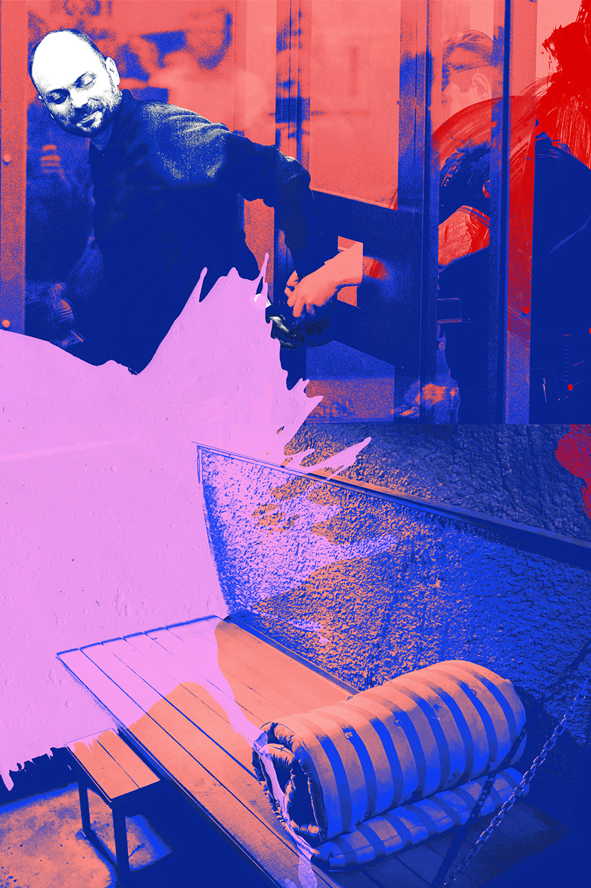
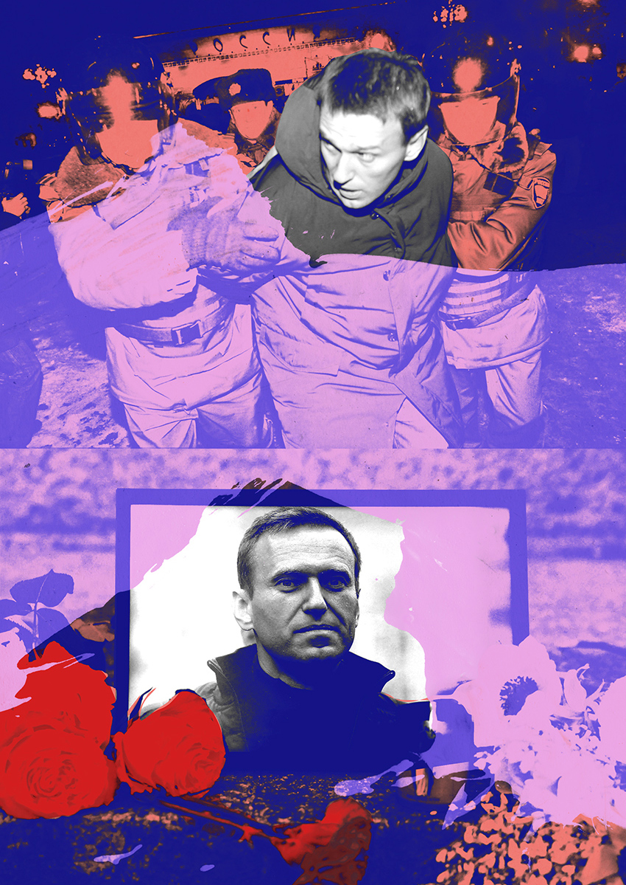

###### Russia

# One day in the life of a Russian political prisoner 

##### Navalny’s death has exposed the similarities between Putin’s penal system and Stalin’s 

 

> Feb 22nd 2024 

The wake-up call in cell number nine of the IK-6 prison colony in the Siberian town of Omsk comes at 5am in the form of the Russian national anthem blasting from a loudspeaker. Vladimir Kara-Murza, a journalist and politician, knew as soon as he heard the opening chord that he had only five minutes to get up before prison guards would take away his pillow and mattress. By 5.20am his metal bed frame, attached to the wall, would be locked up so that he could not use it for the rest of the day. Kara-Murza’s cell, painted in bright blue, was five metres long and two metres wide. In the middle, a table and a bench were screwed to the floor. The only objects he was allowed to keep were a mug, a tooth brush, a towel and a pair of slippers. The light was never turned off. 

Later in the morning a mug of tea and a bowl of gluey porridge made from an unidentifiable grain would be pushed through a small hatch in the cell door. At some point Kara-Murza would be permitted a 90-minute “walk” – a stroll around a concrete courtyard the same size as his cell with a metal grille in place of a roof. He was obliged to keep his hands behind his back. Often the sub-zero temperatures made it impossible to keep going for the allotted time. The loudspeaker in his cell blared throughout the day, sometimes playing the local radio station, sometimes a monotonous recital of the penal-colony rules. 


CCTV cameras were trained on Kara-Murza around the clock. Even so, the guards would take him to an inspection room at 9am and 5pm each day. He had to strip naked while they ran a metal detector over his clothes and underwear. Every time he is addressed he has to identify himself in the official formula: “Kara-Murza, Vladimir Vladimirovich, date of birth September 7th 1981, convicted under criminal code articles 284.1 part one, 207.3 part two, 275. Start date of sentence, April 22nd 2022. End date of sentence, April 21st 2047.” 

 


Since the death of , Russia’s most prominent opposition leader, in a similar penal colony in the Arctic last week, Kara-Murza has become, along with Ilya Yashin, an opposition politician, one of the country’s highest-profile political prisoners. Like Navalny, Kara-Murza was the victim of suspected Novichok poisoning. He twice fell into a coma in 2015, and again in 2017. (According to Bellingcat, an investigative outlet, a specialist unit of the Russian security services had been tailing him before each incident.) As a result, he suffers from polyneuropathy, a nerve disease that causes his legs to go numb. 

Like Navalny he could have stayed in exile abroad – he had lived in America for years and is also a British citizen. (The British government has said that it will not try to secure his release through a prisoner exchange.) And like Navalny he also chose to return to Russia, drawn by his calling as a Russian intellectual and a refusal to let his country be defined by Vladimir Putin. On April 5th 2022 – just over a month after Russia  – he flew back to Moscow. By that time Putin had already made it a crime to refer to his “special military operation” as a war, let alone to criticise it. Yet Kara-Murza openly denounced it as a war of aggression. 


A week after his return he was arrested outside his home in Moscow, and charged with spreading “fake news” about the war. His advocacy for the Magnitsky Act – an American law that allows sanctions to be placed on individuals involved in corruption and human-rights abuses – made him a traitor in the eyes of the Kremlin. (It is named after Sergei Magnitsky, a lawyer who uncovered a $230m fraud and who died in prison in 2009, having been denied urgent medical treatment.) His trial for treason took place behind closed doors because it involved what the Kremlin regards as “state secrets”. 

Kara-Murza was given 25 years in prison – a far graver penalty than awarded, on average, for murder. (He was sentenced by Sergei Podoprigorov, the same judge who put Magnitsky in jail and was sanctioned in Magnitsky’s name.) It is the longest term currently being served by a political prisoner in Russia. From his prison cell, Navalny called the sentence “revenge for the fact that [Kara-Murza] did not die”. 

 


On January 26th of this year Kara-Murza was transferred to an even harsher penal colony a short drive away, differentiated from the previous one by a single digit (IK-7). This measure had been taken, officials said, because of a “severe administrative breach” by Kara-Murza: missing a wake-up call which he says never came. 

Kara-Murza is permitted to write and receive letters, though he is only allowed a pen for 90 minutes each day. I wrote to him after his abrupt disappearance from IK-6. “You ask me about the meaning of my transfer,” Kara-Murza replied. “The meaning of a transfer is the transfer itself. One of the main features of prison life is a constant unpredictability, insecurity and uncertainty not only about tomorrow but even this evening.” 

Alexander Solzhenitsyn, the Nobel Prize-winning writer, had identified this kind of punishment as a distinctively Soviet innovation, Kara-Murza said. “The Soviet know-how was to constantly uproot a person, ordering him ‘out with your stuff’ without any warning…As soon as you start getting used to and adapting to a place, you have to start all over again.” 


Kara-Murza is almost completely disconnected from the outside world. Since he arrived in prison, he has been granted only one 15-minute phone call with his children (five minutes per child). Complete isolation means that even a visit from the prosecutor can lift his spirits. 

Apart from the drone of the loudspeakers, Kara-Murza’s only external sources of mental stimulation are letters and books from the prison library. But he finds it hard to read. “You lose concentration very fast, thoughts run away. You read one page and don’t understand what it is that you’ve read,” he wrote to me. “Memory also works in a strange way. You remember in detail what happened 30 years ago, but anything you hear and read this morning is erased completely.” 

 


At 8.30pm he is handed his mattress and pillow. His bunk bed is lowered. Then at 5am the next morning he once again wakes up to the sound of the Soviet national anthem. 

Omsk, the city where Kara-Murza is being held, was one of hundreds of sites for the Main Directorate of Corrective Labour Camps, established by Stalin in 1929 and better known by its acronym in Russian: gulag. This was a centralised system of slave labour on an industrial scale, in which up to 20m people from across the Soviet Union found themselves trapped. Roughly 2m of those prisoners died. 

Solzhenitsyn gave the definitive literary treatment of these labour camps, prisons and transit centres in “The Gulag Archipelago”. He spent 11 years within the gulag and wrote a three-volume “literary investigation” in which he mapped it as though it were “an almost invisible, almost imperceptible country…though scattered in an archipelago geographically”. He described the prisoners, starving and exhausted by work, “eyes oozing with tears, red eyelids. White cracked lips covered with sores. Skewbald, unshaven bristles on the faces.” 

Part of the function of the gulag, Solzhenitysn argued, was economic: Stalin needed labour to industrialise and prepare for war in Europe. The camps were usually in far-flung places rich in natural resources that needed extracting. But their horrors also served a political purpose: to sow terror and purge from society anyone who showed signs of independent thought. It was “a wonderful place into which he could herd millions as a form of intimidation”, wrote Solzhenitsyn. 


After Stalin’s death in 1953 the extermination stopped, the system became more humane and the number of prisoners decreased, but its essence remained. Navalny saw many of the features of the gulag perpetuated in the Russians prison system. “It is not concerned in the slightest with the re-education of prisoners but is aimed only at dehumanising the prisoner, bullying him and serving the illegal orders of the country’s political leadership,” he wrote. “This system cannot be reformed.” As Solzhenitsyn observed: “Archipelago was, Archipelago is, Archipelago will be.” The archipelago has shrunk in size, changed its name and adapted to new economic conditions – but its terrain and procedures remain recognisable. 

Few institutions in Russia have experienced the continuity that prisons have. Both prisoners of the Soviet gulag and those who guarded them have passed on their experiences to their descendants. Russia’s camps – particularly in more remote parts of the country where the prison is the main employer – are often staffed by children and grandchildren of those who guarded the gulag. These dynasties see their past as a point of pride. When the Usolsky penal camp in Siberia celebrated its 75th anniversary in 2013, its press office hailed the unbroken tradition of “loyalty to the Motherland, mutual support and respect for veterans” stretching back to its founding just before the second world war. 

 


Russia’s current prison population remains among the highest per head in Europe with Belarus and Turkey but, at around 430,000, it is the lowest in its history. Around 225,000 employees work in the system. The network of colonies and detention centres is still so vast that prisoners often disappear within it for weeks; they are transferred from one facility to another in windowless train compartments with six berths and twice as many prisoners. Their families and lawyers lose track of them. 

New arrivals to prison are placed in “quarantine”, where they are given medical checks and a psychological assessment, before they are moved to a shared cell or solitary confinement. But the main purpose of this is to break the spirit of the prisoner. Scared and often barred from seeing a lawyer, they feel completely powerless. Kafkaesque absurdity is built into the system, explains Anna Karetnikova, now in exile, who once oversaw pre-trial detention centres in the Moscow region. To demand a meeting with a lawyer, detainees need a pen and paper, which they are often denied. (They can complain, of course, but for that they still need a pen and paper.) 


They soon learn that real power lies in the hands of prison officials known as  – investigators. In countries governed by the rule of law, punishment comes after a trial. In Russia investigations start after an arrest and continue inside prisons and penal colonies. , who are rewarded on the basis of how many crimes they solve, use their unlimited power to coerce confessions and pin new crimes on prisoners. They work in close co-ordination with the security services and the police, deciding who gets urgent medical care and who gets punished with solitary confinement or beaten in special “pressure cells”. 

Conditions vary greatly between colonies and even between cells within the same prison. Some have televisions and fridges; others have only a hole in the floor for a toilet. Some prisoners can pay for the use of a gym or have food brought to them by a delivery company. Others are kept hungry. Many prisons, including IK-7 in Omsk, are connected to an electronic mail system, so sending a letter to a prisoner can take a matter of minutes. But the speed at which it is passed on depends on the good will of the prison censor. A benevolent censor will deliver the correspondence within hours. A cruel one may not deliver it at all. (Navalny was denied letters from his family for weeks.) 

 


Which island of the archipelago a prisoner lands on depends on the financial means of prisoners and the designs of the powerful person who put them there. This offers a business opportunity for prison bosses. Corruption lies at the heart of the gulag’s modern iteration, explains a former senior prisoner official. Bribery can buy you a better cell and racketeering by prison staff is endemic. They rent out slave labour to friendly businesses. 

How much a prisoner must pay is decided by the  – the master who runs the prison. Details of the amounts that change hands are scarce but, in 2012, monthly “collections” at one prison with 1,500 inmates ran at between $1m and $1.5m. Some people paid the equivalent of $60 a month; others $25,000. The money is shared with other prison officials. 

Those who refuse to pay get “broken” – beaten or tortured. The richer they are and the more they resist, the greater the punishment. “Breaking” is mostly carried out not by guards but by “activists” – inmates who work closely with the prison administration. The methods of torture include denying medical care, beatings, suspending prisoners from bars (known as “crucifying”), electric shocks and rape with mop handles. Russian prisons have the highest number of deaths and suicides in Europe and the rate is growing according to the latest figures. Political prisoners are rarely tortured physically but there is no shortage of means by which suffering can be inflicted. Navalny was worn down with sleep deprivation, tormented with the smell of food when he was on hunger strike and denied treatment. 


Relations between prisoners across the system are regulated by a strict, unwritten “thieves’ law” which has evolved over decades and passed down by word of mouth. It has its own argot – prison is called “our common home” – and conflicts are resolved by a council appointed by a “crowned” thief-in-law who oversees the , the common slush fund. 

Prisoners are divided into four castes. The top caste is “criminal elite” or “made men”, who perform no duties themselves and adjudicate conflicts. They are followed by “collaborators”, “bitches” or “reds” who enforce order alongside prison officers. “Lads”, “men” or “wool”, who are not professional criminals, make up the vast majority of prisoners. And then there are the outcasts or untouchables who are referred to as “cocks” or “the degraded” because they sleep under the bunk beds. They are not allowed to touch other prisoners or their possessions, and must eat separately, using their own cutlery. People convicted of sex crimes, snitches and people who hide the fact they’re gay fall into this category. This stigma follows outcasts from one prison to the next. 

 


This informal hierarchy has been endorsed by prison authorities. Recently the security services spread intimate photographs of Azat Miftakhov, a political prisoner, in order to brand him a “cock”. This subculture is so established that last year it was acknowledged in a ruling by the European Court of Human Rights, which awarded damages to a group of outcasts for “inhuman and degrading treatment”. 

Until recently, penal colonies were divided into “red” prisons run by the authorities and “black” prisons where thieves’ law prevailed and inmates administered punishment themselves. The “red” prisons, where power is more impersonally exercised, were considered to be the worst. Today these prisons predominate as the state, obsessed with control, has become intolerant of any sources of autonomy. 

The state and the underworld have fused together, according to Nikolay Shchur, a former prison ombudsman. Gone are the days when collaboration with prison authorities was considered a violation of thieves’ law – brigades of inmates now carry out torture on behalf of the authorities.“The community of criminal bosses today is simply a branch of the FSB, Russia’s security service, or the police, who appoint informants over a particular territory,” Shchur has written. 


Though the prison economy drives many of the abuses within Russia’s penal system, its horrors are politically vital to the Putin regime. “Everyone must be afraid of Russian prison. That is its purpose,” said the former official. “The goal of the penitentiary system…is to break people, to destroy their personality and to vaccinate the population against freedom.” 

One person who has seen this process up close is Maria Eismont, a defence lawyer. In 2019 Konstantin Kotov, one of her clients, was transferred to IK-2, a notorious “red” colony where Navalny was first sent, for taking part in a political protest. After visiting Kotov there, Eismont was struck by how poorly defended it seemed from the outside: there were no towers or barbed wire. “It was guarded by fear,” she wrote. “You feel that fear in the looks of those convicts who walk around the camp without a convoy, but answer monosyllabically to your questions and avoid eye contact,” she has written. “You feel it in the visitors’ waiting room filled with relatives of the convicts, who try their best not to talk to you. ‘They don’t like lawyers here,’ one explained.” 

 


Eventually she was allowed to see her defendant. “Kotov had been there less than a day, but I saw a completely different person.” It was not primarily that his head had been shaved or that he was dressed in an oversized uniform – he simply wouldn’t look her in the eye. The one time he raised his head, she saw tears. “We are not allowed to look around,” he told her. 

In prison brutality is elevated to a virtue and acts of kindness are rooted out. Kotov didn’t have any gloves, so one of his fellow prisoners took pity on him and offered him a spare pair. In response, the prisoner’s parole was cancelled and Kotov was blamed. Earlier this year Alexander Kravchenko, a prison doctor who signed off on the release of four gravely ill prisoners, was sentenced to seven years in jail for “overstepping his authority”. 


There have been intermittent attempts to humanise the prison system and focus it on rehabilitation. But in recent years even these limited efforts have been quashed. In 2018 a liberal newspaper provoked widespread outrage when it published a video showing a dozen prison guards beating an inmate named Yevgeny Makarov with truncheons, periodically reviving him to continue the torture. A group of experts, with the support of politicians, proposed a series of modest reforms. In response, the deputy head of the prison system, who had apologised to Makarov, was fired and locked up, and Putin discarded the proposals. 

Putin had reason to keep the prison system unreformed, which became apparent after the invasion of Ukraine in February 2022. Yevgeny Prigozhin, leader of the Wagner Group, a mercenary outfit, and a former convict himself, demonstrated that penal colonies could be a vital source of manpower. In a video released in September 2022, as the Russian army was retreating , he was seen offering the inmates of Yablonevka prison a pardon if they signed up to fight for six months. Should they survive, he told them, they would be treated as heroes. Olga Romanova, who runs Russia Behind Bars, a prisoners’-rights organisation, estimates that the total number of prisoners who have been recruited since the start of the invasion is about 100,000. She claims half of them made it home alive, but many re-offended, found themselves in prison again and agreed to return to the front line. 

 


Prigozhin and several senior Wagner commanders died in a plane crash after staging a mutiny last year. The Russian defence ministry has taken over the recruitment of prisoners, who are still paid but no longer released after six months. According to a current prisoner, they are offered a choice between fighting on the front line, sewing uniforms or being transferred to a harsher colony. Prison spits out soldiers to fight the war and swallows those like Kara-Murza who protest against it. 

Kara-Murza is a historian by background and by pedigree. He studied history at Cambridge. One of his ancestors was Nikolai Karamzin, a 19th-century historian who is the Russian equivalent of Edward Gibbon and author of the 12-volume “History of the Russian State”. He is attuned to the historical resonances of his surroundings: IK-7, where he is now kept, is only a few miles from a fortress where the novelist Fyodor Dostoyevsky spent four years as a prisoner for possessing and spreading banned literature. Dostoyevsky was forbidden to write but committed his impressions to memory, which he later published as “The House of the Dead”, praised by Tolstoy as the finest work written in Russian. 


Grim though forced labour in the provinces could be under the tsar, Stalin’s repression was a completely different beast. The establishment of the gulag in 1929 served as the foundation of Stalin’s political order; that year was a more pivotal moment in Russian history than 1917. The camps destroyed the fabric of life and liquidated entire social classes. There was no discernable logic determining who was sent there or and nothing you could do would spare you. As with many Russians, the history of the gulag feels personal to Kara-Murza: his grandfather was arrested in 1937 and survived a labour camp in the far east. 

After Stalin’s death, the Soviet leadership lost the appetite for mass repression. Slave labour was ineffective and even the leadership had had enough of terror. The KGB, which Putin joined in the 1970s, found that the memory of mass repression was enough to control the populace. Everyone knew somebody whose relatives had been sent to the gulag. This was enough to instil compliance. The number of political prisoners fell to between 10,000 and 20,000, according to one of the Soviet dissidents. 

Kara-Murza was eight years old in 1989, when “The Gulag Archipelago” was published in Russia. It was an important literary event but it remained largely unread. Two years later the Soviet Union collapsed and even fewer people cared about Soviet dissidents in the brave new world of capitalism. 

 


But Kara-Murza retained his interest. In 2005 he made a four-part documentary about dissidents. Even then, he was in no doubt that Russia was heading back into authoritarianism. His subjects included his hero Vladimir Bukovsky, the Soviet dissident and memoirist. Bukovsky, who was imprisoned during the 1970s, wrote about trying to maintain his sanity in prison by drawing a castle – sometimes on scraps of paper, sometimes on the floor – with a fragment of a pencil lead he kept hidden in his cheek. To escape the feeling of “drowning”, he would sketch out “every detail, from the foundations, floors, walls, staircases and secret passages right up to the pointed roofs and turrets”. 

Now, surreally, Kara-Murza finds himself part of the  that he reveres. “Sometimes I can’t help feeling that I am inside one of those books,” he wrote to me from IK-7. 

Russians became noticeably less fearful after the collapse of the Soviet Union. In the 2000s the economy boomed and Putin ruled legitimately with popular support. By 2008 only 17% of the population worried about the return of repression, according to a poll. The children born in these years did not grow up obliged to choose between defying the absurdities of the governing ideology or submitting to them, as their grandparents had. They became known as the “unflogged” generation, who regarded themselves as citizens rather than subjects. 


In 2012 Putin, who had served as president from 2000 to 2008, decided to circumvent the constitution and return to the Kremlin. He was greeted by large protests, galvanised by Navalny. He knew that he needed to take drastic measures to reassert control. 

Not only did he arrest protesters, he started methodically to lay the foundation for repression. He introduced a law requiring any “politically active” organisation or person, in receipt of funds from outside Russia, to register as a “foreign agent”; and he expanded the scope of treason legislation to encompass not just espionage but “providing financial, material-technical, advisory or other assistance to a foreign state, international or foreign organisation…in activities directed against the security of the Russian Federation”. The vagueness of the word “other” allowed the state, as the Soviets had done before, to pursue people for any activities it disapproved of. Investigating corrupt Russian officials could be treason; so could writing reports or articles read by Western officials. 

 


Putin’s new laws needed to be enforced gradually in order not to trigger resistance. In 2013 there were just four convictions on charges of treason. But Putin didn’t need a conveyor belt of trials to achieve his goals – his intention was to reignite collective fear because exemplary brutality and lengthy sentences intimidate the whole of society. By 2021 more than half of the population were concerned about the return of repression. 

Putin started the war against Ukraine to solidify his power and shape Russia in his image. The extraordinary circumstances allowed him to boost his arsenal of repressive measures in order to stamp out any opposition. The offences introduced at the beginning of the war – “spreading false information” and “discrediting the Russian army” – were taken straight from the Soviet criminal code. He has also brought back Soviet practices, such as declaring dissidents “insane” and locking them up in psychiatric hospitals. Last year an 18-year-old activist, Maksim Lypkyan, was forcibly detained in a mental institution after being convicted of spreading “fake news”. 

The justice system has become a tool of repression – few people get out of prison after being arrested. Pre-trial detentions can last for years and the acquittal rate in Russia is less than 0.5%. Sometimes, punishment is dispensed without a trial. If people who are designated “foreign agents” repeatedly fail to declare their status when they broadcast, publish or post on social media, they are automatically considered criminals. 


In 2023 more than 100 people were charged with treason, among them Kara-Murza. In court he noted that in “its secrecy and its contempt for legal norms”, his trial was less fair than those of Soviet dissidents in the 1960s and 1970s. He felt as if he had been taken back to the show trials of the great terror in the 1930s. 

For the most part, Putin’s terror has worked. After 15,000 arrests in the first month after the invasion, protests have died down. Around 1,100 people are serving sentences for their beliefs. The number of people who have been charged under politically repressive laws in Russia over the past six years is greater than at any time since 1956, according to Proekt, a Russian online media outlet. Mass arrests can be dangerous for authoritarian regimes, because they puncture the myth of popular support. But numbers don’t tell the whole story. “Until recently it was the well educated, a socially and politically active minority, who were aware of political prosecutions. Now everybody, from a taxi driver to a shop assistant, knows that people can go to prison for what they say,” says Eismont, who has defended prisoners of conscience, including Kara-Murza. 

 


Some of the recent crop of political prisoners are famous, such as Yashin, the charismatic Russian politician. But many are ordinary people – increasingly women – who had never previously been political. Anna Bazhutova, 30, was arrested in August 2023 for live-streaming a video about Bucha, a Ukrainian town where Russian troops committed a massacre, in which she declared “death to the Russian occupiers”. Technology makes the FSB’s job easier. It stages sting operations on social media and prosecutes people at random to create an atmosphere of unpredictability. 

Political prisoners are also younger these days: over the past decade the average age has dropped from 47 to 39. Growing up, they never experienced the climate of fear that shaped their elders. “He is part of Russia’s freest generation,” says Eismont, of Dimitry Ivanov, one of her clients. Ivanov is a 23-year-old maths student who was sentenced to eight-and-a-half years in prison for “disseminating knowingly false information about the Russian Armed Forces motivated by political or ideological hatred”. He showed no fear in court when he addressed the judge at his sentencing: “Freedom is the ability to say that two times two is four.” 


Transcripts of trial proceedings have become the last examples of free political speech in Russia. These texts have been posted on social media and gathered in book form. Yevgenia Berkovich, a poet and theatre director who was arrested for “justifying terrorism” in a play about Russian women who became brides of Islamic State fighters. She addressed the judge in verse, turning the court into a theatre. Her statement has been transformed into a rap. 

Those who defy the regime act in the full knowledge that they will be imprisoned. Kara-Murza returned to Russia after Navalny was already behind bars. Before he was arrested, Yashin had prepared himself for his ordeal with a psychologist. Ivanov knew he would end up in jail for his actions. They spoke out because they wanted to assert their freedom to act and because they believed that their country had been hijacked. 

 


It may not look as if Russian political prisoners have achieved much. But they destroy the appearance of ubiquitous support and threaten the government by undermining fear and obedience. In one of his first communications from prison in January 2021, Navalny wrote that the authorities are cowed by “those who are not afraid, or, to be more precise: those who may be afraid, but overcome their fear”. 

Prison is ingrained in Russian song, language and folklore. “You can never be safe from prison or the begging bowl,” runs a popular proverb. “If you have not been to prison, you don’t know life,” goes another common saying. Despite the barbed-wire fences, the separation between the world inside and outside prison has always been notional. Prisoners are not an aberration but an essential part of Russian life. 

“The only place befitting an honest man in Russia at the present time is a prison,” a character reflects in Tolstoy’s novel “Resurrection”. Much of the book is set in a penal colony in Siberia in homage to Dostoyevsky. Tolstoy, much to his regret, never went to prison. Neither did Anton Chekhov. But both recognised that you cannot be a writer of national importance without incorporating the institution into your literary world. For those who aspire to be national politicians in Russia, prison is not just a punishment or hindrance but the ultimate test of someone’s convictions. It asserts their dignity and earns them moral authority. 


Navalny, the ultimate national politician, understood this fully. He walked into prison to strike at the fear that prison instils and, in so doing, liberate his people from paralysis. When Putin tortured Navalny, he didn’t want a confession but a plea for mercy, an admission that fear works. He could not obtain it. 

In his last significant appeal to Russia’s supreme court made from his penal colony, Navalny pleaded not for justice for his country or for his own release, but for the right of prisoners to have two items of printed material in a punishment cell. The rules permitted just one. For himself he requested two books – the Bible and “The Law of God”, a volume of Orthodox teachings. But he wasn’t just concerned with his own situation. A Muslim prisoner, he argued, is faced with a choice of having the Quran or a newspaper. Such a prisoner would always choose the former, but anyone put in a punishment cell also needs a newspaper because “it is a very cold place.” he said: “Do you know what they take newspapers into the cell for? To cover themselves at night.” In Russia the separation between prison and freedom, life and death, is newspaper thin. ■

 is ’s Russia editor and author of “The Invention of Russia: From Gorbachev’s Freedom to Putin’s War”

ILLUSTRATIONS: 

source images: GETTY, AP, CAPITAL

