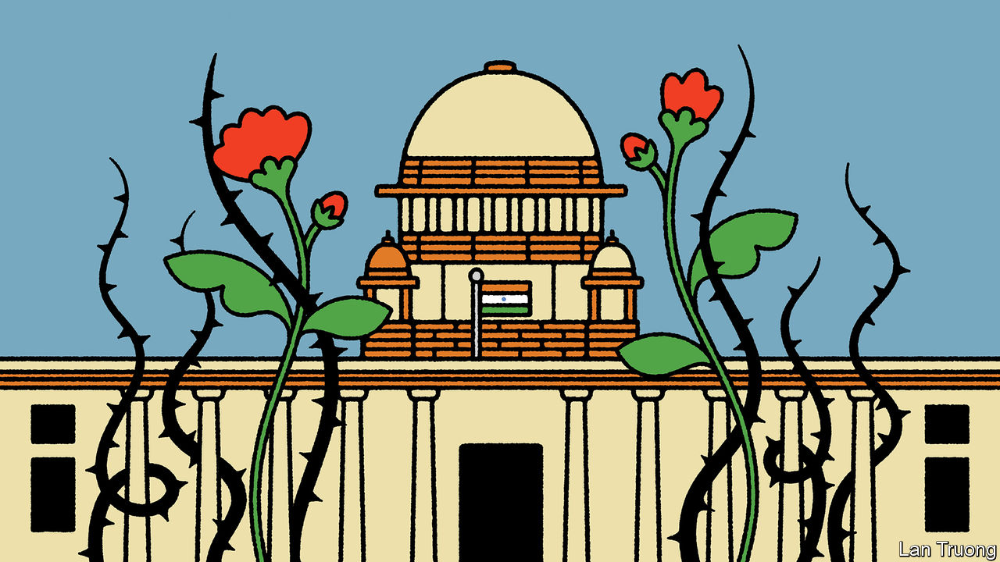

###### Banyan

# How independent is India’s Supreme Court? 

##### Despite its enormous powers, it rarely challenges the government 

 

> Feb 22nd 2024 

India’s Supreme Court has been making waves. On February 21st it overturned the result of a mayoral election in Chandigarh, capital of the northern states of Punjab and Haryana, and chided an official loyal to the Bharatiya Janata Party (BJP) for having rigged the poll. Two days earlier it ordered the government of Narendra Modi to reverse a dilution in the rules protecting forestland. Last week it struck down electoral bonds, an opaque campaign-finance instrument that had mainly benefited the bjp.

These judgments highlight the court’s considerable power to challenge the government. India’s constitution makes it among the world’s most powerful supreme courts. Yet anyone counting on it emerging as a strong check on Mr Modi’s authoritarian drift is liable to be disappointed. The court has been much less willing to challenge the bjp government on its political priorities. Despite its recent activities, a combination of structural flaws and political pressure has severely diminished its role as an independent bulwark against the excesses of the ruling party.

The court’s power was damaged during Indira’s Gandhi’s more extreme spell of authoritarianism, the 21-month-long Emergency that the former prime minister declared in 1975. It has since clawed back most of the functions and prestige stripped from it at that time. And it has expanded its role beyond judicial review to include functions more commonly reserved for the legislature and executive, says Anuj Bhuwania, a legal scholar at the University of Leipzig. On occasion, the court has used these powers to advance an agenda at odds with the aims of Mr Modi’s government.

Examples of that include landmark rulings which decriminalised gay sex (though stopped short of legalising same-sex marriage) and advanced citizens’ rights to privacy. These arguably made India more progressive. Yet the court has been extremely reluctant to challenge Mr Modi on more hot-button issues. In December, for example, it approved the government’s move in 2019 to strip Jammu and Kashmir, previously India’s only Muslim-majority state, of its statehood and split it into two territories.

In 2022 it cleared the prime minister of complicity in deadly sectarian riots in Gujarat in 2002, when he was the state’s chief minister. More surprisingly, it suggested the petitioners who had brought the case should be prosecuted for abusing the judicial process. In 2019 it awarded land in Ayodhya, where Hindu extremists demolished an ancient mosque in 1992, to Hindus. That led to the construction of the lavish Ram temple that Mr Modi inaugurated on the site last month.

When the court cannot bring itself to side with the government in such hypersensitive cases, it often refrains from passing judgment—a tactic known as “judicial avoidance”. Some controversial cases, such as a raft of petitions filed against the Citizenship Amendment Act, a law that discriminates against Muslims, have had hearings postponed for years. Umar Khalid, a student activist who has been in jail for three years awaiting trial on bogus terrorism charges, last week decided to withdraw his plea for bail after his hearing was postponed for the 14th time. The ruling on electoral bonds came seven years after their introduction was first challenged. The court thus gave the ruling party ample time to benefit from what always looked like a questionable instrument.

Some of this appears straightforwardly a result of political pressure. Lawyers say the government drags its feet on clearing the appointment of judges it dislikes and accuse it of trying to pick and choose between those that hear sensitive cases. Last year a lawyer wrote an open letter to the chief justice complaining about last-minute switches of judges set to hear human-rights and freedom-of-speech cases. In 2018 four Supreme Court judges accused the then-chief justice of bending to Mr Modi. 

Yet unlike, for example, Hungary and Turkey, which are also democracies with strongmen rulers, the government has not engaged in blatant court-stacking. The court itself thwarted the only alleged recent attempt to do so: in 2015 it struck down a law that would have given the executive more power over judicial appointments. 

By and large, says Mr Bhuwania, the court has decided to align its agenda with that of the government in order to safeguard its autonomy. Such a court might sometimes take on the government. But it will not be an especially reliable constitutional check on executive power.■


