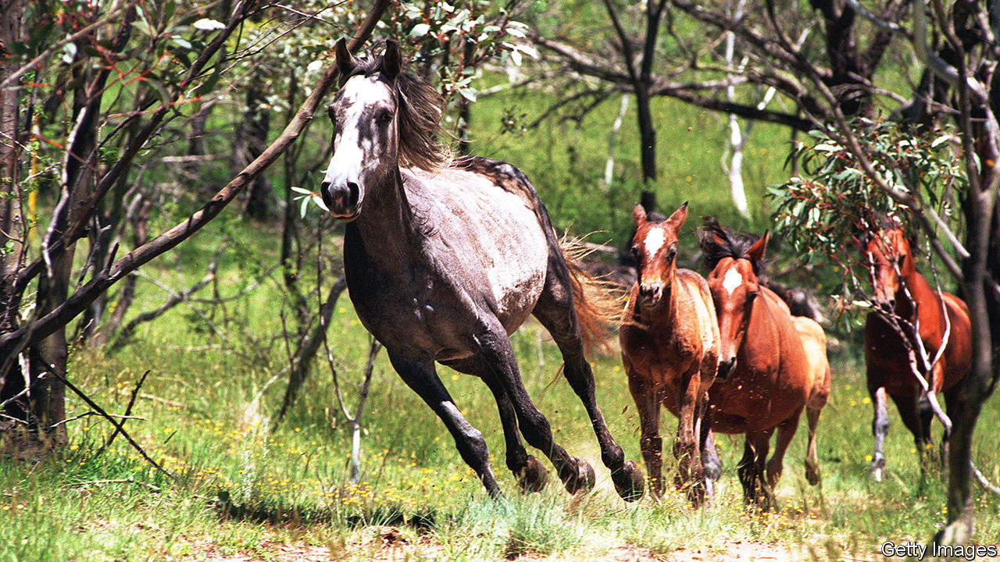

###### Feral ponies

# How wild horses sparked a culture war in Australia 

##### A long-delayed brumby cull is proving controversial 

 

> Feb 22nd 2024 

Brumbies are romantic creatures. Australia’s wild horses, descended from the steeds of early settlers, roam the continent’s highest ranges, the Australian Alps. Synonymous with whip-cracking stockmen of yesteryear, they are celebrated in poetry and on a banknote. So when the state of New South Wales culled some brumbies in 2022, it provoked such outrage that park rangers were threatened with firebombing.

A much bigger cull is under way. The number of brumbies in the “high country”, which spans three south-eastern states and territories, has been growing by 15% a year. In New South Wales, 17,000 feral horses were estimated last year to be ravaging a fragile alpine ecosystem, much of which is national park. Environmentalists have long raised the alarm. Politicians are now cracking down.

Last year a new centre-left Labor government in New South Wales authorised “aerial culling” of brumbies for the first time in 20 years. Since November over 800 have been shot from helicopters and thousands removed by other means. The state aims to cut numbers in its alpine national park to 3,000 by 2027. Victoria, another state, has shot 700 brumbies since 2020, when its Supreme Court rejected a bid to protect them.

There is growing acceptance of the need for culling, says Jack Gough of the Invasive Species Council, an ngo. But brumby fans insist the horse is as iconically Australian as any marsupial and deserves protection. To some, they are a last vestige of a ranching culture extirpated when the high country was protected. They are “fundamental to our unique heritage that is all but lost”, says Leisa Caldwell, a brumby advocate whose family used to graze cattle there.

Such feelings evince “a really strong culture war among a vocal minority”, says Mr Gough. Scientists are accused of inflating brumby numbers. Park staff face harassment. “The horses are an avatar of belonging” for Australians nostalgic for colonial days, says Richard Swain, a national-park guide. Fortunately for the parks, though not the brumbies, most Australians have moved on.■


