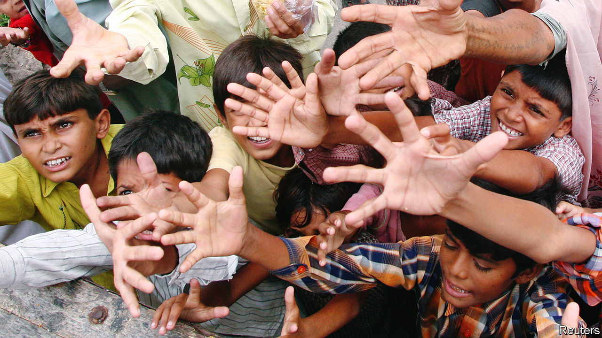
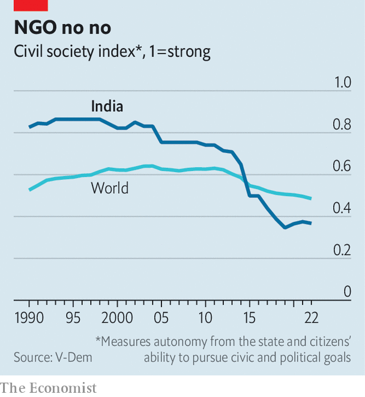

###### Uncharitable India

# India’s civil society is under attack 

##### The crackdown is hurting policymaking and millions of poor Indian lives 

 

> Feb 21st 2024 

India’s civil society is one of its biggest industries. It includes over 200,000 registered NGOs—more than the number of private firms in the country’s agriculture and finance sectors. The contribution of these charities—which range from small concerns to vast India-wide networks—to development and the individual lives of millions of poor Indians is incalculable.

Activist groups helped India gain independence in 1947 and have since helped restrain the state’s excesses and compensate for its weaknesses. Care India, which provides public-health education and other services to women and girls, assisted 84m people in 2021-22. Research outfits such as the Centre for Policy Research (CPR), a think-tank in Delhi, drafted many of the policies that have made India a laboratory of anti-poverty schemes. Registered NGOs, a minority of the total, are estimated to employ 2.7m people. Perhaps only Bangladesh, globally famed for its ngos, owes more to them. This makes the decade-long attack that the Bharatiya Janata Party (BJP) government has launched on the sector both risky and costly.

 


Since coming to power in 2014, Narendra Modi’s administration has shut down or depleted thousands of charities, according to industry veterans. The sector is operating in an “environment of fear”, says an NGO boss. Victims in the past year have included Care India and CPR, which had their licences to receive foreign donations suspended and revoked. Care has since laid off 4,000 people. cpr, a non-partisan body that in 2022-23 produced over 600 articles, policy notes and chapters, has laid off all but a handful of its 200 researchers and may not survive. On a measure of civil-society health compiled by V-Dem, a Swedish think-tank, India’s score has fallen by half since 2014.

The exact number of organisations affected is hard to ascertain because of the diverse legal means used against them. Some, initially including CPR, have been plagued by tax raids. Individual activists have been arrested on anti-terrorism charges. Such cases rarely lead to convictions; by tying up limited resources and paralysing operations, the legal process is the punishment. Yet the tool most often wielded by the government is the Foreign Contribution Regulation Act (FCRA). Passed in 1976 to limit any unwelcome “foreign hand” (which at the time mostly meant America) in India’s affairs, it allows the government to deny NGOs foreign funding.

The home ministry, which regulates ngos, has cancelled nearly 17,000 licences to receive foreign contributions under the act since 2014. It has also made applying for a licence much harder. This is a powerful curb because of how dependent many of the most influential Indian NGOs are on foreign money. Nearly half of the 200 biggest rely on overseas donations for more than half their income, according to a survey by Sattva Consulting, an advisory outfit. Organisations that work on policy and research are even more reliant. Around 75% of CPR’s funding came from abroad.

What explains the assault? Industry watchers, almost none of whom were willing to be named in this article, cite the government’s Hindu-first ideology and growing intolerance of opposing views. An analysis of its targets seems to support this. Most fit into two categories. The first is non-Hindu, faith-based NGOs, which bjp figures accuse of trying to convert Hindus. Pandering to that exaggerated fear, Amit Shah, the BJP’s home minister and second-in-command, said “no mercy” would be shown to outfits trying to change India’s “demography”. Hardly any NGO works explicitly for that aim. Yet of those that lost foreign-funding licences in the past two years, more than half were Christian or Muslim. The India branch of World Vision, an ecumenical Christian outfit that has been working on child welfare in India for seven decades and was assisting over 300,000 children, lost its licence last month. Hindu outfits, including members of the Sangh Parivar, a family of organisations that backs the BJP, are rarely or never attacked. (Nor is the ruling party, for that matter—though it probably receives a lot of foreign donations.)

The second major target are groups the bjp considers to be ideological opponents. This is a broad category, given that Mr Modi’s party suspects, probably rightly, that most NGOs prefer its main rival, the Congress party. Aakar Patel, a former head of Amnesty International’s India office, claims Mr Modi considers the entire sector “a disease”. Amnesty International, an NGO known for probing abuses by Sangh activists, was another victim. It ceased operations in India in 2020 after its funds were frozen in a money-laundering case.

To a degree, the curbs reflect a disagreement between the bjp and its rivals about the nature of development. Congress, which has roots in the social activism of Mohandas Gandhi and other pre-independence leaders, has generally pursued it alongside NGOs. For example, the previous Congress-led administration launched a National Advisory Council (NAC), including academics and activists such as Jean Dreze, an economist, to advise the government and mark its card. The BJP, by contrast, thinks the decades-long NGO-Congress collaboration has produced frustratingly poor results, in part due to some of the charities’ high overheads and other inefficiencies. It advocates instead a strong, tech-savvy, centralised state, largely unencumbered by interfering outsiders. Mr Modi characterises this approach as “hard work over Harvard”.

Yet the weakness of the Indian state cannot be wished away. State governments are especially reliant on NGOs to deliver basic services, such as the education that Pratham, an NGO, is providing to 5.6m children. For all the BJP’s many efforts to help the poor, from higher spending on transfers to them as a share of GDP to huge improvements in digital infrastructure, the state’s reach—in education and health care especially—still only goes so far.

Moreover, the details of the crackdown on ngos often appear more vindictive than based on genuine ideological difference. Though many of Congress’s collaborators were critical of its efforts (Mr Dreze was one of several who resigned in high dudgeon from the now-defunct NAC), the BJP appears to consider all ngos with Congress ties hostile. Its moves against them, which are in line with a broader intolerance of dissent, often seem political. The Centre for Equity Studies, another Delhi-based think-tank, had its FCRA licence suspended after its founder, Harsh Mander—another former NAC member—criticised the government. His house in Delhi was recently raided by intelligence agents. The BJP is “vengeful”, says Paranjoy Guha Thakurta, a journalist who experienced a similar raid over his association with News-Click, a left-leaning outlet under investigation for allegedly running Chinese state-sponsored content.

The FCRA restrictions on big NGOs are hurting the many smaller outfits they support, often in India’s poorest regions. This is a “fatal blow to small NGOs that rely on sub-grants”, says the leader of a big grassroots outfit. The erosion of brainpower at institutes such as CPR could be irreversible. Many of its former scholars have gone abroad or to work in better-paying private firms. The weakening of such bodies is likely to result in fewer innovative ideas, poorer policy and less oversight.

Simultaneous campaigns against critical journalists and opposition politicians—often using the same legal tools—are likely to exacerbate the institutional damage and risk of groupthink. Already, says a senior official, decisions are “often centralised” without any external input. The fear is that if the BJP wins a third term in the election due by May, as looks likely, things could get worse. ■


