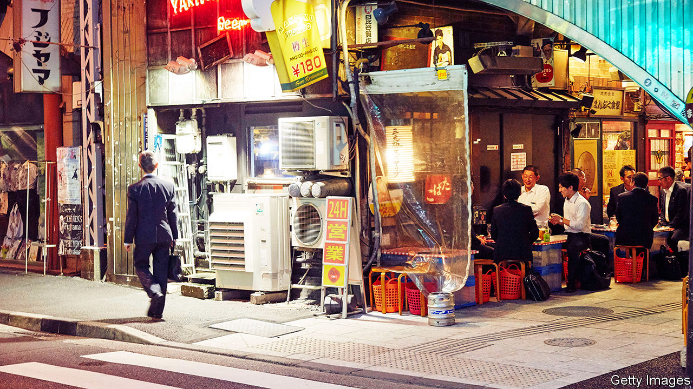

###### Gender relations

# Japanese men have an identity crisis 

##### Japanese women are empowered. Japanese men don’t know what they are 

 

> Feb 22nd 2024 

Fukushima Michihito wanted to marry his girlfriend. But a decade ago he fell ill, had to stop working, and consequently broke up with her. “I thought: if I can’t support my family, I shouldn’t get married,” he recalls. He later realised that many Japanese men are similarly weighed down by pressure to fill the traditional male role. He now runs a “men’s hotline” in the city of Osaka, which encourages men to discuss their anxieties.

In Japan, relations between men and women are shifting as marriage rates decline and more women enter the workforce. But the idea that men are breadwinners remains deeply entrenched. In 2022 only 17% of eligible men took parental leave, compared with 80% of women. Japanese women spend five times longer doing chores than men. A survey in 2022 by Lean In Tokyo, an activist group, suggested that over 60% of Japanese men feel awkward at work because of pressure to behave in a manly way. In Japan, which has the highest suicide rate in the G7, men are twice as likely to kill themselves as women.

The hotline Mr Fukushima helps run was established in 1995. It was founded mainly in an effort to reduce domestic violence by giving anxious men an opportunity to air their grievances to a discreet stranger. Since then, the hotline has received calls on an expanding range of concerns, including relationships, sexuality and work. “More men are growing tired of behaving in a manly fashion, and want to be free,” says Mr Fukushima. The government has also taken an interest in the problem. In 2010 it included an objective to promote “men’s counselling” in its gender equality plan. There are now over 80 counselling centres offering this service.

Japan’s archetypal gender roles—the salaryman husband and stay-at-home mum—were cemented during the country’s long post-war boom. Following the oil crisis of the early 1970s, those rigid roles began to break down in many Western countries, as more and more women entered work in response to economic stagnation and labour shortages. By contrast, Japan tried to overcome the crisis by extending men’s working hours—then by inflating the great “bubble economy” of the 1980s. While Western countries went through a “transition point” in gender relations, says Tanaka Toshiyuki, a sociologist, “Japan missed the opportunity to change.” 

Since the 1990s, as fears about a slumping birth rate increased and more Japanese women entered the workforce, calls for men to participate in domestic work have grown. In 2010 the government tried to promote the concept of —which combines(child-rearing) and (cool men). But culture is slow to change at many companies, in part due to gerontocratic male management.

The great extent to which Japanese men are encouraged to commit themselves to work is another barrier to change. Retired workaholic men are described as a or “wet fallen leaf”, because, lacking hobbies or friends, they follow their wives around like a wet leaf stuck to a shoe. A staple magazine article offers advice to wives suffering a severe case of “Retired Husband Syndrome”. For men, the pain of being considered a nuisance by their lifelong spouse can be immense. Mr Fukushima laments that “so many men sacrifice themselves for work to provide for their family—only to realise later in life that they don’t belong at home.”

Mr Fukushima, who describes men’s tendency to assert their dominance as “the armour of masculinity”, hopes more men will feel able to show weakness. That is still not easy. He says some men who call the hotline quickly become aggressive, probably to hide their sense of humiliation. As for Mr Fukushima himself, when asked what he would do if he had his choice of proposing to or breaking up with his girlfriend again, he says he would probably still take the second course. “Even if I’m fine with the idea [of being a disempowered husband], the question is: what would she think? What would people around us think?” he says.■

