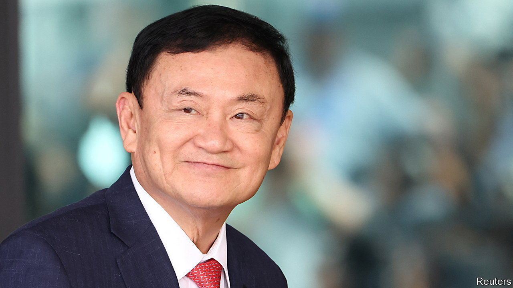

###### Thai politics

# Thaksin Shinawatra joins Thailand’s establishment 

##### The former prime minister has become a tool for nobbling Thai democrats 

 

> Feb 22nd 2024 

For the past 20 years, Thai politics has been largely defined by a feud. After winning elections in 2001 and 2005, Thaksin Shinawatra, a populist prime minister, was ousted in a military coup in 2006. He spent 15 years in self-imposed exile, dodging an eight-year prison sentence for corruption and abuse of power. Then, in a stunning development last year, Mr Thaksin returned to Thailand. This fuelled speculation that he had cut a deal with his former nemesis, the country’s powerful conservative establishment, a nexus of royal, military and business elites. After serving only a tiny portion of his original sentence in detention—and not a single night in jail—he was duly released on parole on February 18th from a military hospital. 

After decades fighting Thailand’s powerful establishment, Mr Thaksin appears to have joined it. The conservative elites need his help to tackle what their members see as a far bigger enemy: Move Forward, a political party dominated by young progressives that won a dramatic electoral victory last year on a promise to reduce the power of the monarchy and army. Move Forward was blocked from forming a government only because conservatives control key institutions, including the senate and constitutional court. 

After nearly a decade of military rule, a coalition government, including pro-military parties and Mr Thaksin’s Pheu Thai party, took power in August. Led by Srettha Thavisin, a member of Pheu Thai, it has duly protected the monarchy, pushing back against the growing number of Thais who are disillusioned with the country’s strict law. Also known as Article 112, this forbids insulting the king and other members of the royal family. 

Two Thai activists were arrested on February 13th for having allegedly blocked a royal motorcade. The previous day a journalist and a freelance photographer were arrested for covering a story about an activist who had sprayed anti-royalist graffiti on Bangkok’s grand palace. In January an anti-monarchy activist received a 50-year prison sentence, the stiffest penalty ever handed out for royal defamation, for sharing video clips on social media of shows that were considered offensive to the monarchy, including John Oliver’s “Last Week Tonight” and a BBC documentary.

The conservative establishment has also gone after Move Forward. During its election campaign, Move Forward proposed abolishing a minimum jail term of three years for Article 112 convictions. It also wanted to reform the royal defamation law so that only the Bureau of Royal Household, the agency that represents the monarchy, could file charges under it. (Currently, any Thai citizen can bring a  case.) On January 31st Thailand’s constitutional court ruled that Move Forward’s proposal was an attempt to overthrow the monarchy. A separate petition brought by an ultra-royalist to disband Move Forward will be heard soon. Move Forward remains Thailand’s most popular political party, according to surveys.

Pheu Thai’s popularity has plummeted since its deal with the pro-army parties. To counteract this, Mr Thaksin’s party is hoping that Thais will like its main campaign promise: a digital wallet scheme that will include cash handouts to around 50m Thais. The government had planned to launch this stimulus in May; it has been delayed. It also hopes that the growing profile of Mr Thaksin will help restore his party’s image. He is remembered by many Thais for overseeing an economic boom as prime minister and also introducing a universal health-care scheme and other policies that improved people’s lives. Mr Srettha said on February 17th that he would consult Mr Thaksin when appropriate.

Yet Thais may not be so easily mollified. Nearly 40% think the country’s economic situation is getting worse because of political conflict, according to a survey by the National Institute of Development Administration, a research outfit. Having put himself on the unpopular side of that conflict, Mr Thaksin may find he is unable to rally the country as he once could. ■

