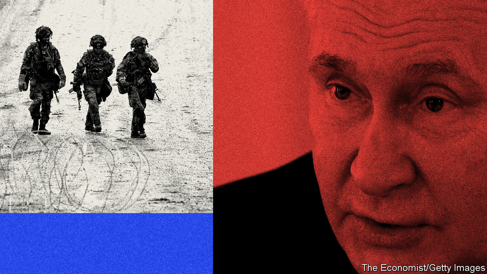
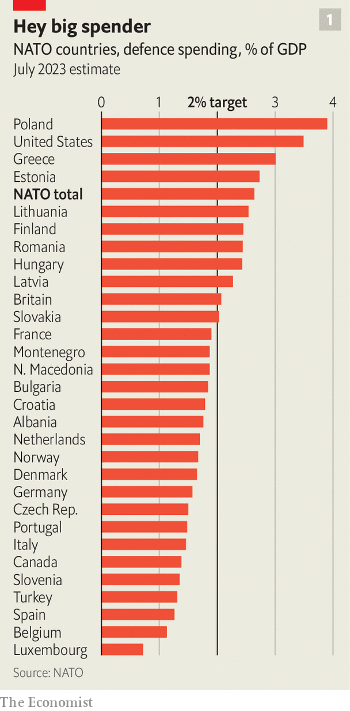
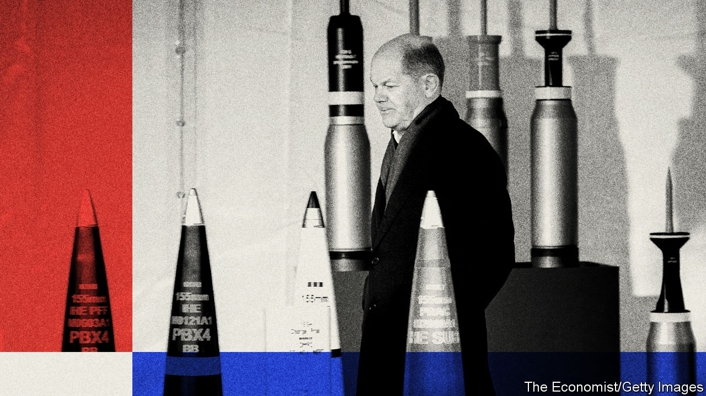
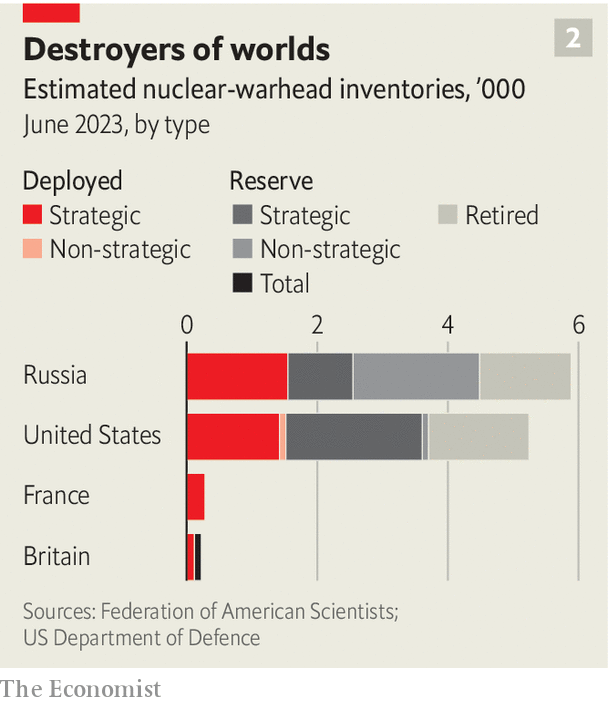
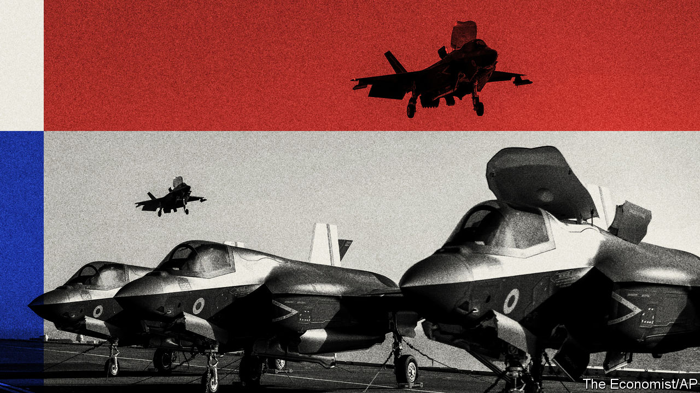

###### Present at the destruction

# Can Europe defend itself without America? 

##### It would need to replace military aid, a nuclear umbrella and leadership 

 

> Feb 18th 2024 

The second anniversary of Russia’s invasion of Ukraine, on February 24th, and the continuing menace Vladimir Putin, Russia’s president, presents to Europe, were always going to overshadow this year’s Munich Security Conference. But as the annual gathering of bigwigs got under way, a series of additional blows fell. First came the death of , Russia’s foremost opposition leader, in a Siberian gulag on February 16th. The next day Ukraine’s army withdrew from the town of Avdiivka, handing Mr Putin his first military victory in almost a year. America’s Congress, meanwhile, showed no sign of passing a bill to dispense more military aid to Ukraine, which is starved of ammunition and therefore likely to suffer more setbacks on the battlefield. The auguries could scarcely have been more awful.

The deadlock in Congress reflects the baleful influence of , whose opposition to aid for Ukraine has cowed Republican lawmakers. It was the spectre of Mr Trump’s potential return to office in November’s presidential election that cast the darkest pall over Munich. A week earlier Mr Trump had explained what he would say to an ally in nato that had not spent as much as the alliance urges on defence and then suffered an invasion: “You’re delinquent? No, I would not protect you. In fact, I would encourage them [the invaders] to do whatever the hell they want.”

Combined harms

Russia’s ever-deepening belligerence, Ukraine’s deteriorating position and Mr Trump’s possible return to the White House have brought Europe to its most dangerous juncture in decades. The question is not just whether America will abandon Ukraine, but whether it might abandon Europe. For Europe to fill the space left by America’s absence would require much more than increased defence spending. It would have to revitalise its arms industry, design a new nuclear umbrella and come up with a new command structure 

In Munich the mood was fearful, but determined rather than panicked. American and European officials remain hopeful that more American munitions will eventually get to Ukraine, but they are also making contingencies. On February 17th Petr Pavel, the Czech president, said his country had “found” 800,000 shells that could be shipped within weeks. In an interview with  , Germany’s defence minister, insisted that European arms production was increasing “as fast as possible” and said he was “very optimistic” that Europe could plug any gaps left by America. 

 


Not everyone is so sanguine. If American aid were to evaporate entirely, Ukraine would probably lose, an American official tells . Mr Pistorius is correct that European arms production is rising fast; the continent should be able to produce shells at an annual rate of 1m-2m late this year, potentially outstripping America. But that may come too late for Ukraine, which needs some 1.5m per year according to Rheinmetall, a European arms manufacturer. A sense of wartime urgency is still lacking. European shell-makers export 40% of their production to non-EU countries other than Ukraine; when the European Commission proposed that Ukraine should be prioritised by law, member states refused. The continent’s arms firms complain that their order books remain too thin to warrant big investments in production lines. 

A Ukrainian defeat would inflict a psychological blow on the West while emboldening Mr Putin. That does not mean he could take advantage right away. “There is no immediate threat to NATO,” says Admiral Rob Bauer, the head of NATO’s international military committee. Allies disagree over how long Russia would need to rebuild its forces to a pre-war standard, he says, and the timing depends in part on Western sanctions, but three to seven years is the range “a lot of people talk about”. The direction of travel is clear. “We can expect that within the next decade, NATO will face a Soviet-style mass army,” warned Estonia’s annual intelligence report, published on February 13th. The threat is not just a Russian invasion, but attacks and provocations which might test the limits of Article 5, NATO’s mutual-defence clause. “It cannot be ruled out that within a three- to five-year period, Russia will test Article 5 and NATO’s solidarity,” Denmark’s defence minister recently warned. But the concern is less the timing than the prospect of confronting Russia alone. 

Change of station

Europe has thought about such a moment for years. In 2019 Emmanuel Macron, France’s president, told this newspaper that allies needed to “reassess the reality of what NATO is in the light of the commitment of the United States”. Mr Trump’s first term in office, in which he flirted with withdrawing from NATO and publicly sided with Mr Putin over his own intelligence agencies, served as a catalyst. The idea of European “strategic autonomy”, once pushed only by France, was embraced by other countries. Defence spending, which began rising after Russia’s first invasion of Ukraine in 2014, has increased dramatically. That year just three members of NATO met the alliance’s target of spending 2% of GDP on defence. Last year 11 countries did, ten of them in Europe (see chart 1). This year at least 18 of NATO’s 28 European members will hit the target. Europe’s total defence spending will reach around $380bn—about the same as Russia’s, after adjusting for Europe’s higher prices. 

Those numbers flatter Europe, however. Its defence spending yields disproportionately little combat power, and its armed forces are less than the sum of their parts. The continent is years away from being able to defend itself from attack by a reconstituted Russian force. At last year’s summit, NATO leaders approved their first comprehensive national defence plans since the cold war. NATO officials say those plans require Europe to increase its existing (and unmet) targets for military capability by about a third. That, in turn, means Europe would have to spend around 50% more on defence than today, or about 3% of GDP. The only European members of NATO that currently reach that level are Poland and Greece, the latter flattered by bloated military pensions. 

Anyway, more money is not enough. Almost all European armies are struggling to meet their recruitment targets, as is America’s. Moreover the rise in spending after 2014 delivered alarmingly little growth in combat capability. A recent paper by the International Institute of Strategic Studies (IISS), a think-tank in London, found that the number of combat battalions had barely increased since 2015 (France and Germany each added just one) or had even fallen, in Britain by five battalions. At a conference last year, an American general lamented that most European countries could field just one full-strength brigade (a formation of a few thousand troops), if that. Germany’s bold decision to deploy a full brigade to Lithuania, for instance, is likely to stretch its army severely. 

Even when Europe can produce combat forces, they often lack the things needed to fight effectively for long periods: command-and-control capabilities, such as staff officers trained to run large headquarters; intelligence, surveillance and reconnaissance, such as drones and satellites; logistics capabilities, including airlift; and ammunition to last for longer than a week or so. “The things that European militaries can do, they can do really well,” says Michael Kofman, a military expert, “but they typically can’t do a lot of them, they can’t do them for very long and they’re configured for the initial period of a war that the United States would lead.” 

Poland is an instructive case. It is the poster boy for European rearmament. It will spend 4% of its GDP on defence this year, and splurges more than half of that money on equipment, far above NATO’s target of 20%. It is buying huge numbers of tanks, helicopters, howitzers and HIMARS rocket artillery—on the face of it, just what Europe needs. But under the previous government, says Konrad Muzyka, a defence analyst, it did so with little coherent planning and utter neglect of how to crew and sustain the equipment, with personnel numbers falling. Poland’s HIMARS launchers can hit targets 300km away, but its intelligence platforms cannot see that far. It relies on America for that.

One option would be for Europeans to pool their resources. For the past 16 years, for instance, a group of 12 European countries have jointly bought and operated a fleet of three long-range cargo aircraft—essentially a timeshare programme for airlift. In January Germany, the Netherlands, Romania and Spain teamed up to order 1,000 of the missiles used in the Patriot air-defence system, diving down the cost through bulk. The same approach could be taken in other areas, such as reconnaissance satellites.

The hitch is that countries with big defence industries—France, Germany, Italy and Spain—often fail to agree on how contracts should be split among their national arms-makers. There is also a trade-off between plugging holes quickly and building up the continent’s own defence industry. France is irked by a recent German-led scheme, the European Sky Shield Initiative, in which 21 European countries jointly buy air-defence systems, in part because it involves buying American and Israeli launchers alongside German ones. When Olaf Scholz, Germany’s chancellor, recently called for Europe to adopt a “war economy”, Benjamin Haddad, a French lawmaker in Emmanuel Macron’s Renaissance party, retorted, “It’s not by buying American equipment that we’re going to get there.” European arms-makers, he argued, will not hire workers and build production lines if they do not get orders. 

These twin challenges—building up military capability and revitalising arms production—are formidable. Europe’s defence industry is less fragmented than many assume, says Jan Joel Andersson of the EU Institute for Security Studies in a recent paper: the continent makes fewer types of fighter jets and airborne radar planes than America, for instance. But there are inefficiencies. Countries often have different design priorities. France wants carrier-capable jets and lighter armoured vehicles; Germany prefers longer-range aircraft and heavier tanks. Europe-wide co-operation on tanks has consistently failed, writes Mr Andersson, and an ongoing Franco-German effort is in doubt. 

 


The scale of the required changes raises broader economic, social and political questions. Germany’s military renaissance will be unaffordable without cutting other government spending or junking the country’s “debt brake”, which would require a constitutional amendment. Mr Pistorius says he is convinced that German society backs higher defence expenditure, but acknowledges, “We have to convince people that this might have an impact on other spending.” Thierry Breton, the EU commissioner in charge of defence, has proposed a €100bn ($108bn) defence fund to boost arms production. Kaja Kallas, Estonia’s prime minister, backed by Mr Macron and other leaders, has proposed that the EU fund such defence spending with joint borrowing, as it did the recovery fund it established during the covid-19 pandemic—a controversial idea among the thriftiest member-states.

Europe’s manpower shortages are driving similarly fraught discussions. In December Mr Pistorius said that “in retrospect” Germany had erred in ending compulsory national service in 2011. In January General Sir Patrick Sanders, the head of the British Army, said preparing Western societies for a war footing would be a “whole-of-nation undertaking”, and that Ukraine showed that “regular armies start wars; citizen armies win them”. His remarks prompted a national furore over conscription, though he never used the word. Several western European countries are studying the “total defence” models of Sweden, Finland and other northern European countries, which emphasise civil defence and national preparedness.

 


Perhaps the hardest capability for Europe to replace is the one everyone hopes will never be needed. America is committed to using its nuclear weapons to defend European allies. That includes both its “strategic” nuclear forces, those in submarines, silos and bombers, and the smaller, shorter-range “non-strategic” B61 gravity bombs stored in bases across Europe, which can be dropped by several European air forces. Those weapons have served as the ultimate guarantee against Russian invasion. Yet an American president who declined to risk American troops to defend a European ally would hardly be likely to risk American cities in a nuclear exchange.

During Mr Trump’s first spell in office, that fear revived an old debate over how Europe might compensate for the loss of the American umbrella. Britain and France both possess nuclear weapons. But they have only 500 warheads between them, compared with America’s 5,000 and Russia’s nearly 6,000 (see chart 2 ). For advocates of “minimum” deterrence, that makes little difference: they think a few hundred warheads, more than enough to wipe out Moscow and other cities, will dissuade Mr Putin from any reckless adventure. Analysts of a more macabre bent think such lopsided megatonnage, and the disproportionate damage which Britain and France would suffer, give Mr Putin an advantage.

Nuclear posturing

This is not just a numerical problem. British nuclear weapons are assigned to NATO, whose Nuclear Planning Group (NPG) shapes policy on how nuclear weapons should be used. The deterrent is operationally independent: Britain can launch as it pleases. But it depends on America for the design of future warheads and draws from a common pool of missiles, which is kept on the other side of the Atlantic. If America were to sever all co-operation, British nuclear forces “would probably have a life expectancy measured in months rather than years”, according to an assessment published ten years ago. In contrast, France’s deterrent is entirely home-grown and more aloof from NATO: uniquely among NATO’s members, France does not participate in the NPG, though it has long said that its arsenal, “by its existence”, contributes to the alliance’s security. 

Within NATO, nuclear issues were long on the “back burner”, says Admiral Bauer. That has changed in the past two years, with more and wider discussions on nuclear planning and deterrence. But NATO’s plans hinge on American forces; they do not say what should happen if America leaves. The question of how Britain and France might fill that gap is now percolating. On February 13th Christian Lindner, Germany’s finance minister and head of the pro-business Free Democratic Party, called in the , a German newspaper, for a “rethink” of European nuclear arrangements. “Under what political and financial conditions would Paris and London be prepared to maintain or expand their own strategic capabilities for collective security?” he asked. “And vice versa, what contribution are we willing to make?”

Such musings have a long history. In the 1960s America and Europe pondered a “multilateral” nuclear force under joint control. Today, the idea that Britain or France would “share” the decision to use nuclear weapons is a non-starter, writes Bruno Tertrais, a French expert involved in the debate for decades, in a recent paper. Nor is France likely to join the NPG or assign its air-launched nuclear forces to NATO, he says. One option would be for the two countries to affirm more forcefully that their deterrents would, or at least could, protect allies. In 2020 Mr Macron stated that France’s “vital interests”—the issues over which it would contemplate nuclear use—“now have a European dimension” and offered a “strategic dialogue” with allies on this topic, a position he reiterated last year. 

The question is how this would be made credible. In deterrence, the crucial issue is how to make adversaries (and allies) believe that a commitment is real, rather than a cheap diplomatic gesture that would be abandoned when the stakes become apocalyptic. Mr Tertrais proposes a range of options. At the tame end, France could simply promise to consult on nuclear use with its partners, time permitting. More radically, if the American umbrella had gone entirely, France could invite European partners to participate in nuclear operations, such as providing escort aircraft for bombers, joining a task force with the eventual successor to the aircraft-carrier, which can host nukes, or even basing a few missiles in Germany. Such options might ultimately require “a common nuclear planning mechanism”, he says. 

Mr Lindner’s talk of a European deterrent was largely dismissed by German officials who spoke to  in Munich. But the nuclear question, involving as it does the deepest questions of sovereignty, identity and national survival, points to the vacuum that would be left if America abandons Europe. “There will be a European nuclear doctrine, a European deterrent, only when there are vital European interests, considered as such by the Europeans, and understood as such by others,” pronounced François Mitterrand, France’s president, in 1994. “We are far away from there.” Today Europe is closer, but not close enough. The same doubt that drove France to develop its own nuclear forces in the 1950s—would an American president sacrifice New York for Paris?—is replicated within Europe: would Mr Macron risk Toulouse for Tallinn?

The seemingly dry question of military command and control brings such issues to the fore. NATO is a political and diplomatic body. It is also a formidable bureaucracy that spends €3.3bn annually and operates a complex network of headquarters: a Supreme Headquarters Allied Powers Europe (SHAPE) in Belgium, three big joint commands in America, the Netherlands and Italy, and a series of smaller ones below. These are the brains that would run any war with Russia. If Mr Trump withdrew from NATO overnight, Europeans would have to decide how to replace them.

 


An “EU-only” option would not work, says Daniel Fiott of the Elcano Royal Institute, a Spanish think-tank. In part that is because the EU’s own military headquarters is still small, inexperienced and incapable of overseeing high-intensity war. In part it is because this would exclude Britain, Europe’s largest defence spender, as well as other non-EU NATO members such as Canada, Norway and Turkey. An alternative would be for Europeans to inherit the rump NATO structures and keep the alliance alive without America. Whatever institution was chosen, it would have to be filled with skilled officers. Officials at SHAPE acknowledge that much of the serious planning falls on just a few countries. Among Europeans, says Olivier Schmitt, a professor at the Centre for War Studies in Denmark, only “the French, the Brits and maybe the Germans on a good day can send officers able to plan operations at the division and corps level”, precisely those needed in the event of a serious Russian attack. 

The question of command is also intrinsically political. Mr Fiott doubts that EU member states could agree on a figure equivalent to the Supreme Allied Commander Europe, the alliance’s top general and, by custom, always an American. That epitomises how American dominance in Europe has suppressed intra-European disputes for decades, as captured in the cold-war quip that NATO’s purpose was to keep “the Americans in, the Russians out and the Germans down”. Sophia Besch of the Carnegie Endowment observes caustically that Europeans still defer to America on the biggest questions of European security: “My impression is that Americans often think more strategically about EU membership for Ukraine than many Europeans.” She sees little hope that Europe will bring bold new ideas to this year’s NATO summit in Washington in July, which will mark the alliance’s 75th anniversary. 

It is certainly possible that the shock to European security will be less dramatic than feared. Perhaps America will pass an aid package. Perhaps Europe will scrape together enough shells to keep Ukraine solvent. Perhaps, even if Mr Trump wins, he will keep America in NATO, claiming credit for the fact that a majority of its members—and all of those along the eastern front, and thus most in need of protection—are no longer “delinquent”. Some European officials even muse that Mr Trump, who is fond of nuclear weapons, might take drastic steps such as meeting Poland’s demand to be included in nuclear-sharing arrangements. For the moment, there are still intense debates over how far Europe should hedge against American abandonment. Jens Stoltenberg, the secretary-general of NATO, has repeatedly warned that the idea is futile. “The European Union cannot defend Europe,” he said on February 14th. “Eighty per cent of NATO’s defence expenditures come from non-EU NATO allies.” 

Forward-operating haste

Advocates of European self-sufficiency retort that building up a “European pillar” within NATO serves a triple purpose. It strengthens NATO as long as America remains, shows that Europe is committed to share the burden of collective defence and, if necessary, lays the groundwork in case of a future rupture. Higher defence spending, more arms production and more combat-capable forces will be necessary even if America remains in the alliance and under current war plans. Moreover, even the most Europhile of presidents could be forced to divert forces away from Europe if, for instance, America were to be pulled into a big war in Asia. 

The difficult questions around command and control, and its implications for political leadership, are probably here to stay. In the worst case of a complete American exit from NATO, a “messy” solution would be needed, says Mr Fiott, perhaps one that would bring Europe’s overlapping institutions into greater alignment. He suggests some radical options, such as giving the EU a seat on the North Atlantic Council, NATO’s main decision-making body, or even a fusion of the posts of NATO secretary-general and president of the European Commission. Such notions still seem otherworldly. But less so with every passing week. ■

