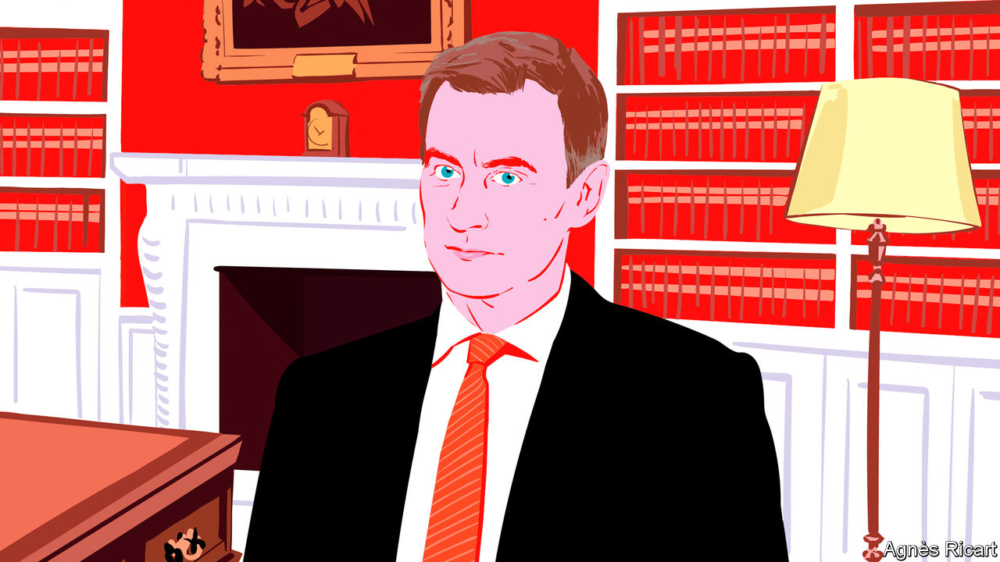

###### Tax advice

# A memo to Britain’s chancellor, Jeremy Hunt 

##### Pre-budget thoughts from a fictitious Treasury adviser 

 

> Feb 22nd 2024 

On March 6th Jeremy Hunt, the chancellor of the exchequer, presents what should be the last budget before the general election. The governing Conservatives trail Labour by 20 points in the opinion polls. His backbenchers are demanding tax cuts in a bid to close the gap, but money is tight. What to do? We present the frank advice of an imaginary Treasury mandarin.


  


As you know, chancellor, budget day is nearing. Budgets prompt big questions. Are choreographed fiscal events a sensible way to run an economy? Is “fiscal headroom” too volatile to be a helpful yardstick for fiscal policy? Should we worry that current spending plans require sharp cuts to public services after the election?

The answers are “no”, “maybe” and “certainly”. But such things can wait. There is a budget to be written, a battered red briefcase to be photographed—and a political as well as an economic game to be played. Permit me to offer my advice on the way through this morass. 

1. The fiscal position

Let’s start with fiscal headroom, the annual amount you can spend or cut taxes by while complying with your self-imposed rule that government debt begins falling (relative to GDP) in five years. City forecasters think that you will have £15bn-20bn ($19bn-25bn), or 0.7-0.9% of GDP. But you may have less: the economy shrank in the last two quarters of 2023, and the watchdogs at the Office for Budget Responsibility may downgrade their growth outlook.

But assume those forecasts are right. Nothing says you have to hand it all out. The best course, indeed, would be to keep it. Estimates of headroom are just that. They can shrink to nothing in a trice. Your recent predecessors kept a buffer of about £30bn on average. After years of topsy-turvy fiscal policy, no one should object if you swear off more tinkering. And with public services creaking and inflation above target, the economy is hardly screaming for tax cuts, even if it is in recession.

Nevertheless, an election is looming, your party is adrift in the polls and your backbenchers and the Tory press are baying for tax cuts. If you do insist on giveaways, what are your options? Can you smuggle in any sensible reforms alongside the bread and circuses? I believe you can.

2. Your tax-cutting options

What about the obvious headline-grabbers: cutting income tax or national insurance? There are two steps here. First, which is better? National insurance, I would advise. It is a tax on income from employment, whereas income tax also covers savings, pensions and property. A further percentage-point cut in national insurance (to follow your recent two-point cut) is thus cheaper (£5bn) than the same cut in the standard rate of income tax (£7bn). It may also improve labour supply, a little. 

Second, should you cut the rate or raise the threshold at which people start to pay? Cut the rate, I would say. The two are economically very similar (distributional differences aside) but rate changes are more visible. As a politician, you’ll want voters to see tax rates falling. And we at the Treasury would prefer it if frozen tax thresholds stayed out of the public conversation. As long as Britain’s long-term fiscal position is fragile, this will not be the last government to freeze thresholds in order to raise taxes by stealth. 

Better still, leave both taxes alone. If growth remains meagre and inflation keeps falling, the economy may soon need economic stimulus. But leave this to the Bank of England. Stimulative tax cuts may be self-defeating if they push the bank to keep interest rates high. So if you insist on tax cuts, choose those that also spur the supply side. A bad choice here (though popular with your backbenchers) would be to abolish inheritance tax (cost: £8bn). That is plainly regressive: only 4% of estates are rich enough to benefit.

Consider instead abolishing stamp duty land tax, a levy on property transactions, for residential properties (cost: £9bn). The better-off are still the immediate beneficiaries, but less egregiously. The knock-on effects are broader: a more fluid property market could unlock housing supply by permitting empty-nesters to downsize without a tax bill and help to unclog the labour market by making it easier for people to move. Ideally, you would announce a wholesale rationalisation of property taxes, including increases in council tax on the most expensive homes. But even a politically neutral civil servant shudders at that in an election year. 

 


Look too at the other, less discussed, variety of stamp duty: stamp duty reserve tax (SDRT), a 0.5% charge on transactions in shares. You are keen to re-energise British capital markets: abolishing SDRT would help (cost: £4bn). Academics suggest it would boost share prices by 1-2%, if not more. Unlike the “Brit ISA” (tax-advantaged investment in domestic equities) you are fond of, cutting SDRT whiffs less of protectionism and brings Britain closer to international norms.

A final area to consider is a “bonfire of irrationalities”. You could cut taxes alongside other measures to clean up tax perversities. Marginal tax rates leap from 40% to 60% on incomes of £50,000-60,000 (for parents of two, as child benefit is withdrawn) and £100,000-125,000 (for all, as personal allowance tapers), and then drop again. The chart shows this absurdity.

Value-added tax (VAT) provides another option. The £85,000 VAT registration threshold restrains business growth and the thicket of exemptions needs a machete. Chocolate Nesquik powder—for that milky drink many children like—is VAT-free; strawberry isn’t. You could extend permanent full expensing of capital allowances, which you brought in last November, to leased equipment. The bank levy could be rolled into corporation tax. My colleagues would be delighted to draw up a longer list. In fairness, some of this may only win you votes at think-tanks.

3. Closing advice

Your predecessor Lord Lamont (borrowing from J.K. Galbraith) called politics “the art of choosing between the disastrous and the unpalatable”. This budget risks being both. Thus, two final warnings. First, do not expect too much. Even a stimulative budget, says Goldman Sachs, would boost growth by only a tenth of a percentage point this year. Second, look to your legacy. Choose cuts that your successors, of either party, will want to keep. But of course, chancellor, the decision is yours.■


